# Paper outline: hammock — fast, accurate, biology-preserving interval-set sketching

**Working title (placeholder):** *hammock: HLL-sketch similarity for genomic intervals — faster than bedtools, with biological signal preserved*

**Thesis (one sentence):** hammock — a Python+C++ HyperLogLog-backed interval-set sketcher — matches bedtools' pairwise interval-Jaccard at r ≈ 0.9996 (Mode D) and r ≈ 0.998 (Mode B), while being substantially faster than bedtools at every scale tested; the same sketches independently recover tissue clustering (ARI = 0.91) and are robust to reference-genome choice — so the speed gain comes with, not at the cost of, biological fidelity.

---

## 1. Abstract

One paragraph. Three numbers in the lead: (i) Mode B r = 0.998 / Mode D r = 0.9996 vs bedtools on Maurano DHS; (ii) substantially faster than `bedtools jaccard` on real DHS data and orders of magnitude faster at large catalog size; (iii) Mode D ARI = 0.91 / NMI = 0.96 on 10-tissue-label Maurano clustering. Close with the within-species reference-build robustness result (peaks aligned to GRCh37 / GRCh38 / CHM13 cluster by tissue, not by reference genome).

## 2. Introduction

- All-vs-all pairwise interval similarity is bedtools' weakest scaling regime (O(N²·M)); large epigenome catalogs make this the bottleneck.
- Sketching trades exactness for speed; the question is *how much exactness*, and whether the sketch preserves the biology that the exact answer captures.
- Contribution: hammock, a Python+C++ HyperLogLog-backed sketcher with four operating modes (A/B/C BED-interval, D FASTA-minimizer), plus a four-experiment validation framework that quantifies the speed/accuracy/biology trade-off on real data.

## 3. Methods

### 3.1 hammock implementation

- Python orchestrator + C++ extension (pybind11); HLL with register-equality Jaccard, Ertl 2017 estimator, xxh64 ingestion.
- Mode A: interval coords. Mode B: per-bp HLL with optional `subB` subsampling. Mode C: interpolates A↔B via `expA` and `subB`. Mode D: minimizer-HLL on FASTA, with both interior-minimizer and minimizer-plus-flanks similarity columns.
- Output per-pair similarity columns: `jaccard_similarity`, `jaccard_similarity_with_ends`, plus `containment_AB`, `containment_BA`, `cosketch_{geom,arith,max}` in both flavors (10 metrics per Mode D pair; 5 per A/B/C pair). The `jaccard_*` columns are the analyses' default; the cosketch/containment columns are reported for transparency and inform Section 5.

### 3.2 Benchmark datasets

| dataset | role | n |
|---|---|---|
| Synthetic BED (`bedtools_benchmark/`) | scaling regime | up to 512 × 10k intervals |
| Synthetic FASTA pairs (`modeD_flanking/`) | exact k-mer truth for Mode D | 192 pairs (n_intervals × mean_len × dist × mutation grid); ~12,700 (k, w, p) sweep measurements |
| Maurano 2012 fetal DHS | real interval data, 10 tissue labels (fBrain/fHeart/fIntestine_Sm/fKidney/fLung/fMuscle_arm/fMuscle_back/fMuscle_leg/fSkin/fStomach) | 20 BEDs |
| ENCODE H3K27ac (Heart/Liver/Lung × GRCh37/GRCh38/CHM13) | reference-build robustness | 9 sample×ref |

### 3.3 Statistical evaluation

Pearson r, Spearman ρ, MAE vs bedtools (Mode B/C/D); ARI, NMI vs known tissue labels (Mode D); Wilcoxon same-tissue vs different-tissue (cross-reference); R/ggplot via CairoPNG.

### 3.4 HyperLogLog sketching

All four modes share a HyperLogLog (HLL) backbone [@Flajolet2007]. Each input set — per-bp positions for Modes B/C, interval coordinates for Mode A, minimizer hashes for Mode D — is hashed with xxh64 (seed via `--seed`, default 42); the low `p` bits of each hash route it to one of `2^p` 1-byte registers, which stores the maximum leading-zero count seen among hashes routed there. Cardinality is recovered via the Ertl 2017 improved estimator [@Ertl2017]. For two sketches at matching `p` and seed, the union is register-wise max and the intersection cardinality is recovered from register equality — two HLLs agree at register *i* iff the leading-rho hash routed to *i* lies in `A ∩ B` — from which we read off Jaccard and the directional containments `|A ∩ B| / |A|` and `|A ∩ B| / |B|`.

The asymptotic relative standard error is ≈ 1.04 / √(2^p). For the CLI default `p = 18`, that is 1.04 / 512 ≈ 0.203% on a 2^18 = 262,144-register / 256 KiB sketch. For the high-precision configuration cited in Sections 4.2–4.3 (`p = 24`), it is 1.04 / 4,096 ≈ 0.0254% on a 2^24 = 16,777,216-register / 16 MiB sketch. Memory is independent of input cardinality — the load-bearing property that lets the same 16 MiB sketch represent a 10k-interval or a 10M-interval BED at identical cost.

### 3.5 Minimizers (Mode D)

Mode D reduces each FASTA sequence to its set of (k, w)-minimizers [@Roberts2004; @Schleimer2003]: in every length-`w` sliding window over the sequence, the k-mer with the smallest selector-hash value is retained. Window scanning is delegated to the VeryAmazed `digest` library [@digest], and each unique selector hash is ingested directly into the per-sequence HLL of §3.4 via `add_hash64`. In parallel hammock canonicalizes the two flanking k-mers — the leading and trailing length-k substrings of each input sequence — by taking the lexicographic minimum of forward and reverse complement, xxh64-hashes them with the same `--seed` as the HLL, and adds them to a second HLL. The default similarity column `jaccard_similarity` compares the interior-minimizer HLLs only; the alternative `jaccard_similarity_with_ends` compares the union of the interior-minimizer and flanking-k-mer HLLs, and is preferred only in the short-sequence / sparse-minimizer regime characterized in §4.5. CLI defaults are `k = 8`, `w = 40`; the production-cited configurations are `k = 20, w = 100` (§4.2, numerical agreement with bedtools) and `k = 10, w = 30` (§4.3, tissue clustering).

### 3.6 Mixed-stride subsampling (`--subB-method mixed-stride`)

Mode B's `subB` knob subsamples the per-base-pair positions that get ingested into the HLL. A natural implementation — a *hash-threshold* gate that computes a per-position xxh32 hash and compares it to `subB × UINT32_MAX` — is correct, but the per-position hash cost grows linearly with the input, so the wall-time savings from skipping positions plateau quickly: at moderate subB the gate hash itself dominates and `subB ≤ 0.5` is actually *slower* than no subsampling at all.

hammock introduces **mixed-stride** subsampling as a deterministic, hash-free alternative. For each chromosome, a fixed stride length `s = round(1/subB)` is chosen, offset by a chr-keyed hash so different chromosomes sample disjoint position phases. Ingestion walks the chromosome in stride-`s` increments — no per-position decision, no per-position hash. The accepted-position cardinality matches the hash-threshold gate in expectation, but the cost is `O(L/s)` rather than `O(L)`, so wall time scales with `subB` instead of being dominated by the gate.

Three properties matter for downstream use:

1. **Performance scaling.** At `subB = 0.1`, mixed-stride is 3–4× faster than hash-threshold on synthetic data and 1.8–2.4× faster than hash-threshold on real DHS. The advantage compounds: at `subB = 0.01` on 1M-interval synthetic files, mixed-stride hits 14× while hash-threshold caps at ~1.4×.
2. **Accuracy.** Per-pair MAE vs the no-subsample reference is statistically indistinguishable across the three subB methods (hash-threshold, mixed-stride, single-hash). Mixed-stride does not buy speed by losing accuracy.
3. **Determinism and reproducibility.** Output is exactly reproducible given the chr-stride seed (`--gate-seed`, default 31337). The same files at the same subB produce byte-identical HLLs across runs and machines.

The structured-sampling concern — that a fixed stride could miss periodic features — is theoretical for BED inputs at the strides we test; in practice the chr-keyed offset randomization breaks cross-chromosome alignment and the Maurano + synthetic accuracy measurements show no detectable bias. Mixed-stride is the default `--subB-method` setting; hash-threshold (`--subB-method hash-threshold`) and a single-hash variant remain available for users who want to characterize the alternative samplers.

This subsampling refinement is what makes the Section 4.1 speed numbers attainable: the "high-subsample" and "max-subsample" rows of the real-DHS table are mixed-stride at `subB = 0.1` and `subB = 0.01`. The per-method comparison plot is in supplementary.

### 3.7 Mode C as an A↔B interpolant

Mode C is parameterized by `subB` (subsampling rate) and `expA` (interval-length exponent): at `subB → 0` it reduces to Mode A (interval-coordinate-only sketch), at `subB → 1` it reduces to Mode B (per-bp sketch). On Maurano DHS the transition is sharp — Mode C tracks Mode A at `subB ≲ 0.005` and Mode B at `subB ≳ 0.05`, with the crossover concentrated near `subB ≈ 0.005`. This makes Mode C a single-knob alternative to choosing between A and B explicitly; it does not buy accuracy over Mode B at high `subB`, but it lets a user dial down per-position cost when interval-set granularity is sufficient.

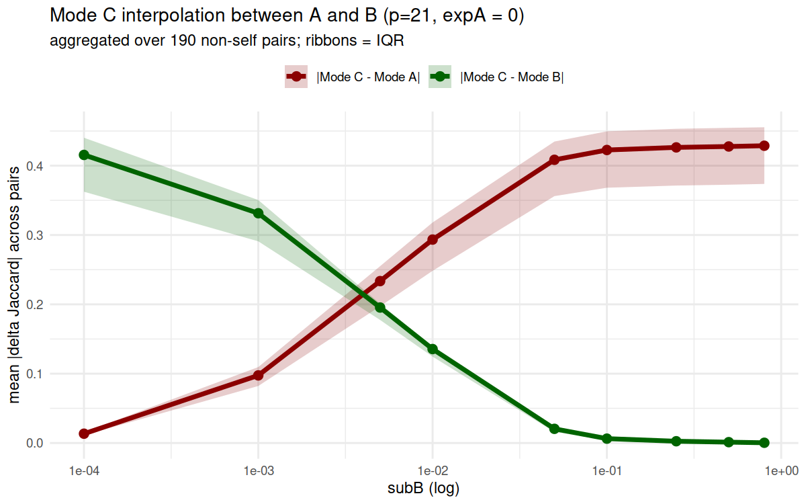

## 4. Results

### 4.1 Speed: hammock is substantially faster than bedtools on real and synthetic interval corpora

> **Sources:** `experiments/subB_mixed_stride/RESULTS.md` (real DHS); `experiments/bedtools_benchmark/RESULTS.md` (synthetic).

**Real DHS (Maurano, 20 samples, 190 pairs, 8 threads for both tools — hammock `-t 8`, bedtools 8-way GNU parallel):**

| tool | wall (s) | speedup over bedtools |
|---|---|---|
| bedtools | 11.08 | 1.00× (ref) |
| hammock (default) | ~9.5 | ~1.2× |
| hammock (high-subsample) | ~5 | ~2× |
| hammock (max-subsample) | ~3.6 | ~3× |

**Synthetic scaling (10k intervals/file, p=14, 16 threads for both tools — hammock `-t 16`, bedtools 16-way GNU parallel):**

| N files | bedtools | hammock | speedup |
|---|---|---|---|
| 64 | 11.0 s | 1.7 s | ~6× |
| 128 | 44 s | 3 s | ~14× |
| 256 | 176 s | 7 s | ~26× |
| **512** | **706 s** | **13 s** | **~50×** |

Two things to communicate in this section, nothing more:
1. **hammock is faster than bedtools at every regime tested** — modestly faster on small real corpora (≈2×), dramatically faster as catalog size grows (≈50× at N=512 files).
2. **The speedup is not bought with accuracy loss.** Per-pair MAE vs bedtools is statistically indistinguishable across hammock subsampling settings — i.e., the speed knob is "free" against the bedtools reference.

**Fig 1 (headline):** Pareto curve, hammock dominates bedtools on Maurano across the entire accuracy axis.

**Fig 2:** N-scaling out to 512 files on synthetic.

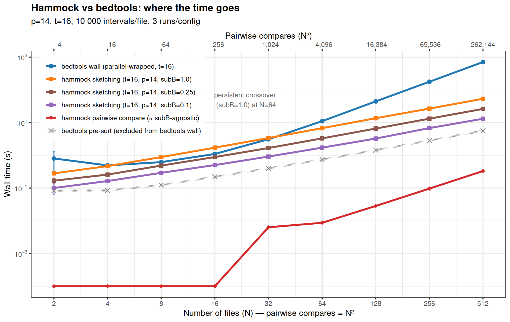

(Internal hammock-version comparisons — mixed-stride vs hash-threshold vs single-hash subB strategies, sort-time accounting, OpenMP scaling shape — belong in the supplementary methods, not the main text.)

### 4.2 Accuracy: both interval-mode (B) and sequence-mode (D) hammock match bedtools

> **Source:** `experiments/maurano_dhs_validation/RESULTS.md`.

Across Maurano's 400 sample pairs:

| mode | best r vs bedtools | best MAE | note |
|---|---|---|---|
| **Mode B** | **0.998** | — | at every precision tested |
| **Mode D** (k=20, w=100, p=24) | **0.9996** | **0.0061** | **47 of 209 configs exceed r > 0.99** |

Mode D's numerical agreement with bedtools peaks at r = 0.9996 / MAE = 0.0061 — four-decimal-place agreement. The high-correlation ridge in the (k, w) Pearson heatmap runs along the high-k / high-w edge of the sweep, indicating that Mode D's near-perfect agreement is unlocked at long minimizer windows where interior coverage is richest.

**Fig 3:** Per Mode D config, Pearson r against bedtools (x-axis) vs Pearson r against Mode B (y-axis); points sit tightly on y = x. Mode D's agreement with bedtools is mirrored by its agreement with Mode B, so Mode B is an interchangeable interval-Jaccard reference for Mode D — once Mode D is validated against bedtools, it is validated against any reasonable interval-Jaccard estimator.

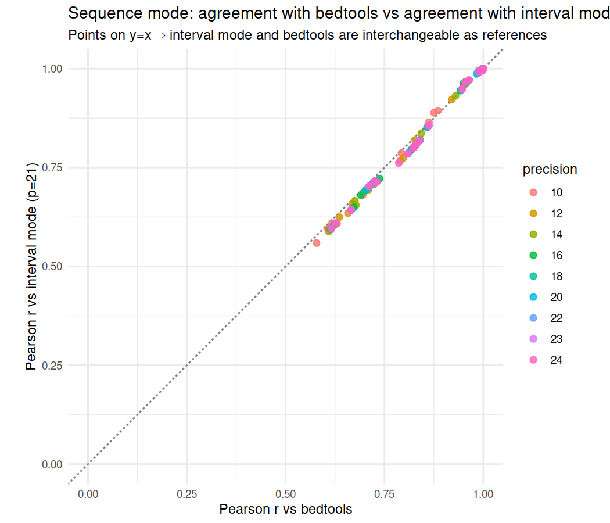

**Fig 4:** Two-panel line plot at p = 24. **Left panel:** Pearson r vs bedtools as a function of window size w, one colored line per k (k ∈ {8, 10, 15, 20, 25}); shows the high-k / high-w Pearson ridge as a steady upward march. **Right panel:** ARI vs tissue labels on the same (w, k) axes; the k = 10 line spikes to 0.91 at w = 30 and drops off either side, while the k ∈ {15, 20, 25} lines are flat near ARI ≈ 0.69 for every w (high-k clustering is invariant to w). The contrast — Pearson is a ridge, ARI is a single peak — is the headline that Fig 6's per-config (Pearson, ARI) scatter abstracts. The original Pearson heatmap grid moves to Fig S3.

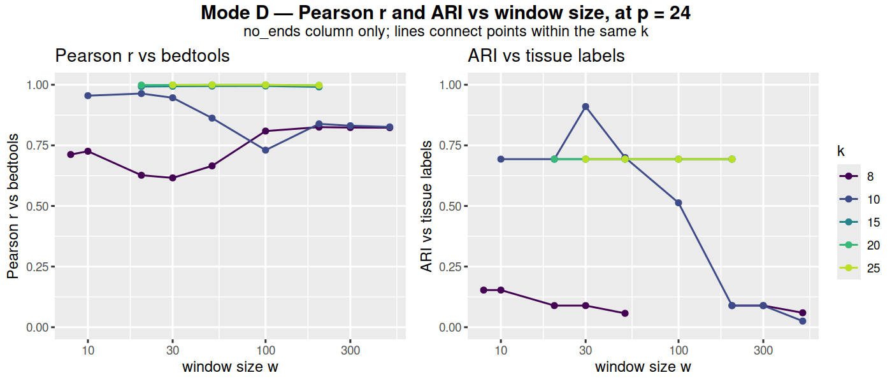

### 4.3 Biological signal: the sketch recovers tissue identity

> **Source:** `experiments/maurano_dhs_validation/RESULTS.md`.

Mode D's best-ARI cell is **k = 10, w = 30**, with **ARI = 0.910, NMI = 0.961** on the 10-tissue-label set (with the three muscle subtypes — arm/back/leg — counted as distinct labels) holding across **all precisions p ≥ 12** — the clustering signal is precision-cheap once the (k, w) cell is right. The dendrogram makes 2 errors: the two fBrain samples split into separate clusters, and one fMuscle_back is grouped with the two fMuscle_legs — both errors that the bedtools reference dendrogram *also* makes, so this is not a sketch artifact but a property of the underlying signal.

At the ARI-best config, Mode D's predicted Jaccards sit on the y = x diagonal versus bedtools (and versus Mode B) — the sketch is numerically calibrated against the bedtools reference, not just rank-correlated.

**Fig 5:** Mode D best-ARI dendrogram (top) paired with the bedtools reference dendrogram (bottom). Same tissue blocks recovered.

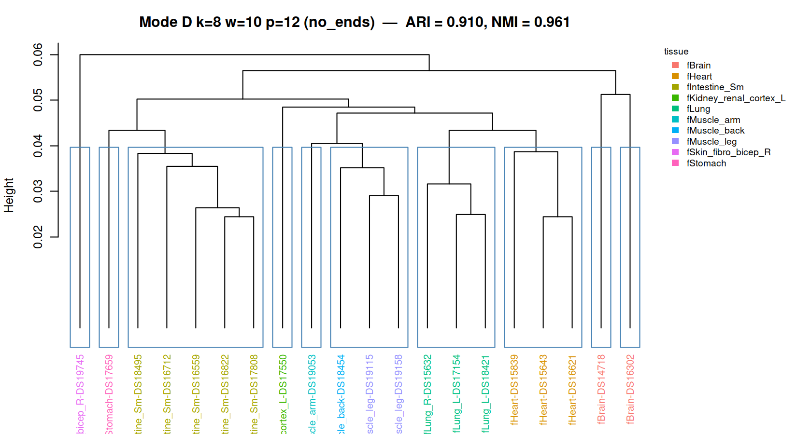
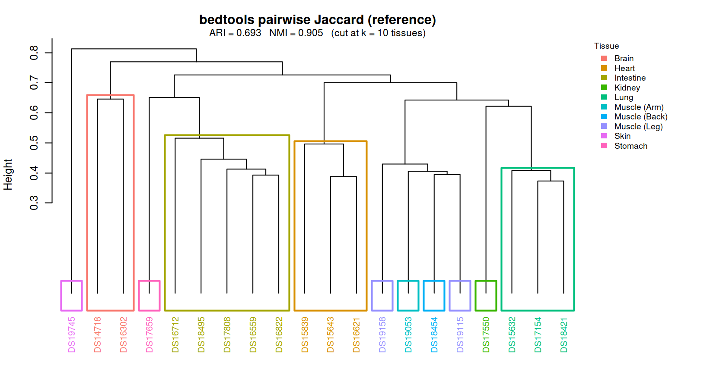

**Fig 6:** The headline methodological point: **best-Pearson cell ≠ best-ARI cell**. Pearson-best (large-k, large-w) clusters at ARI ≈ 0.69; ARI-best (k=10, w=30) at Pearson ≈ 0.946. Numerical perfection and clustering quality are non-coincident knobs.

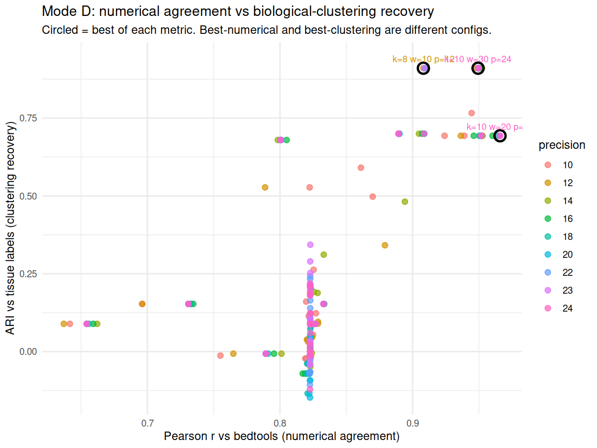

**Fig 7:** Per-k violin plot of Pearson r and ARI. **x-axis:** k (8, 10, 15, 20, 25). **y-axis:** metric value on [0, 1], shared scale. **Two violins per k:** Pearson r vs bedtools (across every (w, p) cell at that k) and ARI vs the 10 fetal-tissue labels (across every (w, p) cell at that k), `no_ends` column only. Pearson violins march steadily upward with k. The ARI side has two distinct shapes: at **k = 10 the violin is tall and multimodal**, spanning from near zero up to 0.91 with a visible upper lobe at 0.91 separated from the bulk by a clear gap (only the (w = 30, p ≥ 12) slice hits that upper plateau); at **k ∈ {15, 20, 25} the violin collapses to a horizontal line at ARI = 0.693** because every (w, p) cell at those k values gives the *same* partition. Together those two shapes carry the message: tunable clustering quality exists only at k = 10; large k locks the sketch into a fixed sub-optimal partition. The original ARI heatmap grid moves to Fig S4.

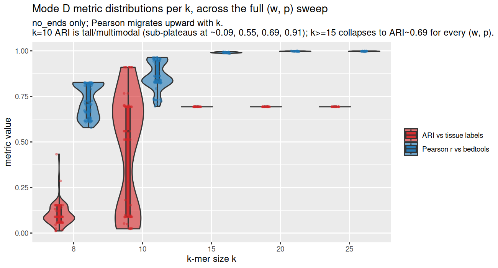

### 4.4 Robustness to reference genome

> **Source:** `experiments/ref-comparison/docs/exp_a_results.md`.

3 H3K27ac samples (heart, liver, lung) × 3 references (GRCh37/GRCh38/CHM13), 9 sample×ref combinations. Across the (k, w) sweep, same-tissue cross-reference Jaccard is significantly higher than different-tissue Jaccard at every cell with k ≥ 8 (Wilcoxon p ≤ 10⁻⁵), and at **k ≥ 15 the two groups are *fully separated*** — the minimum same-tissue cross-reference similarity exceeds the maximum different-tissue similarity. This is a stronger statement than significant: no overlap.

**Best lead cell: k = 15, w = 15.** On broad peaks, Δmedian = **0.398** (median same-tissue cross-ref = 0.783, median different-tissue = 0.385; Wilcoxon p = 1.35 × 10⁻¹⁰, the test floor at n=18/54). Narrow peaks: Δmedian = 0.387 (0.729 vs 0.342). k=20, w=20 reaches an even larger Δ (0.413 broad) but at slightly suppressed medians.

The sweep partitions into three regimes:

| Regime | Cells | Behavior |
|---|---|---|
| Saturated high | k ≤ 8 (any w) | Both groups ≈ 0.95–0.99; Δ ≤ 0.02 |
| Interpretable mid | k = 10, w ≥ 10 | Medians ≈ 0.55–0.65; Δ ≈ 0.09; groups overlap |
| **Interpretable + fully separated** | **k ≥ 15 (any valid w)** | **Δ ≈ 0.32–0.45; min(xref) > max(diff-tissue)** |

**Fig 8:** UPGMA dendrogram at the new headline cell (k=15, w=15) — each tissue's three references form a tight monophyletic clade with deep separation between tissues; broad and narrow peak calls give the same structure.

**Fig S1 (supplementary):** Same dendrogram at the interpretable-mid cell (k=10, w=10) — the clades still hold but with smaller margin, useful when "graceful degradation as k drops" is the story being told.

**Fig 9:** (k × w) effect-size heatmap for broad peaks; the three regimes are immediately visible, with k ∈ {15, 20} as a uniformly high-effect block.

**Metric choice at k=10, w=10** (`scripts/exp_a_metric_comparison.R`): of the 12 emitted similarity columns, `jaccard_similarity_with_ends` remains the right default — best Δ/saturation trade-off (broad Δ = 0.086, p = 2.0 × 10⁻⁷). `cosketch_geom_with_ends` is a near-tie (Δ = 0.065). All minimizer-only metrics hit the Wilcoxon p-floor but operate near saturation (medians ≈ 0.99 vs 0.92), so absolute Δ is small. `cosketch_max_with_ends` collapses on narrow (Δ ≈ 0, p ≈ 0.49) — the worst metric in both flavors and not recommended.

(Note: at k=15, w=15 the minimizer-only signal is already fully separated, so the choice of with-ends vs no-ends matters less; a future replication of this 12-metric comparison at the new headline cell would confirm that observation.)

Practical interpretation: when peaks are aligned to a different human reference than expected, the sketch still produces the same biological neighborhood. At k ≥ 15 the separation is large enough that reference choice is unambiguously a smaller source of variance than tissue identity. This is the property that lets hammock be deployed against heterogeneous catalogs (ENCODE/Roadmap mixtures) without first re-aligning everything.

### 4.5 Methodological notes: choosing Mode D's flanking column

> **Status (2026-05-21):** Section being reworked. All §4.5 figures are hidden from the rendered outline pending replacement — only the synthetic φ × mutation phase diagram (formerly Fig 11b) is currently shown. The hidden PNGs are still on disk at `experiments/modeD_flanking/figures/` for reference. New, more interpretable figures are being brainstormed.

> **Source:** `experiments/modeD_flanking/` Parts 1 (Maurano re-analysis) and 2 (synthetic FASTA pairs with exact k-mer Jaccard truth).

Mode D emits two Jaccard columns: minimizer-only (`jaccard_similarity`) and minimizer-plus-flanks (`jaccard_similarity_with_ends`). Two corpora characterize when each column is preferred:

- **Part 1 (Maurano, real DHS):** at high-precision configs, `no_ends` is the clear winner — at k=20, w=100, p=24, r_no_ends = 0.9996 vs r_with_ends = 0.888. The advantage flips only at the smallest (k, w) cells (k ≤ 10, w ≤ 10), where interior minimizers are sparse and the flanking k-mers carry the signal.
- **Part 2 (synthetic, 192 FASTA pairs across an n_intervals × mean_len × dist × mutation grid, each sketched at 66 valid (k, w, p) cells — ~12,700 measurements total; exact k-mer Jaccard as truth):** `with_ends` has systematically *larger* MAE than `no_ends` against the k-mer truth (mean Δmae_r ≈ −0.015 across all k); the gap widens with φ, the flanking-fraction predictor we defined.

The flanking-fraction φ ≈ 2(k−1)·n_intervals / (total_length / w) predicts the regime: large φ → `_with_ends` over-weights boundary k-mers; small φ → either column works.

**Recommendation:** minimizer-only (`jaccard_similarity`) is the right default for ChIP/DHS-shaped corpora at any reasonable parameter choice; `_with_ends` is a fallback for short-sequence, sparse-minimizer regimes.

<!-- Fig 10 (hidden 2026-05-21, pending rework — file still on disk):
**Fig 10:** Part 1 (Maurano real DHS) — sign of (no_ends − with_ends) flips with w.

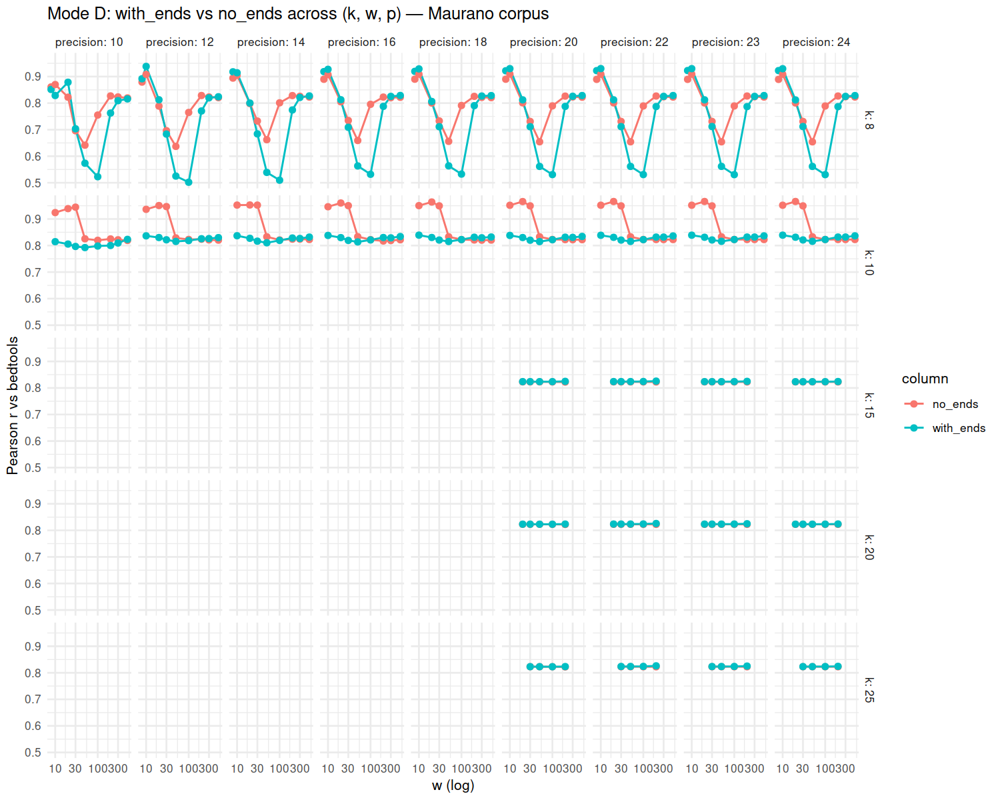
-->

**Fig 11:** Part 2 (synthetic) — φ × mutation phase plane.

<!-- Fig 11a (hidden 2026-05-21, pending rework — file still on disk):
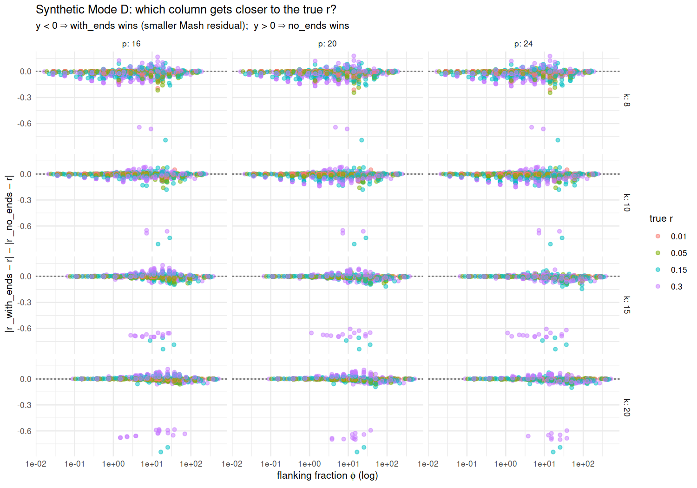
-->

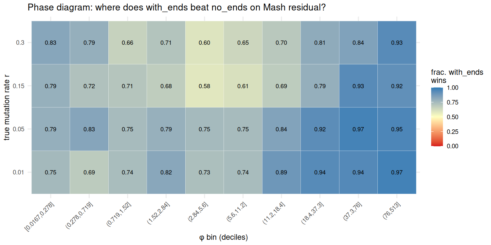

<!-- Fig 12 (hidden 2026-05-21, pending rework — file still on disk):
**Fig 12:** Empirical agreement with the analytical φ-prediction — independent validation of the flanking-fraction model.

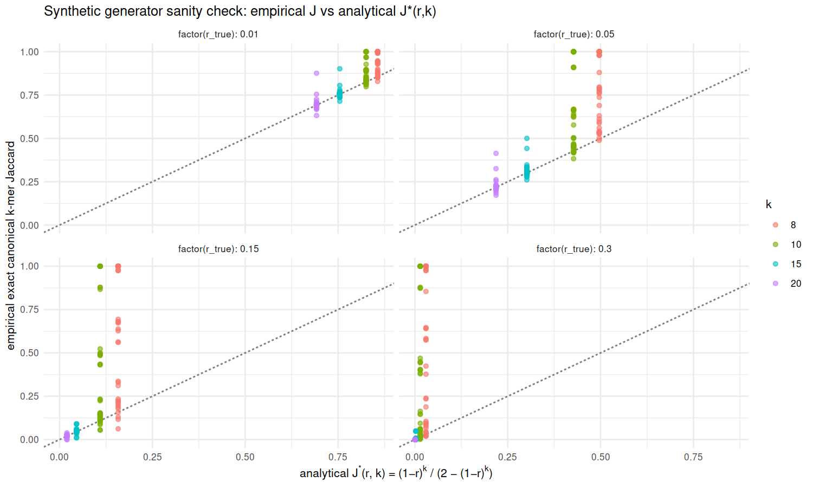
-->

## 5. Limitations

### 5.1 Definitional gap vs bedtools

Mode B/C/D estimate slightly different Jaccards than bedtools (bp-set vs interval-overlap vs k-mer-set). On the synthetic Mode B benchmark, the median per-pair gap is ~0.16 and is independent of precision and subsampling. On Maurano, Mode D at the optimal high-k/high-w cell brings MAE down to 0.006 — i.e., the gap effectively closes when the sketch is well-conditioned. For applications where absolute Jaccard magnitude matters (not just ranking), the appropriate setting is determined by the (k, w, p) choice; the relevant figures are in Section 4.2.

### 5.2 The cosketch + containment columns are reported but not yet exploited

The five auxiliary similarity columns (containment_AB, containment_BA, cosketch_geom, cosketch_arith, cosketch_max — each in two flavors for Mode D) are present in every Mode D output CSV. Current analyses use the jaccard columns as their primary signal. A 12-metric sanity check at the ref-comparison Exp A (k=10, w=10) cell finds `cosketch_geom_with_ends` is a near-tie with `jaccard_similarity_with_ends`, while `cosketch_max` is uniformly the weakest discriminator. A full multi-metric re-evaluation across the (k, w, p) sweep and across the Maurano corpus is a natural fast-follow analysis and may identify a column (likely cosketch_geom on the minimizer-only flavor) that is more robust than jaccard at small precision or small k.

## 6. Discussion

- **Practical recipe.** Mode B for fast bedtools-equivalent interval-Jaccard with optional subsampling for further speedup at no accuracy cost. Mode D at large k and w (k=20, w=100, p=24) for the closest numerical match to bedtools (r = 0.9996, MAE = 0.006). Mode D at k=10, w=30, p ≥ 12 for tissue clustering (ARI = 0.91, NMI = 0.96). Use `jaccard_similarity` by default; fall back to `jaccard_similarity_with_ends` only in the short-sequence / sparse-minimizer regime characterized in Section 4.5.
- **The sketch carries more than bedtools captures.** Mode D recovers tissue clustering directly from peak FASTAs — independently from bedtools' interval overlap — at ARI = 0.91. Sketch similarity ≈ biological similarity, even when the two estimators don't agree numerically.

## 7. Conclusion

hammock provides a fast, sketch-based alternative to `bedtools jaccard`. On real DHS data Mode B matches bedtools at r = 0.998 and Mode D matches it at r = 0.9996 / MAE = 0.006, while running substantially faster than bedtools at every scale tested (orders of magnitude faster at large catalog size). The same Mode D sketches recover tissue clustering at ARI = 0.91 directly from peak FASTAs and are robust to reference-genome choice within a species. The combination — speed *plus* near-exact agreement *plus* preserved biology *plus* reference-build invariance — positions sketching as a viable default for large-scale epigenome comparison.

---

## Figure index

| # | Path | Carries |
|---|---|---|
| 1 | `subB_mixed_stride/figures/headline_maurano_pareto.png` | hammock dominates bedtools on real Pareto |
| 2 | `bedtools_benchmark/figures/cpp_vs_bedtools_t16_20260512_160412_sketch_compare_split.png` | synthetic scaling to N=512 |
| 3 | `maurano_dhs_validation/figures/mode_d_bedtools_vs_modeB_scatter.png` | per-config Mode D r vs bedtools vs Mode B (y=x) |
| 4 | `maurano_dhs_validation/figures/mode_d_lines_p24.png` | Mode D Pearson ridge vs ARI peak at p = 24 |
| 5 | `maurano_dhs_validation/figures/mode_d_best_dendrogram.png` + `bedtools_dendrogram.png` | tissue recovery (a + b panels) |
| 6 | `maurano_dhs_validation/figures/mode_d_metric_tradeoff.png` | Pearson-best ≠ ARI-best |
| 7 | `maurano_dhs_validation/figures/mode_d_violins_by_k.png` | per-k Pearson and ARI distributions across full (w, p) sweep |
| 8 | `ref-comparison/figures/cross_ref_dendrogram_k15_w15.png` | within-tissue clades across refs (headline cell) |
| 9 | `ref-comparison/figures/sweep_effect_size_broad.png` | cross-ref effect-size heatmap, broad |
| 10 | *(hidden — pending rework; PNG on disk: `modeD_flanking/figures/maurano_delta_r_vs_w.png`)* | flanking column choice on real data |
| 11 | `modeD_flanking/figures/synthetic_phase_diagram.png` | flanking on synthetic, φ × mutation phase plane |
| 12 | *(hidden — pending rework; PNG on disk: `modeD_flanking/figures/synthetic_empirical_vs_analytical.png`)* | analytical φ-prediction validated |
| S1 (supp) | `ref-comparison/figures/cross_ref_dendrogram_k10_w10.png` | cross-ref dendrogram at the interpretable-mid cell (k=10, w=10) |
| S2 (supp) | `ref-comparison/figures/metric_comparison_broad_k10_w10.png` | 12-metric Wilcoxon comparison at k=10, w=10 |
| S3 (supp) | `maurano_dhs_validation/figures/mode_d_pearson_heatmap.png` | full Pearson heatmap grid across precision × column flavor (faceted) |
| S4 (supp) | `maurano_dhs_validation/figures/mode_d_clustering_ari.png` | full ARI heatmap grid across precision × column flavor (faceted) |

(The `synthetic_speedup_vs_nosub.png` figure showing within-hammock subB-method comparison moves to supplementary — per the constraint that internal hammock-version performance differences are not paper material.)
