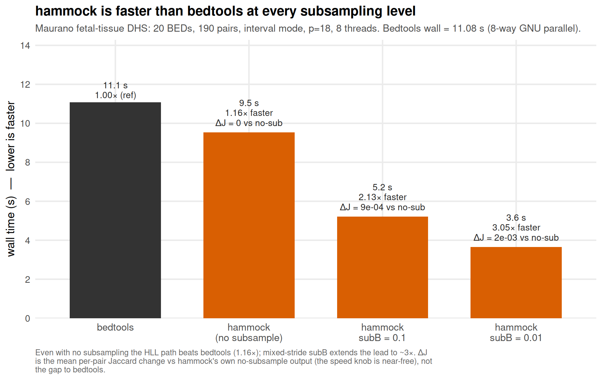
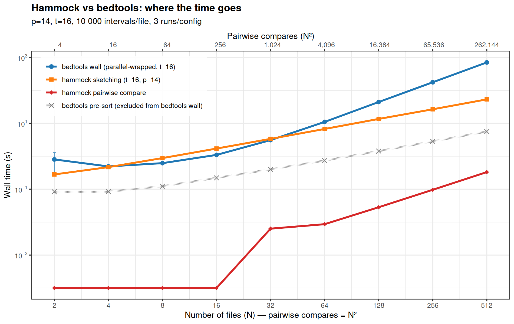
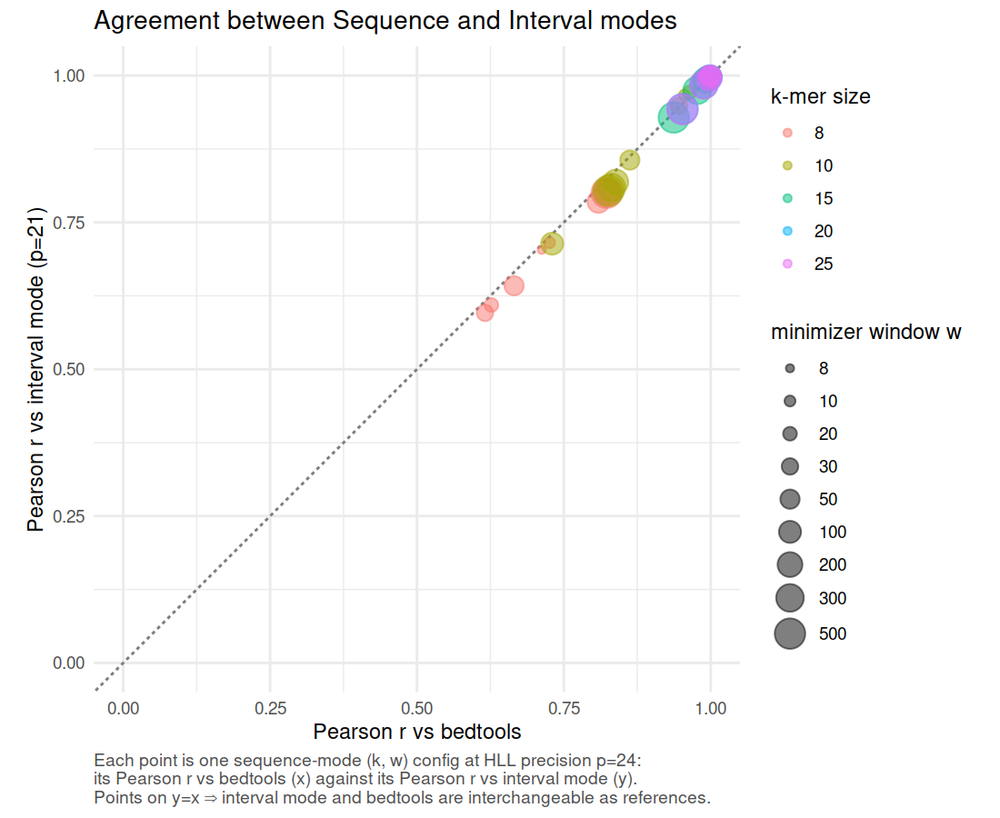
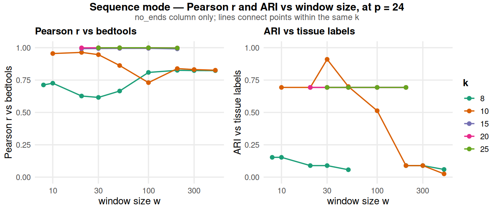
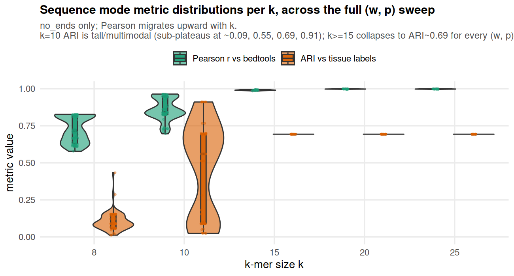
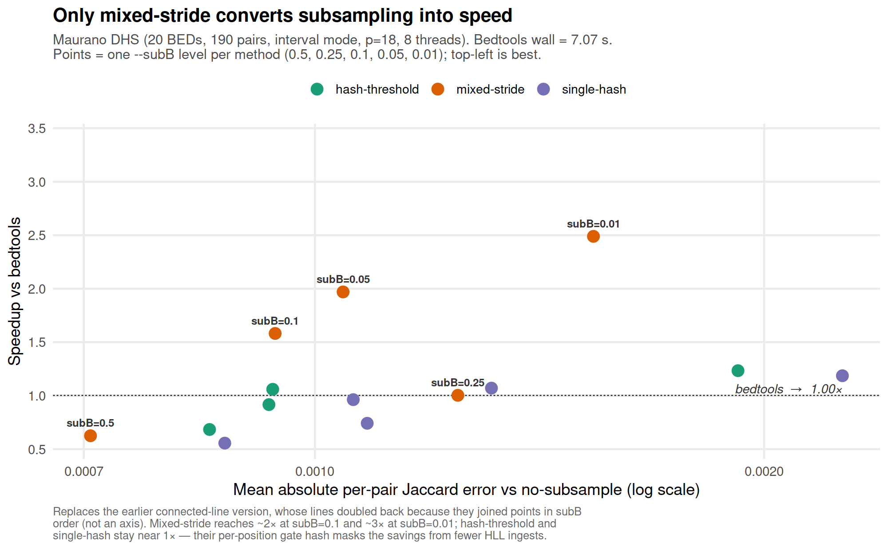

# Paper outline: hammock — fast, accurate, biology-preserving interval-set sketching

**Working title (placeholder):** *hammock: HLL-sketch similarity for genomic intervals — faster than bedtools, with biological signal preserved*

**Thesis (one sentence):** hammock — a Python+C++ HyperLogLog-backed interval-set sketcher — ranks pairwise interval-Jaccard in close agreement with bedtools (interval mode, off-diagonal Pearson r = 0.997, Kendall τ = 0.951; its register-equality estimator is *near*-affine in bedtools' set-Jaccard, order-preserving within a fixed cardinality ratio but inverting 2.5% of pairs across ratios, all at ΔJ_bedtools ≤ 0.025) while its inclusion–exclusion column `jaccard_similarity_ie` reproduces bedtools' values outright (MAE 2.0 × 10⁻⁴, r = 0.999997, τ = 0.9968 at its p = 23 optimum — 4.3 × 10⁻⁴ / 0.99999 / 0.9947 at the p = 21 used elsewhere for cross-row comparability; §3.3), and at high k/w its sequence mode additionally reproduces bedtools' values to four decimals (r ≈ 0.9996, MAE ≈ 0.006), with **interval mode**'s advantage over bedtools *growing with the number of files* — large at catalog scale, but with a crossover below which exact pairwise computation is competitive or faster (all §4.1 timings are Mode B; no sequence-mode speed comparison has been run; see the speed caveat below); the same sketches independently recover tissue clustering (ARI = 0.91) and are robust to reference-genome choice — so the speed gain comes with, not at the cost of, biological fidelity; hammock extends beyond bedtools capabilities by enabling interval comparisons across references.

---

## 1. Abstract

hammock provides two complementary similarity primitives over genomic interval sets, both backed by HyperLogLog sketches. The **interval mode** reproduces `bedtools jaccard` with substantially faster wall time and orders of magnitude lower cost at large catalog size. It emits two similarity columns, and the distinction matters: `jaccard_similarity_ie` is an inclusion–exclusion estimate that reproduces bedtools' *values* (off-diagonal r = 0.999997, MAE = 2.0 × 10⁻⁴ at its p = 23 optimum; 0.99999 / 4.3 × 10⁻⁴ at the p = 21 used below for comparison against the other estimator), while `reg_eq_similarity` is a register-equality statistic that reproduces its *ordering* (r = 0.9972, τ = 0.951) but sits above it by an offset c·(1 − J). That offset is not a constant to be subtracted: c is set by the sketch load factor and by the cardinality ratio |A|/|B|, so register-equality is order-preserving only among pairs of comparable size — on the Maurano corpus (ratio ≤ 2.2) it inverts 2.45% of comparisons, all at ΔJ_bedtools ≤ 0.025. The **sequence mode** compares the nucleotide content of intervals — a similarity primitive bedtools does not offer — recovering tissue identity from fetal DHS peak FASTAs at ARI = 0.91 / NMI = 0.96 on the 10-tissue Maurano label set, and remaining robust across human reference builds (peaks aligned to GRCh37, GRCh38, and CHM13 cluster by tissue, not by reference genome). At high k/w, sequence mode additionally closes the absolute gap, reproducing bedtools' interval-Jaccard values to four decimals (r = 0.9996, MAE = 0.0061) on Maurano DHS.

Since its release in [YEAR], bedtools has been "the Swiss Army knife" of bioinformatics, relied on to quickly calculate overlap and similarity between genomic regions within the same reference. The calculation of all-vs-all jaccard comparisons between region files is one process where bedtools' approach to pairwise comparison of BED files can be improved. Bedtools' all-pairs cost couples the number of files with the per-file size (O(N²M)), thus every additional file costs another full sweep against every other file. Our interval set sketcher, hammock, utilizes hyperloglog sketching to preserves accuracy while reducing cost by reading in each bedfile only once $(O(N^2 +NM ))$. 

## 2. Introduction
Increased availability of high-throughput sequencing has facilitated a corresponding increase in large-scale modern sequencing projects which produce vast numbers of genomic annotation datasets which then, themselves, become part of the genomic data ecosystem. Large-scale initiatives such as the ENCODE Project\cite{encode_2012}, the Roadmap Epigenomics Project\cite{roadmap_2015}, GTex[REF], and the 1000 Genomes Project\cite{10002015global} make datasets publicly available, providing unprecedented opportunities for integrative analysis. Among the most common and biologically informative outputs of these projects are genomic intervals: contiguous stretches of the genome that define transcription factor binding sites, chromatin accessibility peaks, histone modifications, structural variants, and splicing junctions. Such interval datasets have become a cornerstone of downstream analyses that seek to characterize genome function and variation across populations, tissues, cell types, and experimental conditions. Their growing scale, however, creates a substantial computational challenge. ChIP-Atlas, for example, expanded from 37,720 accumulated experiments in 2015 to 464,655 in 2025, while repositories such as ENCODE contain thousands of additional ChIP-seq and chromatin-accessibility experiments. Because the number of possible pairwise comparisons grows quadratically with the number of datasets, even a modest subset of these resources can imply millions or billions of potential comparisons.

Comparisons of interval datasets are fundamental for addressing questions of biological similarity and difference. For instance, overlap analyses enable researchers to identify conserved regulatory elements across tissues... These comparisons are typically conducted using files in the BED format, a simple tab-delimited representation of genomic intervals that has been in wide use since the early 2000s\cite{kent_hgbrowser}. While conceptually straightforward, the notion of ``overlap'' between interval sets is not trivial: it may be defined in terms of base-pair overlap, interval-level overlap, or fractional coverage, each capturing distinct biological relationships. Tools such as \program{BEDTools} provide exact calculations of these measures\cite{quinlan2010bedtools}, but the computational cost of pairwise overlap calculations grows rapidly with the size of modern repositories. In practice, this creates a scalability bottleneck that hampers systematic comparisons across the interval datasets now available\cite{li2020design}.

Scalability is not the only obstacle to systematic interval comparison. BED coordinates are meaningful only with respect to the reference genome on which they were defined, and large public collections remain distributed across multiple genome assemblies. Standard overlap measures therefore cannot directly compare two interval files when one is defined on hg19 and the other on hg38, even when the files describe the same assay or biological feature. Figure~\ref{fig} illustrates this limitation for histone-mark ChIP-seq peak files from Roadmap Epigenomics and BLUEPRINT. For histone marks represented in both collections, within-Roadmap and within-BLUEPRINT comparisons can be performed in their respective coordinate systems, whereas every Roadmap–BLUEPRINT pairing is blocked by the hg19–hg38 mismatch. Coordinate conversion can sometimes recover such comparisons, but it introduces additional preprocessing, may not map all intervals unambiguously, and continues to define similarity in terms of a selected coordinate system. An alternative is to extract the reference sequence underlying each interval and compare the resulting sequence collections directly, allowing related genomic annotations to be evaluated across references without requiring their coordinates to coincide.

Probabilistic data structures, or sketches, offer a powerful solution to this challenge. Sketching methods compress large datasets into compact representations that allow efficient estimation of set cardinality and similarity. Techniques such as MinHash\cite{minhash} and HyperLogLog\cite{hll} have seen wide application in computer science, and their introduction to genomics has already revolutionized k-mer–based comparisons of sequencing datasets. Tools like Mash\cite{mash}  and Dashing \cite{dashing} have demonstrated the value of sketching for rapid, large-scale sequence and metagenome comparisons. Extending these methods to genomic interval data, however, remains relatively unexplored. Because intervals represent continuous spans rather than discrete tokens, adapting sketches for overlap estimation presents unique methodological challenges but also significant opportunities. Because intervals represent continuous spans rather than discrete tokens, adapting sketches for overlap estimation presents unique methodological challenges but also significant opportunities. Moreover, representing intervals through both their coordinates and their underlying reference sequences provides complementary notions of similarity: coordinate-based sketches support rapid comparison within a shared reference, whereas sequence-based sketches can support comparisons across references.

In this study, we present \program{hammock}, a command-line tool for scalable comparison of genomic interval datasets. Within a shared reference genome, \program{hammock} applies probabilistic sketches to BED intervals to approximate overlap and similarity across large collections of files, reducing the computational burden of systematic pairwise analysis. We benchmark these estimates against exact calculations from established interval-processing tools and evaluate the resulting trade-offs among speed, memory use, and accuracy. We additionally introduce a sequence-based representation in which the reference sequences underlying BED intervals are extracted and sketched, enabling similarity measurements between annotations defined on different genome assemblies. Together, these approaches address two complementary barriers to large-scale interval analysis: the computational cost of expanding pairwise comparisons within a reference and the coordinate incompatibility that prevents direct comparison across references.
   

- All-vs-all pairwise interval similarity is bedtools' weakest scaling regime (O(N²·M)); large epigenome catalogs make this the bottleneck.
- Sketching trades exactness for speed; the question is *how much exactness*, and whether the sketch preserves the biology that the exact answer captures.
- Contribution: hammock, a Python+C++ HyperLogLog-backed sketcher with two operating modes (interval mode for BED, sequence mode for FASTA), plus a four-experiment validation framework that quantifies the speed/accuracy/biology trade-off on real data.

## 3. Background

### 3.1 The all-pairs interval-similarity problem

- BED file = a set of genomic intervals, treated as the base-pair set the intervals cover (merge within-file before counting).
- Pairwise similarity = base-pair Jaccard `J = |A ∩ B| / |A ∪ B|`.
- Exact all-pairs cost is O(N²·M) — couples file count with file size; the bottleneck sketching exists to break by reading each file once into a fixed-size summary.

### 3.2 Sketching for cardinality and similarity

- Define *sketch*: compact fixed-size set summary supporting approximate cardinality/similarity without retaining elements.
- Two genomics families: MinHash [@minhash] (sample hash-minimal elements) vs HyperLogLog [@hll] (extreme hash values per bucket); precedents Mash [@mash], Dashing [@dashing]; interval-set application comparatively unexplored.
- hammock uses HLL for both modes; §3.3–§3.4 develop the two pieces the results depend on.

### 3.3 HyperLogLog and the register-equality estimator

- HLL mechanics: hash → low `p` bits route to one of `m = 2^p` registers, each storing max ρ (leading/trailing-zero count, geometric: P(ρ=k)=2⁻ᵏ); cardinality via Ertl 2017 estimator [@Ertl2017]; RSE ≈ 1.04/√m, independent of input size.
- hammock reports the **register-equality** Jaccard (inherited from original `hammock`): `J_re = #{i : R_A[i]=R_B[i]≠0} / #{active}` — *not* exact set-Jaccard.
- Derivation that this is **affine** in the true Jaccard: per active register, the max-ρ "winner" is a shared element with prob ≈ J (guaranteed match), else ties by chance with prob `c` ⇒ `J_re ≈ c + (1 − c)·J`.
- Two load-bearing consequences (used in §4.2): (i) near-affine ⇒ order-preserving **at a fixed cardinality ratio |A|/|B|**, but a *different* transform per ratio, so ranking across a size-heterogeneous corpus is faithful only down to a resolution ΔJ set by the corpus's ratio spread; (ii) offset `J_re − J ≈ c·(1 − J)` is largest at low J, vanishes as J→1. The residual from the affine fit is not noise: ±0.025 (>10σ), peaking at J ≈ 0.5, and it correlates at −0.885 with `|log(|A|/|B|)|` (residual taken against `c + (1 − c)·J` with `c` the OLS intercept; the correlation moves to −0.83 under a constrained-LS `c` and −0.90 under a free-slope fit, so the residual definition must be stated — see `paper/interval_accuracy/plot_interval_accuracy.R`).
- `c` is not a universal constant. It is a step in the load factor λ = n/m (flat 0.1699 for λ ≳ 5, collapsing below: 0.118 at λ=1, 0.016 at λ=0.1) *and* a decreasing function of the cardinality ratio (0.1699 at 1:1, 0.147 at 2.2:1, 0.058 at 10:1). Any quoted offset is specific to a corpus, a precision, and a size regime.
- Since v0.5.0 every row also carries `jaccard_similarity_ie`, an inclusion–exclusion estimate of set-Jaccard with no chance floor — near-unbiased and directly comparable to bedtools magnitudes, at the cost of higher variance and censoring at 0.
- Intercept `c` = chance-tie rate of registers set by different elements. Exactly `c = Σ_{k≥1} p_k² / (1 − p_0²)` with `p_k = e^(−λ2^(−k)) − e^(−λ2^(−(k−1)))` at load factor `λ = n/m`; the `1 − p_0²` denominator conditions on the same "at least one side active" event that `matching/active` does, and the `k ≥ 1` sum excludes both-empty registers — dropping the normalization gives values up to 5× off at low λ (e.g. 4.53, not a probability, if summed from k=0 at λ=0.1). The often-quoted `Σ_k(2⁻ᵏ)² = 1/3` is a *different* conditional (both registers hold exactly one element) and is a loose upper bound not approached at any realistic λ. Measured/predicted `c ≈ 0.17` for λ ≳ 20, collapsing toward 0 as λ → 0. An estimator property, so it does not close with subsampling — but it *is* a function of λ and of the cardinality ratio `|A|/|B|`, so it is not a single constant that can be calibrated away.

### 3.4 Minimizers for sequence sketching

- Motivation: compare nucleotide content of intervals; full k-mer set is large/redundant.
- **Minimizer** scheme [@Roberts2004; @Schleimer2003]: smallest-hash k-mer per length-`w` window; subsamples k-mers ~`2/(w+1)` while preserving shared-substring minimizers (local similarity survives).
- Minimizer hashes feed the HLL of §3.3 → the register-equality statistic and inclusion–exclusion Jaccard estimate.
- Parameters as sweep axes: `k` = token specificity, `w` = density/compression; the (k, w) axes of the Results heatmaps.

## 4. Results

### 4.1 Speed: hammock's advantage grows with collection size, and is a crossover rather than a constant

> **Sources:** `experiments/subB_mixed_stride/RESULTS.md` (real DHS); `experiments/bedtools_benchmark/RESULTS.md` (synthetic).

**Real DHS (Maurano, 20 samples, 190 pairs, 8 threads for both tools — hammock `-t 8`, bedtools 8-way GNU parallel):**

> Generated by `docs/scripts/maurano_speed_table.R` from `docs/data/maurano_subB_summary.csv` (mixed-stride wall medians + per-pair MAE) and `docs/data/maurano_bedtools.csv` (bedtools reference wall); 5 reps per setting. Hammock subsample rows are mixed-stride.

| tool / setting | wall median (s) | speedup over bedtools | mean \|ΔJ\| vs hammock no-subsample |
|---|---|---|---|
| bedtools | 7.07 | 1.00× (ref) | — |
| hammock (no subsample) | 8.19 | **0.86× — i.e. 1.16× *slower*** | 0 |
| hammock (subB = 0.1, high) | 4.47 | 1.58× | 9.4×10⁻⁴ |
| hammock (subB = 0.01, max) | 2.84 | 2.49× | 1.5×10⁻³ |

> hammock does not beat bedtools at subB = 1.0 on this corpus — 1.16× slower.
> Consistent with the precision sweep's independent cross-check
> (`docs/data/sweep_precision_maurano_p18_t8.csv`): 0.81× at t=8, p=18.
> Expected: N = 20 is well below the N ≈ 64 crossover in the synthetic table
> below. Subsampling is what makes hammock win on a corpus this small; scale
> is what makes it win without subsampling.

**Synthetic scaling (10k intervals/file, p=18 — the CLI default — 16 threads for both tools; hammock `-t 16`, bedtools 16-way GNU parallel), subB=1.0:**

| N files | bedtools | hammock | speedup | bedtools cores busy | replicates |
|---|---|---|---|---|---|
| 2 | 0.14 s | 0.25 s | 0.58× | 0.4 of 16 | 20 |
| 4 | 0.17 s | 0.49 s | 0.34× | 1.2 of 16 | 20 |
| 8 | 0.28 s | 0.96 s | 0.29× | 2.8 of 16 | 20 |
| 16 | 0.75 s | 1.92 s | 0.39× | 4.2 of 16 | 20 |
| 32 | 2.58 s | 3.85 s | 0.67× | 4.9 of 16 | 20 |
| 64 | 9.88 s | 7.72 s | 1.28× | 5.1 of 16 | 3 |
| 128 | 39.56 s | 15.66 s | 2.53× | 5.1 of 16 | 3 |
| 256 | 160.54 s | 33.06 s | 4.86× | 5.0 of 16 | 3 |
| **512** | **653.41 s** | **70.97 s** | **9.21×** | **5.0 of 16** | 3 |

> **Source: `docs/data/cpp_vs_bedtools_t16_p18.csv`**, one exclusive node
> allocation, two passes: N≤32 at 20 replicates, N≥64 at 3.
>
> **bedtools wins at every N ≤ 32, monotonically, with tight replicate spread**
> (e.g. N=32 spans 2.52–2.63 s across 20 reps, CV ~1%). The crossover is
> between N=32 (0.67×, bedtools still faster) and N=64 (1.28×, hammock
> faster).
>
> **The `subB=0.1` arm is deliberately absent** — no p=18 measurement of it
> exists at this scale; Figure 3 Panel A plots subB=1.0, subsampling is Panel
> B's axis.
>
> The last column is why the speedup at large N is a real effect and not an
> artifact of a hobbled baseline: bedtools converts more of its 16 cores as N
> grows (0.4 → 5.1 of 16), plateauing well short of saturated by N≈64.
> Supplementary Fig S6 gives bedtools' own thread-scaling optimum.

Two things to communicate in this section:
1. **The advantage is a crossover, not a constant.** hammock's cost is
   dominated by sketching, which is Θ(N); bedtools re-reads every file for
   every pair, which is Θ(N²). Below N = 32 bedtools wins, reliably (20
   replicates, monotonic); the crossover falls between N=32 and N=64; from
   there the gap opens monotonically to **8.4× at N=512** for the
   inclusion–exclusion output shown in main Figure 3 (the register-equality-only
   total is 9.2× in Supplementary Fig S9). Supplementary Figure S7 shows
   measured register-equality-only hammock timings through N=2048 and a
   BEDTools projection beyond its measured N=512 point.
   **Do not write "faster at every scale tested"** — hammock is slower than
   bedtools below N≈64 on synthetic data, and slower on Maurano without
   subsampling regardless of N (1.16× slower at t=8, see table above) since
   N=20 there is below the crossover.
2. **The speedup is not bought with accuracy loss.** Subsampling changes hammock's own per-pair Jaccard by < 2×10⁻³ vs its no-subsample output, so the gap to bedtools is statistically indistinguishable across subsampling settings — the speed knob is effectively "free."

**Fig 1 (headline):** Grouped wall-time bars — bedtools vs hammock at no-subsample / subB=0.1 / subB=0.01 (mixed-stride) on the Maurano corpus. Each hammock bar is annotated with its speedup over bedtools and the mean *absolute* per-pair Jaccard change vs hammock's own no-subsample output (mean |ΔJ| ≤ 2×10⁻³; magnitude only — the absolute value is taken before averaging, so it cannot show direction, and the no-subsample bar is the baseline, not a zero), carrying "faster at no accuracy cost" in a single view. (Additional supporting figure: Fig S5.)

**Fig 2:** N-scaling out to 512 files on synthetic.

(Internal hammock-version comparisons — mixed-stride vs hash-threshold vs single-hash subB strategies, sort-time accounting, OpenMP scaling shape — belong in the supplementary methods, not the main text. The three-method speed/accuracy scatter is **Fig S5**, in the Supplementary figures section at the end.)

### 4.2 Accuracy: interval mode ranks like bedtools; sequence mode matches its values

> **Source:** `experiments/maurano_dhs_validation/RESULTS.md`.

Two distinct claims, which we are careful to keep separate. Interval mode's `reg_eq_similarity` is **rank-faithful up to a stated resolution**, not exactly: it tracks bedtools at off-diagonal Pearson r = 0.997 / Spearman ρ = 0.994 / Kendall τ = 0.951, i.e. 439 of 17,955 comparisons (2.45%) invert, all of them at ΔJ_bedtools ≤ 0.025. (The often-quoted r = 0.998 is computed over the full square matrix including 20 self-pairs pinned at (1,1); off-diagonal it is 0.9972. Fig 4 excludes self-pairs and should be read as the 0.9972 figure.) It reports the register-equality statistic, approximately an affine transform `J_re ≈ c + (1 − c)·J` of the exact base-pair Jaccard (§3.3) — order-preserving **at fixed (|A|,|B|)**, but with a different `c` for each cardinality ratio, which is what the inversions are: they are systematic (correlating at −0.885 with `|log(|A|/|B|)|` under the OLS-intercept residual, and reproducing at r = 0.994 between p = 18 and p = 21 sketch sets), not HLL noise. The offset `c·(1 − J)` is ≈ 0.16 on these low-J pairs and shrinks to zero as similarity rises; it does not close with subsampling, and it is a function of the load factor `n/m` — flat while `m ≪ n` (`c` = 0.180 at p = 12/16/20 on a synthetic 90-pair spread) and collapsing to 0.045 at p = 24 where `m > n`. Quoted offsets are therefore specific to a corpus, a precision, *and* a size regime. Where a bedtools-comparable magnitude is wanted, the `jaccard_similarity_ie` column (v0.5.0+) supplies it directly. Sequence mode, at high k/w, is by contrast **value-identical** to four decimals.

Across Maurano's 400 sample pairs:

| mode | best r vs bedtools | best MAE | claim |
|---|---|---|---|
| **interval**, `reg_eq_similarity` | **0.9972** (off-diagonal) | 0.1378; near-affine offset c·(1−J), §3.3 | rank-faithful to ΔJ ≤ 0.025 at p=21 (≤ 0.030 over p=18–23); τ = 0.951 |
| **interval**, `jaccard_similarity_ie` | **0.999997** (p=23) | **0.00020** (p=23) | τ = 0.9968; 29/17,955 inverted (0.16%) at p=23 (0.99999/0.00043/τ=0.9947, 48/17,955 (0.27%) at p=21 — used elsewhere in this section for cross-row comparability with `reg_eq_similarity`, which does not improve with precision) |
| **sequence** (k=25, w=100, p=24) | **0.9996** | **0.0061** | value-identical |

Sequence mode's numerical agreement with bedtools peaks at r = 0.9996 / MAE = 0.0061 — four-decimal-place agreement, i.e. it closes the absolute gap that interval mode leaves open. The high-correlation ridge in the (k, w) Pearson heatmap runs along the high-k / high-w edge of the sweep, indicating that sequence mode's near-perfect agreement is unlocked at long minimizer windows where interior coverage is richest. (Caveat: agreement is not monotonic in w — at the very largest windows it falls back off saturation, e.g. at k = 15, p = 24 Pearson drops from ≈ 1.0 to 0.937 at w = 500 as interior minimizers grow too sparse — so the ridge peaks at high-k / moderate-w rather than at the extreme corner.)

**Fig 3:** Per sequence mode config, Pearson r against bedtools (x-axis) vs Pearson r against interval mode (y-axis); points sit tightly on y = x. Sequence mode's agreement with bedtools is mirrored by its agreement with interval mode, so interval mode is an interchangeable interval-Jaccard reference for sequence mode — once sequence mode is validated against bedtools, it is validated against any reasonable interval-Jaccard estimator.

**Fig 4:** Two-panel line plot at p = 24, `no_ends` column (register-equality, `jaccard_similarity` in the sweep's own archived output — it predates the `reg_eq_similarity` rename; the sweep emitted it. Reading `jaccard_similarity_ie` instead does *not* reproduce the surface pointwise — 48 of 235 cells shift, max |ΔARI| 0.30, concentrated at low p — but leaves every optimum and every claim drawn off this panel unchanged; see `docs/estimator-analysis-findings.md` §9.7). **Left panel:** Pearson r vs bedtools as a function of window size w, one colored line per k (k ∈ {8, 10, 15, 20, 25}); the high-k lines (15/20/25) sit at r ≈ 1.0 across most of the w range (dipping only at the largest window, w = 500, down to ≈ 0.94), while the low-k lines (8, 10) climb toward them as w grows — together tracing the high-k / high-w Pearson ridge. **Right panel:** ARI vs tissue labels on the same axes; the k = 10 line spikes to 0.91 at w = 30 and drops off either side, while the k ∈ {15, 20, 25} lines are flat near ARI ≈ 0.69 for every w (high-k clustering is invariant to w). The contrast — Pearson is a ridge, ARI is a single peak — is the headline that Fig 6's per-config (Pearson, ARI) scatter abstracts. The original Pearson heatmap grid moves to Fig S2.

### 4.3 Biological signal: tissue identity recovery

> **Source:** `experiments/maurano_dhs_validation/RESULTS.md`.

Sequence mode's best-ARI cell is **k = 10, w = 30**, with **ARI = 0.910, NMI = 0.961** on the 10-tissue-label set (with the three muscle subtypes — arm/back/leg — counted as distinct labels) holding across **all precisions p ≥ 12** — the clustering signal is precision-cheap once the (k, w) cell is right [INCLUDE FIGURE ILLUSTRATING SETTINGS]. Hammock successfully separates and groups the tissues, reproducing the same overall dendrogram structure as the bedtools reference (Fig 5b), including its one imperfect split: one fMuscle_back sample lands with the two fMuscle_leg samples rather than getting its own cluster, in **both** dendrograms — hammock is not resolving a muscle-subtype confusion that bedtools has, it is reproducing it (`experiments/maurano_dhs_validation/RESULTS.md`: "Bedtools' own dendrogram cuts the same way for most tissues ... modulo the same ... muscle_back/leg lumping"). fMuscle_arm does land in its own cluster under both tools.

At the ARI-best config, sequence mode's predicted Jaccards sit on the y = x diagonal versus bedtools (and versus interval mode) — the sketch is numerically calibrated against the bedtools reference, not just rank-correlated.

**Fig 5:** sequence mode best-ARI dendrogram (top) paired with the bedtools reference dendrogram (bottom). Same tissue blocks recovered.

**Fig 6:** The headline methodological point: **best-Pearson cell ≠ best-ARI cell**. In the p=24 inclusion–exclusion slice shown in current Figure 7, the Pearson optimum is k=20, w=20 (r=0.99997; ARI=0.693), whereas the ARI optimum is k=10, w=30 (ARI=0.910; r=0.946). Numerical agreement and clustering quality are non-coincident knobs. The exact reference was independently regenerated with BEDTools 2.30.0 over all 400 ordered pairs and matched the checked-in reference byte-for-byte, with 0 of 190 unique pairs asymmetric.

(The per-k violin view of Pearson r and ARI — which makes the "tunable clustering only at k = 10, fixed partition at large k" contrast explicit — is **Fig S4**, in the Supplementary figures section.)

### 4.4 Robustness to reference genome

> **Source:** `experiments/ref-comparison/docs/exp_a_results.md`.

3 H3K27ac samples (heart, liver, lung) × 3 references (GRCh37/GRCh38/CHM13), 9 sample×ref combinations. Across the (k, w) sweep, same-tissue cross-reference Jaccard is significantly higher than different-tissue Jaccard at every cell with k ≥ 8 (Wilcoxon p ≤ 10⁻⁵), and by **k = 10 the two groups are *fully separated*** — the minimum same-tissue cross-reference similarity exceeds the maximum different-tissue similarity. This is a stronger statement than significant: no overlap.

Ranked by effect size (Δ = median same-tissue cross-reference − median
different-tissue) on `jaccard_similarity_ie` across all 20 (k, w) cells,
broad peaks: **k20_w20 has the largest observed Δ** (0.563), closely followed
by k20_w30 (0.561), k15_w15 (0.510), k15_w20 (0.510), and k15_w30 (0.508).
The top five sit within 0.06 of each other and the top two within 0.008, so
this reads as a **k ≥ 15 plateau** rather
than a single best cell — full separation (min(same-tissue) > max
(different-tissue)) holds throughout it, and by k = 10 it already holds too
(broad min(xref) 0.988 > max(diff) 0.935; narrow 0.985 > 0.927).

| Regime | Cells | Behavior |
|---|---|---|
| Saturated high | k ≤ 8 (any w) | Both groups ≈ 0.95–0.99; Δ ≤ 0.02 |
| Interpretable, fully separated | k = 10, w ≥ 10 | Medians ≈ 0.55–0.65 same-tissue vs overlapping-to-separated different-tissue |
| Interpretable, fully separated | k ≥ 15 (any valid w) | Δ ≈ 0.32–0.45; the clearest margin between the two groups |

**Fig 7:** UPGMA dendrogram at k=15, w=15, a representative cell from the
k ≥ 15 plateau — each tissue's three references form a tight monophyletic
clade with deep separation between tissues; broad and narrow peak calls give
the same structure.

**Fig 8:** (k × w) effect-size heatmap for broad peaks; k ≥ 15 reads as a
uniformly high-effect block.

Practical interpretation: when peaks are aligned to a different human reference than expected, the sketch still produces the same biological neighborhood. At k ≥ 15 the separation is large enough that reference choice is unambiguously a smaller source of variance than tissue identity. This is the property that lets hammock be deployed against heterogeneous catalogs (ENCODE/Roadmap mixtures) without first re-aligning everything.

This is a proof-of-concept on a deliberately small panel (3 tissues × 3 references = 9 samples; n = 18 same-tissue cross-reference pairs vs 54 different-tissue pairs), and the Wilcoxon test is at its p-floor at that n — so the result establishes that the separation is large and consistent on these tissues, not that it generalizes across the full diversity of cell types, assays, or reference builds. **n = 18/54 are *ordered* pairs, not independent units** — every unordered comparison is counted twice (`exp_a_results.md`), so the true independent-unit count is 9 cross-reference and 27 different-tissue comparisons over 9 files that themselves share samples. The medians reported above are unaffected by the doubling, but the Wilcoxon p-values should be read as indicative of consistency, not taken at face value as a properly-powered significance test. See §6.3.

### 4.5 Methodological note: sequence mode's removed flanking column

Sequence mode originally emitted a second Jaccard column,
`jaccard_similarity_with_ends`, computed on a minimizer sketch merged with a
second sketch of each record's boundary k-mers. hammock v0.6.0 removed it
(`CLAUDE.md` divergence #8; full evidence in `docs/mode-d-ends-removal.md`).
Three reasons, each measured:

- The merged score was an algebraic blend `(1−φ)·J_minimizer + φ·J_flank` at
  a weight φ set by (k, w, record count, length) and never by the user.
- k−1 of the flank sketch's k+1 per-record elements were chimeric k-mers
  spanning an artificial start/end splice, not real sequence content.
- The flank term is an exact-boundary-identity indicator: 1 bp of jitter
  destroys it (J_flank 1.000 → 0.130), and on real DHS data only 0.01% of
  intervals match exactly at their boundaries.

Its stated rationale — rescuing records too short to yield minimizers —
didn't hold either: the no-minimizer fallback fed the whole sequence into
both HLLs, so the two columns were bit-identical exactly where the flank
column was supposed to help.

On the corpora that motivated the comparison, minimizer-only
(`reg_eq_similarity`) was already the stronger column at any reasonable
(k, w): on Maurano real DHS at k=20, w=100, p=24, r_no_ends = 0.9996 vs
r_with_ends = 0.888; on a synthetic grid of 192 FASTA pairs sketched at 66
(k, w, p) cells each against exact k-mer-Jaccard ground truth, `with_ends`
carried systematically larger MAE (mean Δmae_r ≈ −0.015 across all k).
Sequence mode now emits exactly one similarity block, on the minimizer HLL.

## 5. Methods

### 5.1 hammock implementation

- Python orchestrator + C++ extension (pybind11); HLL with a register-equality statistic and inclusion–exclusion Jaccard estimate, Ertl 2017 estimator, xxh64 ingestion.
- Interval mode: per-bp HLL with optional `subB` subsampling. Sequence mode: minimizer-HLL on FASTA (§4.5 covers a since-removed second, flank-based column). (The implementation also carries two interval-coordinate variants — a coordinate-only sketch and an interpolation between it and per-bp interval mode — but neither is evaluated in this paper.)
- Similarity is reported as **register-equality Jaccard**: the fraction of active registers (nonzero in at least one sketch) whose values are equal, matching the original `hammock`'s estimator. Note this is not exact set-Jaccard — it is a *near*-affine transform of it (§3.3), order-preserving at a fixed cardinality ratio, with an offset that is flat in precision only while the sketch stays saturated (`m ≪ n`) and that varies with `|A|/|B|`. Alongside it, `jaccard_similarity_ie` reports the inclusion–exclusion estimate of set-Jaccard, which carries no chance floor. Both modes sketch the same base-pair (interval) or k-mer (sequence) universe that the exact reference does.
- Output per-pair similarity columns: `reg_eq_similarity`, `jaccard_similarity_ie`, `containment_AB`, `containment_BA`, `cosketch_{geom,arith,max}` — 7 metrics per pair in both interval and sequence mode. (Sequence mode emitted a second `_with_ends` copy of this block through v0.5.0; removed in v0.6.0, §4.5.) The `jaccard_*` columns are the analyses' default; the cosketch/containment columns are reported for transparency and inform Section 6. Through v0.6.x the standalone C++ benchmark binary omitted six of these seven unless `--metrics` was passed, so it and the Python CLI did not in fact emit the same set; since v0.7.0 both emit all seven by default and `--no-metrics` is the opt-out for timing runs.

### 5.2 Benchmark datasets

| dataset | role | n |
|---|---|---|
| Synthetic BED (`bedtools_benchmark/`) | scaling regime | up to 512 × 10k intervals |
| Synthetic FASTA pairs (`modeD_flanking/`) | exact k-mer truth for sequence mode | 192 pairs (n_intervals × mean_len × dist × mutation grid); ~12,700 (k, w, p) sweep measurements |
| Maurano 2012 fetal DHS | real interval data, 10 tissue labels (fBrain/fHeart/fIntestine_Sm/fKidney/fLung/fMuscle_arm/fMuscle_back/fMuscle_leg/fSkin/fStomach) | 20 BEDs |
| ENCODE H3K27ac (Heart/Liver/Lung × GRCh37/GRCh38/CHM13) | reference-build robustness | 9 sample×ref |

### 5.3 Statistical evaluation

Pearson r, Spearman ρ, MAE vs bedtools (interval and sequence modes); ARI, NMI vs known tissue labels (sequence mode); Wilcoxon same-tissue vs different-tissue (cross-reference); R/ggplot via CairoPNG.

### 5.4 HyperLogLog sketching

Both modes share a HyperLogLog (HLL) backbone [@Flajolet2007]. Each input set — per-bp positions for interval mode, minimizer hashes for sequence mode — is hashed with xxh64 (seed via `--seed`, default 42); the low `p` bits of each hash route it to one of `2^p` 1-byte registers, which stores the maximum leading-zero count seen among hashes routed there. Cardinality is recovered via the Ertl 2017 improved estimator [@Ertl2017]. For two sketches at matching `p` and seed, the union is the register-wise maximum. The two reported similarity families are derived from that union by **different routes**, and the distinction is load-bearing for how their values should be read:

- `reg_eq_similarity` is the **register-equality** statistic of §3.3 — the fraction of active registers whose values are equal. Register agreement is implied by, but does not imply, a shared element: two registers set by *different* elements of equal ρ also agree, which is the chance-tie term `c` that makes this an affine transform of the exact Jaccard rather than an estimate of it.
- The directional containments `|A ∩ B| / |A|` and `|A ∩ B| / |B|` (and the three co-sketch summaries derived from them) instead take the intersection cardinality by **inclusion–exclusion**, `|A| + |B| − |A ∪ B|`, evaluated with the Ertl estimator on each of the three sketches. This carries no chance-tie term, so unlike `reg_eq_similarity` these columns estimate the true set quantities — at the cost of being a difference of large estimates, hence higher variance when the intersection is small relative to the union.

The asymptotic relative standard error is ≈ 1.04 / √(2^p). For the CLI default `p = 18`, that is 1.04 / 512 ≈ 0.203% on a 2^18 = 262,144-register / 256 KiB sketch. For the high-precision configuration cited in Sections 4.2–4.3 (`p = 24`), it is 1.04 / 4,096 ≈ 0.0254% on a 2^24 = 16,777,216-register / 16 MiB sketch. Memory is independent of input cardinality — the load-bearing property that lets the same 16 MiB sketch represent a 10k-interval or a 10M-interval BED at identical cost.

### 5.5 Minimizers (sequence mode)

Sequence mode reduces each FASTA sequence to its set of (k, w)-minimizers [@Roberts2004; @Schleimer2003]: in every length-`w` sliding window over the sequence, the k-mer with the smallest selector-hash value is retained. Window scanning is delegated to the VeryAmazed `digest` library [@digest], and each unique selector hash is ingested directly into the per-sequence HLL of §5.4 via `add_hash64`. The similarity column `reg_eq_similarity` compares these minimizer HLLs. (Through v0.5.0 a second HLL also held per-record boundary k-mers, giving a `jaccard_similarity_with_ends` column; v0.6.0 removed it — see §4.5 and `docs/mode-d-ends-removal.md`. Note the description previously given here was inaccurate: hammock did not canonicalize the two flanking k-mers individually, it canonicalized their 2k *concatenation* and then hashed all k+1 sliding k-mers of it, so k−1 of the inserted elements spanned an artificial splice.) CLI defaults are `k = 8`, `w = 40`; the production-cited configurations are `k = 25, w = 100` (§4.2, numerical agreement with bedtools) and `k = 10, w = 30` (§4.3, tissue clustering).

### 5.6 Mixed-stride subsampling (`--subB-method mixed-stride`)

Interval mode's `subB` knob subsamples the per-base-pair positions that get ingested into the HLL. A natural implementation — a *hash-threshold* gate that computes a per-position xxh32 hash and compares it to `subB × UINT32_MAX` — is correct, but the per-position hash cost grows linearly with the input, so the wall-time savings from skipping positions plateau quickly: at moderate subB the gate hash itself dominates and `subB ≤ 0.5` is actually *slower* than no subsampling at all.

hammock introduces **mixed-stride** subsampling as a deterministic, hash-free alternative. For each chromosome, a fixed stride length `s = round(1/subB)` is chosen, offset by a chr-keyed hash so different chromosomes sample disjoint position phases. Ingestion walks the chromosome in stride-`s` increments — no per-position decision, no per-position hash. The accepted-position cardinality matches the hash-threshold gate in expectation, but the cost is `O(L/s)` rather than `O(L)`, so wall time scales with `subB` instead of being dominated by the gate.

Three properties matter for downstream use:

1. **Performance scaling.** At `subB = 0.1`, mixed-stride is **2.6–3.5×** faster than hash-threshold on synthetic data (corrected — the earlier "3–4×" figure was the vs-no-subsample statistic, not vs-hash-threshold) and **1.73×** faster than hash-threshold on real DHS (recomputed from `docs/data/maurano_subB_summary.csv`: 7.72 s vs 4.47 s median wall). The Maurano mixed-stride/hash-threshold ratio never exceeds **2.02×** across the subB levels tested (0.01–0.5), rising as subB shrinks. The advantage compounds further at scale: at `subB = 0.01` on 1M-interval synthetic files, mixed-stride hits 14× while hash-threshold caps at ~1.4×.
2. **Accuracy.** Per-pair MAE vs the no-subsample reference is statistically indistinguishable across the three subB methods (hash-threshold, mixed-stride, single-hash). Mixed-stride does not buy speed by losing accuracy.
3. **Determinism and reproducibility.** Output is exactly reproducible given the chr-stride seed (`--gate-seed`, default 31337). The same files at the same subB produce byte-identical HLLs across runs and machines.

The structured-sampling concern — that a fixed stride could miss periodic features — is theoretical for BED inputs at the strides we test; in practice the chr-keyed offset randomization breaks cross-chromosome alignment and the Maurano + synthetic accuracy measurements show no detectable bias. Mixed-stride is the default `--subB-method` setting; hash-threshold (`--subB-method hash-threshold`) and a single-hash variant remain available for users who want to characterize the alternative samplers.

This subsampling refinement is what makes the Section 4.1 speed numbers attainable: the "high-subsample" and "max-subsample" rows of the real-DHS table are mixed-stride at `subB = 0.1` and `subB = 0.01`. The per-method comparison plot is in supplementary.

## 6. Limitations

### 6.1 Definitional gap vs bedtools

The estimator-vs-exact gap is characterized in §3.3: interval mode's register-equality Jaccard is *approximately* an affine transform c + (1 − c)·J of the exact base-pair Jaccard — rank-faithful at off-diagonal r = 0.9972 / τ = 0.951, with absolute values carrying an offset c·(1 − J) of ~0.16 at low J on the synthetic benchmark, shrinking to zero as similarity rises. The approximation is not exact: residuals reach ±0.025 (>10σ), and because `c` depends on the cardinality ratio as well as the load factor, 2.45% of Maurano comparisons invert bedtools' ordering (all at ΔJ_bedtools ≤ 0.025). Because these are estimator properties rather than statistical noise they do not close with subsampling; the precision-flatness holds only *while the sketch stays saturated* (`m ≪ n`), collapsing once `m` exceeds `n` (0.180 at p = 12/16/20 vs 0.045 at p = 24 on the ~5 Mbp-coverage synthetic benchmark — the Maurano files cover 63–139 Mbp). The practical consequence: interval-mode `reg_eq_similarity` should be read as a ranking within comparably-sized files; for a bedtools magnitude, read `jaccard_similarity_ie`.

Two routes recover absolute magnitude. (1) **Sequence mode** at the optimal high-k/high-w cell brings MAE against bedtools down to 0.006. (2) Within interval mode, the **containment columns already estimate the true set quantities** by inclusion–exclusion (§5.4), so a set-Jaccard estimate is recoverable from existing output with no rerun: `J = 1/(1/C_AB + 1/C_BA − 1)`. Because both containments derive from a single shared intersection estimate, this recovers the inclusion–exclusion estimator exactly rather than approximating it. On the synthetic spread it tracks bedtools at MAE 5×10⁻⁴ (p = 20) and 1×10⁻⁴ (p = 24), versus 0.15 for the reported `reg_eq_similarity`.

**The trade-off is real but narrow, and the paper should scope it rather than call it a wash.** MAE scores calibration, not resolution, so resolution is measured separately by Kendall τ against exact bedtools truth — a rank statistic, chosen because it is invariant under any monotone transform of the estimator and so cannot be inflated by the register-equality column's own bias, unlike a raw standard-deviation comparison (`docs/jaccard-definitional-gap.md`).
- Below J = 0.05, τ runs register-equality 0.335 / 0.658 / 0.905 / 0.907 against inclusion–exclusion 0.289 / 0.562 / 0.794 / 0.967 at p = 12 / 16 / 20 / 24. So register-equality ranks better up to p = 20 and loses at p = 24.
- Above J = 0.05 both reach τ = 1.0000 by p = 20 on the synthetic corpus (register-equality is 0.9804 at p = 16 in the J ≥ 0.2 stratum — 1 discordant pair out of 102 — so p = 16 is not the convergence point, though the cell turns on a single comparison); those strata resolve nothing and no winner should be read out of them.
- MAE favours inclusion–exclusion in every stratum at every precision, by **12–388×** (recomputed directly from `experiments/bedtools_benchmark/results/estimator_compare_full.csv`: per-(stratum, precision)-cell MAE ratios range from 11.9× at p=12, J≥0.05 to 387.7× at p=24, J<0.05 — the previously quoted "20–1700×" did not reproduce from this file and is corrected here; `docs/jaccard-definitional-gap.md` and `docs/estimator-analysis-findings.md` §9.1 carry the old figure and should be updated to match).
- Inclusion–exclusion is censored: the `≥ 0` clamp fires on 25/90 pairs at p = 12, all at low J, so conditional on being non-zero it is biased upward near J = 0, and its relative error `≈ 0.6/(J√m)` makes it uninformative below J ≈ a few/√m. Nothing is clamped anywhere on the Maurano corpus.
- Net, as a reading rule rather than a computation rule (the CLI emits both columns unconditionally): **read `jaccard_similarity_ie`; if the corpus is low-J and the task is ranking rather than measurement, raise `-p` to 24 rather than switching columns.** Register-equality is preferable only for ranking, only below J ≈ 0.05, only at p ≤ 20, and only among pairs of comparable set size.
- Downstream: no published Mode D or cross-species headline changes under either column; at k = 20 on the primate H3K4me3 corpus inclusion–exclusion recovers one additional true clade (Laurasiatheria). Details in `docs/estimator-analysis-findings.md` §9.
- Figure: `paper/figures/estimator_crossover.png` (generator `paper/estimator_crossover/plot_estimator_crossover.R`).

### 6.2 The cosketch + containment columns are reported but not yet exploited

The five auxiliary similarity columns (containment_AB, containment_BA, cosketch_geom, cosketch_arith, cosketch_max) are present in every output CSV, in both interval and sequence mode. Current analyses use the jaccard columns as their primary signal. A 12-metric sanity check — on the since-removed 14-column schema — at the ref-comparison Exp A (k=10, w=10) cell — run before the two `_ie` columns existed — finds `cosketch_geom_with_ends` is a near-tie with `jaccard_similarity_with_ends`, while `cosketch_max` is uniformly the weakest discriminator. A full multi-metric re-evaluation across the (k, w, p) sweep and across the Maurano corpus is a natural fast-follow analysis and may identify a column (likely cosketch_geom on the minimizer-only flavor) that is more robust than jaccard at small precision or small k.

### 6.3 Reference-robustness is shown on a small panel

The reference-genome invariance result (§4.4) is established on 9 samples — 3 tissues (heart/liver/lung H3K27ac) × 3 references (GRCh37/GRCh38/CHM13), giving n = 18 same-tissue cross-reference pairs and 54 different-tissue pairs (ordered pairs — see the §4.4 caveat; the independent-unit count is smaller). The separation at k ≥ 15 is large (Δmedian ≈ 0.4, full separation of the two groups), but with this n the Wilcoxon statistic is pinned at its floor, so the p-values quantify consistency on these tissues rather than generalization. We read the experiment as a proof-of-concept that reference build is a smaller variance source than tissue identity for these marks — not as a survey across cell types, assays, or assemblies. Extending the panel (more tissues, more assays, additional assemblies) is the obvious next step before the invariance claim is relied on for heterogeneous-catalog deployment.

### 6.4 CLI wall time is not predicted by the hammock-cpp benchmark at every catalog size

Every wall-time figure in this paper times the standalone `hammock-cpp` binary (the wheel installs it, but not onto `PATH`), not the Python `hammock` CLI most users actually run. Re-measured directly (`docs/seed-hammock-cpp-file-dispatch.md` Part 2; job 29763124, `--exclusive`, N=2..2048, p=18, 16 threads, both `--metrics` and register-equality arms; the falsification-criterion node-CPU-model confound separately closed by job 29851516): the CLI-vs-hammock-cpp wall-time ratio is a non-monotonic hump, not a fixed overhead. cli/cpp = 1.54 at N=2, 0.95 at N=8, 0.72 at N=32, 0.73 at N=128, 0.86 at N=512, 0.96 at N=1024, 1.13 at N=2048. The CLI is genuinely faster N≈8–1024 (peak ~28% at N=32–128) because its file-dispatch `ThreadPoolExecutor` sketches multiple files concurrently while `hammock-cpp` sketches serially, one file at a time; the ratio converges back through parity and reverses by N=2048, where `hammock-cpp` is ~13% faster — the catalog size closest to what Figure 3's scaling claims target. Candidate mechanism for the reversal, not yet confirmed against its own magnitude: the pairwise-comparison phase is literal shared, identically-parallelized C++ code between the two front-ends and grows ~quadratically with N, diluting a sketch-phase-only dispatch advantage as it comes to dominate wall time. Consequence: the paper's reported `hammock-cpp` timings are not shown to overstate throughput at the N the scaling claims target (N≥1024); a reader benchmarking the CLI itself at smaller catalogs (N≈8–1024) may see faster wall times than the `hammock-cpp` figures here imply. Not yet done: phase-separated timing to confirm the dilution mechanism; a second independent `--exclusive` allocation to replicate the magnitude.

## 7. Discussion

- **Practical recipe.** Interval mode for fast bedtools-equivalent interval-Jaccard with optional subsampling for further speedup at no accuracy cost. Sequence mode at large k and w (k=25, w=100, p=24) for the closest numerical match to bedtools (r = 0.9996, MAE = 0.006). Sequence mode at k=10, w=30, p ≥ 12 for tissue clustering (ARI = 0.91, NMI = 0.96). Use `reg_eq_similarity` for ranking and `jaccard_similarity_ie` for magnitude. (The former `jaccard_similarity_with_ends` fallback is gone as of v0.6.0 — §4.5.)
- **The sketch carries more than bedtools captures.** Sequence mode recovers tissue clustering directly from peak FASTAs — independently from bedtools' interval overlap — at ARI = 0.91. Sketch similarity ≈ biological similarity, even when the two estimators don't agree numerically.

## 8. Conclusion

hammock provides a fast, sketch-based alternative to `bedtools jaccard`. On real DHS data interval mode matches bedtools at off-diagonal r = 0.997 (τ = 0.951) and sequence mode matches it at r = 0.9996 / MAE = 0.006. **Interval mode**'s speed advantage over bedtools grows with the number of files
being compared, and is large at catalog scale — but it is *not* present at every
scale. Every timing result in §4.1 is Mode B, and no sequence-mode speed
comparison has been run.

`bedtools jaccard` has no batch mode, so a pairwise workflow launches N²
processes, re-reading each file N times; hammock launches one process and
reads each file once. That structural difference is why bedtools' achieved
parallel efficiency lags well behind hammock's at any fixed thread count
(41% of 16 cores at t=16 vs hammock's much higher utilization — Supplementary
Fig S6), rather than being a property of sketching. Any headline speedup
should be read alongside the parallel efficiency bedtools actually achieved
in that run — see `docs/bedtools-parallelism-caveat.md`. (A sequence-mode
"faster than bedtools" claim would also need care: for BED input, sequence
mode invokes `bedtools getfasta`, so extraction cost belongs inside any such
comparison.) The same sequence mode sketches recover tissue clustering at
ARI = 0.91 directly from peak FASTAs and are robust to reference-genome
choice within a species. The combination — speed *plus* near-exact agreement
*plus* preserved biology *plus* reference-build invariance — positions
sketching as a viable default for large-scale epigenome comparison.

---

## Figure index

| # | Path | Carries |
|---|---|---|
| 1 | `docs/figures/maurano_speed_bars.png` (data: `docs/data/maurano_subB_summary.csv` + `docs/data/maurano_bedtools.csv`, script: `docs/scripts/maurano_speed.R`) | hammock wall-time bars vs bedtools at no-sub / subB=0.1 / 0.01 |
| 2 | `docs/figures/synthetic_nscaling.png` (data: `docs/data/cpp_vs_bedtools_t16_20260804_172242.csv`, script: `docs/scripts/synthetic_nscaling.R`) | synthetic scaling to N=512 |
| 3 | `docs/figures/mode_d_bedtools_vs_modeB_scatter.png` (data: `docs/data/mode_d_summary.csv`, script: `docs/scripts/mode_d_bedtools_vs_modeB_scatter.R`) | per-config sequence mode r vs bedtools vs interval mode (y=x) |
| 4 | `docs/figures/mode_d_lines_p24.png` (data: `docs/data/mode_d_summary.csv`, script: `docs/scripts/mode_d_lines.R`) | sequence mode Pearson ridge vs ARI peak at p = 24 |
| 5 | `maurano_dhs_validation/figures/mode_d_best_dendrogram.png` + `bedtools_dendrogram.png` | tissue recovery (a + b panels) |
| 6 | `docs/figures/mode_d_metric_tradeoff.png` (data: `docs/data/mode_d_summary.csv`, script: `docs/scripts/mode_d_metric_tradeoff.R`) | Pearson-best ≠ ARI-best |
| 7 | `ref-comparison/figures/cross_ref_dendrogram_k15_w15.png` | within-tissue clades across refs (headline cell) |
| 8 | `ref-comparison/figures/sweep_effect_size_broad.png` | cross-ref effect-size heatmap, broad |
| S1 (supp) | `ref-comparison/figures/metric_comparison_broad_k10_w10.png` | 12-metric Wilcoxon comparison at k=10, w=10 (pre-v0.5.0 schema) |
| S2 (supp) | `maurano_dhs_validation/figures/mode_d_pearson_heatmap.png` | full Pearson heatmap grid across precision × column flavor (faceted) |
| S3 (supp) | `maurano_dhs_validation/figures/mode_d_clustering_ari.png` | full ARI heatmap grid across precision × column flavor (faceted) |
| S4 (supp) | `docs/figures/mode_d_violins_by_k.png` (data: `docs/data/mode_d_summary.csv`, script: `docs/scripts/mode_d_violins.R`) | per-k Pearson and ARI distributions across full (w, p) sweep |
| S5 (supp) | `docs/figures/maurano_subB_pareto_scatter.png` (data + script as Fig 1) | subB-method speed/accuracy scatter (de-zigzagged former headline Pareto) |
| S6 (supp) | `paper/figures/threading_supplement.png` (data: `docs/data/sweep_threads_p18.csv`, script: `paper/pairwise_scaling/plot_threading_supplement.R`) | thread scaling of both tools at N=64, p=18 — wall, speedup vs own t=1, parallel efficiency |
| S7 (supp) | `paper/figures/largeN_supplement.png` (data: `docs/data/cpp_vs_bedtools_t16_p18{,_largeN}.csv`, script: `paper/pairwise_scaling/plot_largeN_supplement.R`) | hammock measured to N=2048 against a *projected* BEDTools curve |
| S8 (supp) | `paper/figures/precision_frontier.png` (data: `docs/data/sweep_precision_maurano_p18_t{8,16}.csv`, script: `paper/pairwise_scaling/plot_precision_frontier.R`) | accuracy/speed frontier over p=12-24 on Maurano, plotted directly rather than on twin axes |

(The `synthetic_speedup_vs_nosub.png` figure showing within-hammock subB-method comparison moves to supplementary — per the constraint that internal hammock-version performance differences are not paper material.)

---

## Supplementary figures

**Fig S1:** 12-metric Wilcoxon comparison at k=10, w=10 (broad peaks; the pre-v0.5.0 schema, without the two `jaccard_similarity_ie` columns). `jaccard_similarity_with_ends` gives the best Δ/saturation trade-off; `cosketch_geom_with_ends` is a near-tie; `cosketch_max` is the weakest discriminator. Backs the metric-choice discussion in §6.2.

**Fig S4:** Per-k violin plot of Pearson r and ARI (moved from the main text). **x-axis:** k (8, 10, 15, 20, 25). **y-axis:** metric value on [0, 1], shared scale. **Two violins per k:** Pearson r vs bedtools (across every (w, p) cell at that k) and ARI vs the 10 fetal-tissue labels (across every (w, p) cell at that k), `no_ends` column only. Pearson violins march steadily upward with k. The ARI side has two distinct shapes: at **k = 10 the violin is tall and multimodal**, spanning from near zero up to 0.91 with a visible upper lobe at 0.91 separated from the bulk by a clear gap (only the (w = 30, p ≥ 12) slice hits that upper plateau); at **k ∈ {15, 20, 25} the violin collapses to a horizontal line at ARI = 0.693** because every (w, p) cell at those k values gives the *same* partition. Together those two shapes carry the message: tunable clustering quality exists only at k = 10; large k locks the sketch into a fixed sub-optimal partition. The full ARI heatmap grid is Fig S3.

**Fig S5:** subB-method speed/accuracy scatter — speedup vs bedtools (y) against mean per-pair Jaccard error vs the no-subsample reference (x, log); points for each `--subB` level of all three methods, no connecting line. Only mixed-stride converts subsampling into speed (~2× at subB=0.1, ~3× at subB=0.01); hash-threshold and single-hash stay near 1×. De-zigzagged replacement for the former headline Pareto (§4.1).

(Figs S2 and S3 — the full Pearson and ARI heatmap grids — are listed in the figure index above but not yet rendered here; add their images to this section when the panels are finalized.)

### Supplementary Figure S6 — Thread scaling (`paper/figures/threading_supplement.png`)

Generated by `paper/pairwise_scaling/plot_threading_supplement.R` from
`docs/data/sweep_threads_p18.csv` (one exclusive node allocation; synthetic
corpus, 64 files/side, 10k intervals/file, p=18, subB=1.0, 3 replicates,
medians). The hammock curve uses the historical register-equality-only output
mode; this run did not measure inclusion--exclusion output.

**Separate from Figure 3 on purpose.** Figure 3 is about how cost scales with
the number of files; this is about what each tool does with the cores it is
given. They answer different questions and share no axis.

- Three panels: wall time, speedup vs that run's own *t* = 1, parallel
  efficiency. Efficiency is computed **within** the run — the threads axis is
  self-calibrating because *t* = 1 is one of its own points, so no cross-run
  comparison enters (which matters here: absolutes on this cluster are not
  portable between jobs).

| threads | 1 | 2 | 4 | 8 | 16 | 32 | 48 |
|---|---|---|---|---|---|---|---|
| BEDTools speedup | 1.00 | 1.44 | 2.68 | 4.22 | 4.29 | 4.22 | 4.20 |
| BEDTools cores busy | 1.2 | 2.1 | 4.1 | 6.4 | 6.5 | 6.5 | 6.4 |
| hammock speedup | 1.00 | 1.77 | 3.21 | 6.04 | 10.63 | **12.11** | 11.59 |
| hammock cores busy | 1.0 | 1.8 | 3.5 | 7.2 | 14.9 | **24.0** | 28.1 |

- **BEDTools plateaus by t=8 (4.22×) and stays flat through t=48 (4.20×)** —
  no further gain, but also no regression. hammock keeps improving to t=32
  (12.11×, 24.0 of 32 cores busy) then eases back slightly at t=48 (11.59×,
  28.1 of 48 — an oversubscription effect worth cross-referencing against
  `docs/seed-mode-d-threading.md`'s sibling finding for interval-mode pools,
  not a new mechanism specific to this figure).
- **The mechanism:** `bedtools jaccard` has no batch mode, so a pairwise
  workflow is N² process launches under a GNU `parallel` wrapper, re-reading
  each file N times; hammock is one process reading each file once. That
  structural difference is why BEDTools saturates its achieved parallelism
  (6.5 of 16-48 cores) far below hammock's — a consequence of batch-mode
  absence, not a process-creation rate ceiling.
- **Why this figure has to exist.** Any speedup quoted at a fixed thread count
  assumes both tools converted cores into throughput. At *t* = 16 BEDTools
  converts 6.5 of 16 cores (41%). Every BEDTools row in the benchmark CSVs now
  carries `mean_bedtools_parallel_eff` so the assumption is checkable rather
  than implicit.
- Caveat to state in the caption: one node, one corpus size, one precision. The
  *level* of BEDTools' achieved parallelism is node-dependent (measured 1.17×,
  1.68×, 2.86× on three configurations with identical code); the *shape* —
  early saturation, then a plateau rather than a steep regression — is the
  part to trust as general.

### Supplementary Figure S7 — Catalog scale (`paper/figures/largeN_supplement.png`)

Generated by `paper/pairwise_scaling/plot_largeN_supplement.R` from
`docs/data/cpp_vs_bedtools_t16_p18.csv` joined to
`docs/data/cpp_vs_bedtools_t16_p18_largeN.csv` — hammock-only, N ∈ {512,
1024, 2048}, p=18, t=16, same synthetic corpus generator and seed schedule
as Figure 3A.

**Separate from Figure 3 on purpose.** Figure 3 plots two *measured* curves.
This one plots a measured hammock curve against a **projected** BEDTools curve,
and putting an extrapolation in the same panel as two measurements is exactly
how a projection ends up quoted later as if it had been run. The projected
segment is dashed, grey, drawn with open points, and annotated on the panel.

- **Why project.** BEDTools measures ~4.0× per doubling (fitted exponent 2.000
  below), **653 s per replicate at N=512**, so one replicate is ~0.7 h at
  N=1024 and ~2.9 h at N=2048 — ~11 h of node time for three replicates at
  each, to extend a comparison already decided by N=256. hammock at p=18 is
  sketching-dominated and near-linear, so measuring
  *it* at catalog scale costs minutes. N≈2048 is a real corpus size, not a round
  number: the ChIP-Atlas manifest holds 2,206 verified hg38 CTCF files.

| N | 512 | 1024 | 2048 |
|---|---|---|---|
| hammock, measured (s) | 71.35 | 164.68 | **417.27** |
| BEDTools | 653.4 (measured) | 2574 (proj.) | 10294 (proj.) |
| speedup | 9.2× | 15.6× (proj.) | 24.7× (proj.) |

hammock crosses over and pulls ahead as N grows, projected to ~25× by
N=2048.

- **Two checks the script runs and prints, and fails loudly on.** (i) N=512 is
  measured by *both* source CSVs, on different nodes: 70.97 s vs 71.73 s,
  **1.1%** — well within this cluster's documented node-to-node spread. That
  is the only thing making the cross-allocation join checkable, and this
  cluster does not guarantee two allocations are comparable. (ii) The
  BEDTools exponent is
  *fitted*, not assumed: **2.000** (theory 2.0), R² = 0.9999, on N ≥ 32 only —
  below that the run is dominated by fixed process/module startup that does
  not scale with pair count, and including it would bias the projection in
  our favour.
- **hammock's own curve bends and must not be extrapolated as a straight line
  on log–log.** Its cost per doubling is rising — 2.30× (512→1024) then 2.53×
  (1024→2048) — because the pairwise phase is Θ(N²) and is overtaking the
  linear sketching phase. The projection is only applied to BEDTools; the
  hammock points beyond N=512 are measured, and no hammock point is projected.
- **The 9-column metrics block costs 1.27× at N=2048** (529.6 s vs 417.3 s),
  against 1.00× at N=20 on Maurano. Same reason: the block is per *pair*, so its
  share grows with N. Any "the metrics are free" statement taken from a
  small-N run does not generalise — quote the N it was measured at.

### Supplementary Figure S8 — Precision frontier (`paper/figures/precision_frontier.png`)

Generated by `paper/pairwise_scaling/plot_precision_frontier.R` from
`docs/data/sweep_precision_maurano_p18_t16.csv` (20 Maurano DHS files, 380
ordered pairs after self-pair exclusion, subB=1.0, p ∈ {12,14,16,18,20,22,24},
3 replicates, means). The t=8 companion (`sweep_precision_maurano_p18_t8.csv`)
is the cross-check, not a second series.

**x = MAE of `jaccard_similarity_ie` vs exact BEDTools (log), y = speedup vs
BEDTools (log), one point per p.** Deliberately *not* twin y-axes against p:
twin log axes have no canonical registration, so sliding one relative to the
other moves the apparent crossing anywhere, and "the curves cross at p=18"
would be a statement about axis limits. Plotted this way, iso-accuracy is a
vertical line and "slower than BEDTools" is the shaded region below y=1.

| p | 12 | 14 | 16 | **18** | 20 | 22 | 24 |
|---|---|---|---|---|---|---|---|
| speedup vs BEDTools (t=16) | 0.744× | 0.742× | 0.709× | **0.659×** | 0.435× | 0.210× | 0.0726× |
| MAE of *J*IE | 8.8e-3 | 4.0e-3 | 2.7e-3 | **1.15e-3** | 5.9e-4 | 2.8e-4 | 1.5e-4 |

At no precision in this sweep does hammock beat BEDTools on this corpus.
- **Accuracy costs steeply and buys a lot.** MAE improves **57×** from p=12 to
  p=24 while speed falls ~10×. There is no accuracy/speed "knee" to trade off
  toward on this corpus — speed only gets worse with precision, so the choice
  of p here is purely an accuracy decision.
- **This panel must be read together with Figure 3A, not against it.** At N=20
  hammock is slower than BEDTools at every precision tested (0.0726×–0.744×);
  Figure 3A reports 8.4× at N=512 for inclusion–exclusion output. Both are true: Maurano is 20 files, below
  the N≈64 crossover, so sketching cost has not yet been amortised over enough
  pairs. The x-axis here is *precision at fixed N*; Figure 3A's is *N at fixed
  precision*.
- **`reg_eq_similarity` cannot appear on this x-axis.** Its MAE is 0.1374–0.1383
  across the whole sweep — it varies **1.01×** while the IE column moves 57× —
  because it is dominated by the register-equality chance-agreement floor, not
  by sampling noise. Precision does not fix it (CLAUDE.md divergence #2), and
  plotting it would draw a vertical line implying precision buys nothing.
- **Two gates the script enforces and dies on.** Pair count must be exactly 380
  (400 minus 20 self-pairs) — at 400 every MAE would be ~5% low from twenty
  exact-1.0 rows; and accuracy at t=8 must be *bit-identical* to t=16, since
  threads change only how fast a deterministic sketch is built. Measured
  max |ΔMAE| = 0, exactly.
- Caveat for the caption: one corpus, one node, subB=1.0 throughout. The p=18
  point is the same accuracy/methodology as Figure 3 Panel B's Maurano bar
  (`jaccard_similarity_ie` metrics-block arm) but **not the same thread
  count** — this sweep is t=16 (`sweep_precision_maurano_p18_t16.csv`) while
  Figure 3 Panel B runs at t=8, so their wall times are not expected to
  match exactly (recomputed: 6.42 s at t=16 here vs 9.40 s at t=8 in
  `docs/data/maurano_subB_ie_summary.csv`). The t=8 companion
  (`sweep_precision_maurano_p18_t8.csv`) is the cell that should actually
  agree with Figure 3 Panel B, and does.
