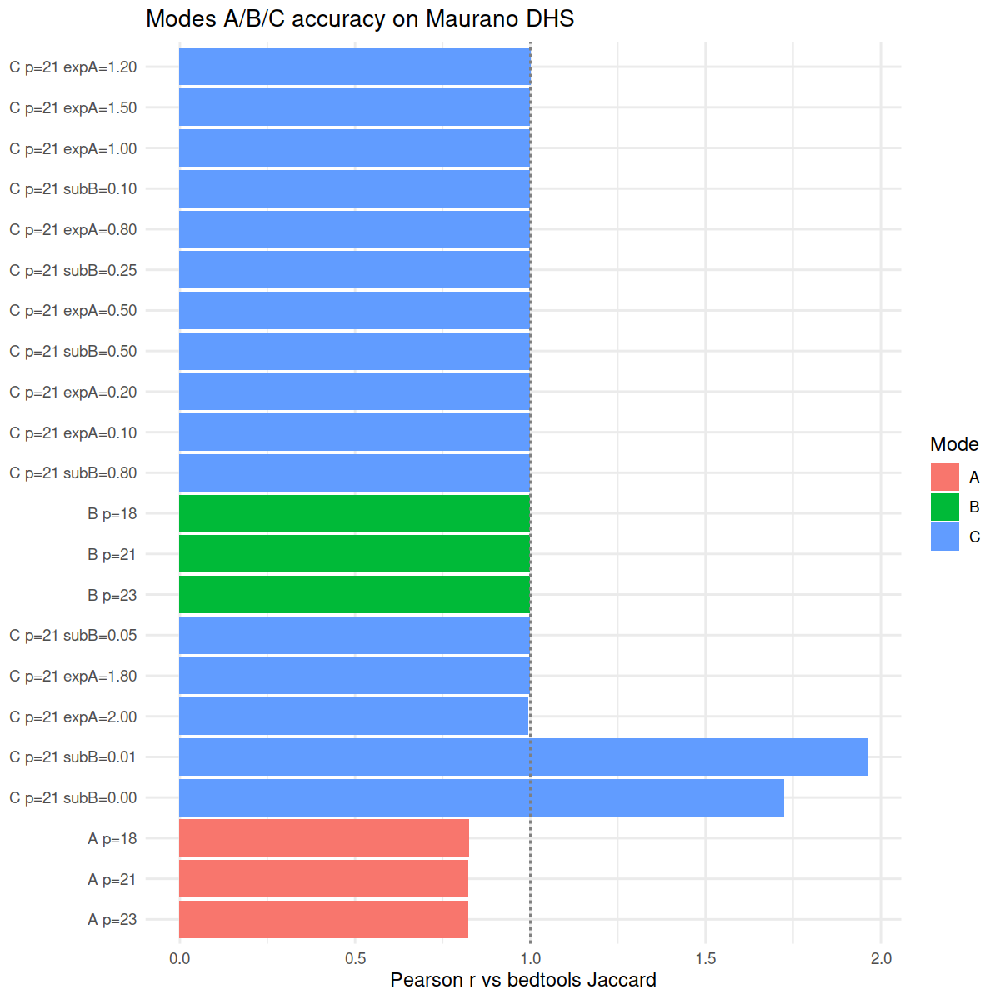
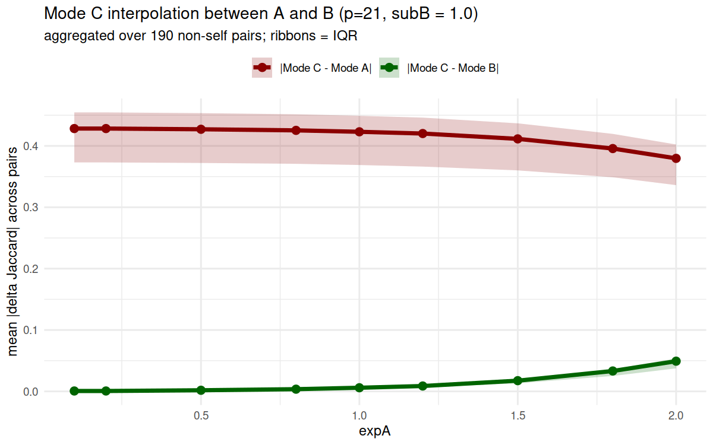
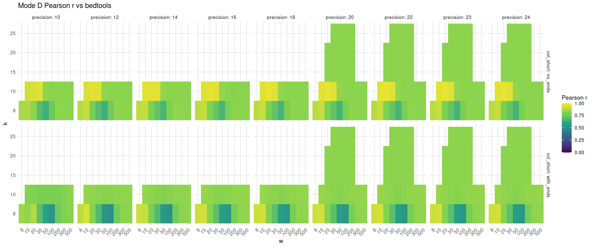
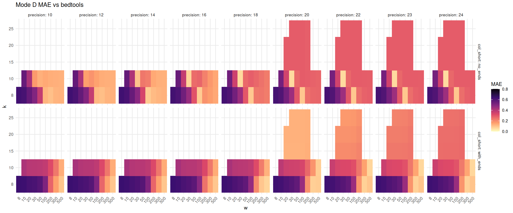
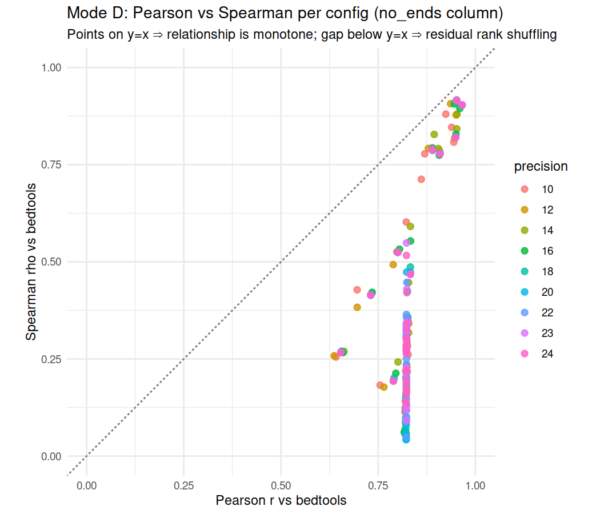
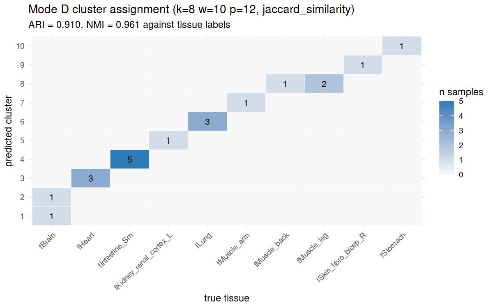
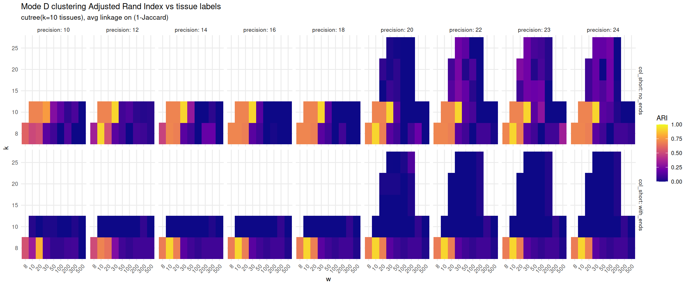
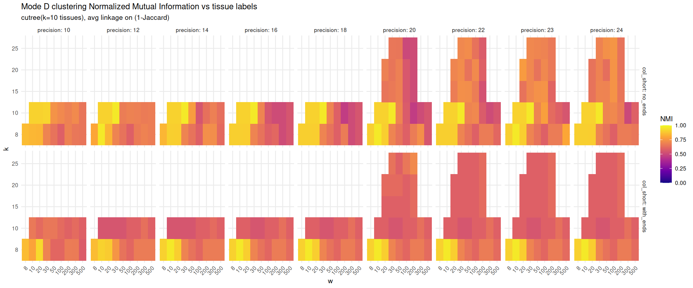
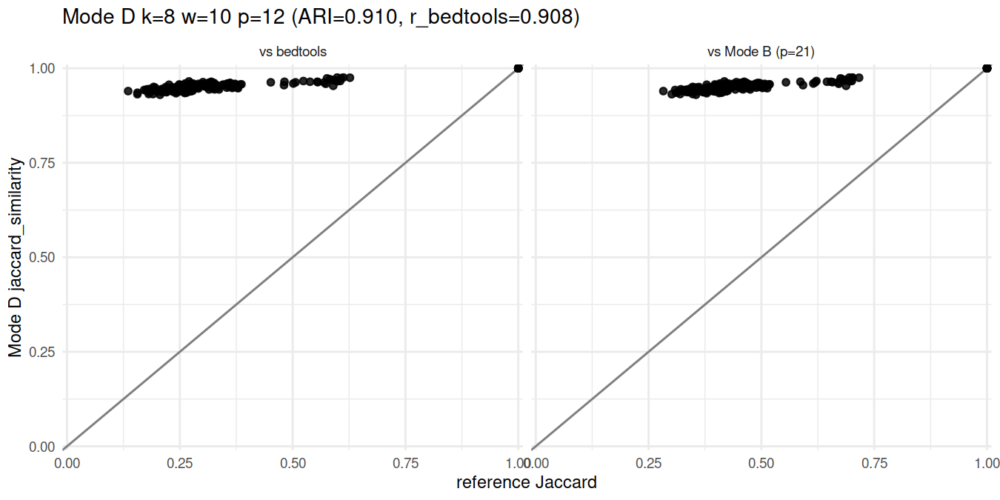

# maurano_dhs_validation — results notes

Generated from the 2026-05-13/14 sweep (209 Mode D configs × 2 columns ×
2 references + 24 A/B/C configs). Numbers below come from
`results/abc_summary.csv` and `results/mode_d_summary.csv`; figures live
in `figures/`.

---

## Modes A, B, C vs bedtools

**Mode B is essentially perfect against bedtools (r = 0.998 at every
precision), and every Mode C variant inherits that.** Mode A is the only
mode that breaks down (r ≈ 0.82) — the interval-only HLL throws away the
length information that bedtools cares about. So when we later ask "does
Mode D recapitulate bedtools," Mode B is a perfectly good stand-in.

---

## Mode C interpolation between Mode A and Mode B

**subB is a sharp knob between Mode-A-like (low subB) and Mode-B-like
(high subB), with the crossover near subB ≈ 0.005.** Below that Mode C
closely tracks Mode A; by subB = 0.01 it has flipped to Mode-B-like
(|C − B| = 0.14 vs |C − A| = 0.29). Above subB ≈ 0.05 Mode C and Mode B
are indistinguishable at the per-pair level.

**expA is a much weaker knob — within `expA ∈ [0.1, 2.0]` Mode C never
leaves Mode-B territory.** |C − Mode B| stays under 0.05 across the whole
sweep. If you want to tune Mode C toward Mode A behaviour, use subB;
expA barely moves the needle.

---

## Mode D vs bedtools — sweep maps

**A high-correlation ridge sits at k = 10, w ∈ {20, 30, 50}, p ≥ 20 in
the `no_ends` column** (Pearson r ≈ 0.96). The `with_ends` column tops out
around 0.93 with much higher MAE. Low precision (p ≤ 14) hurts both
columns, but more in `with_ends`. The heatmap is the right shape for this
sweep — we're asking "where in the (k, w) plane is the optimum?"

**The Pearson-best config is *not* the MAE-best config.** At k = 10,
w = 20, p = 24 the MAE is 0.35 (Mode D predicts ~2× bedtools despite
excellent rank correlation). The MAE optimum is k = 10, w = 30, p = 24
with MAE = 0.060 — six times better numerical agreement, but you'd never
read that off the Pearson plot.

---

## Pearson vs Spearman per config (does scale matter?)

**Most configs sit just below the y = x line: Spearman is consistently
0.05–0.10 below Pearson.** That gap means the bedtools→Mode-D relationship
isn't *purely* monotone — there's some rank shuffling, not just a scale
offset. A few low-precision configs that have decent Pearson collapse to
much worse Spearman (the bottom-left cluster), which is the more honest
signal that they aren't reliably ordering pairs.

---

## Mode D vs bedtools vs Mode B (per config)

**Points lie tightly on y = x: r(D, bedtools) ≈ r(D, Mode B) for every
config.** That's expected — Mode B is r = 0.998 vs bedtools, so it's an
interchangeable reference. This is more useful as a sanity check than a
discovery: if you've validated Mode D against bedtools, you've effectively
validated it against any reasonable interval-Jaccard estimator.

---

## The headline tradeoff — numerical agreement vs clustering recovery

**The best-Pearson config and the best-ARI config are in different
corners of the plot.** Each point is one Mode D config; circled points
are the best of each metric. A handful of (k = 10, w = 20–30, p ≥ 20)
configs sit far right (Pearson ≈ 0.96) but only middle-vertical
(ARI ≈ 0.7). The ARI-best config sits high-left (Pearson ≈ 0.91 but
ARI = 0.91). They are not the same setting. Which one you pick depends
on what "recapitulate" means.

---

## Clustering recovery — the actual tissue clustering

The ARI-best Mode D config is **k = 8, w = 10, p = 12** with
**ARI = 0.910, NMI = 0.961** against the 10 fetal-tissue labels.

**The dendrogram is annotated with the predicted 10 clusters (blue
boxes).** Most tissue groups end up as their own clade: the 5
fIntestine_Sm samples, the 3 fHeart, the 3 fLung, the kidney/skin/stomach
singletons. The two errors visible are (a) the two fBrain samples land
in different clusters and (b) one fMuscle_back is grouped with the two
fMuscle_legs — a sub-tissue split that arguably shouldn't be penalised.
Compare to the bedtools reference below.

**Bedtools' own dendrogram cuts the same way for most tissues** — the
intestine block, the heart block, the muscle clade — modulo the same
brain-pair split and the same muscle_back/leg lumping. Mode D isn't
ignoring biology to score 0.91 on ARI; it's reproducing the bedtools
dendrogram structure.

### Cluster contingency

Predicted cluster × true tissue label at k = 8, w = 10, p = 12
(`results/best_cluster_contingency.csv`):

| predicted | fBrain | fHeart | fIntestine_Sm | fKidney | fLung | fMuscle_arm | fMuscle_back | fMuscle_leg | fSkin | fStomach |
|----------:|:-:|:-:|:-:|:-:|:-:|:-:|:-:|:-:|:-:|:-:|
| 1 | 1 | . | . | . | . | . | . | . | . | . |
| 2 | 1 | . | . | . | . | . | . | . | . | . |
| 3 | . | 3 | . | . | . | . | . | . | . | . |
| 4 | . | . | 5 | . | . | . | . | . | . | . |
| 5 | . | . | . | 1 | . | . | . | . | . | . |
| 6 | . | . | . | . | 3 | . | . | . | . | . |
| 7 | . | . | . | . | . | 1 | . | . | . | . |
| 8 | . | . | . | . | . | . | 1 | 2 | . | . |
| 9 | . | . | . | . | . | . | . | . | 1 | . |
| 10 | . | . | . | . | . | . | . | . | . | 1 |

Per-sample assignments are in `results/best_cluster_assignment.csv`.

**Same contingency as a heatmap.** Every column has its mass concentrated
on a single row (or two adjacent rows for the muscle subtypes / brain
pair). That's why ARI gets to 0.91.

---

## Sweep maps for the clustering metrics

**ARI peaks in a different region from Pearson.** The ARI > 0.8 plateau
covers k ∈ {8, 10}, w ≤ 30, **all precisions p ≥ 10** — i.e. tissue
clustering survives at very low precision. `with_ends` (right column) is
much worse at clustering because it inflates pair similarities
disproportionately for files with many short sequences, blurring the
between-tissue contrast.

**NMI tells the same story.** Peak 0.96 at k = 8, w = 10, p = 12. The
biological-signal regime is broader and tolerates lower precision than
the numerical-agreement regime.

---

## Best-config scatter vs both references

**At the ARI-best config, predictions sit above the y = x diagonal on
both panels** — Mode D's `no_ends` Jaccard is systematically inflated
relative to either bedtools (left) or Mode B (right) — but the inflation
pattern is consistent and monotone. The clustering structure (which is
all ARI/NMI care about) survives the scale shift intact.

---

## Summary — which metric for which question?

| If you want to answer... | Use | At config | Value |
|---|---|---|---|
| Do predictions covary with bedtools?   | Pearson r | k=10, w=20, p=24 | 0.966 |
| Do predictions rank-order the same?    | Spearman ρ | k=10, w=10, p=14 | 0.916 |
| Are the absolute Jaccards close?       | MAE        | k=10, w=30, p=24 | 0.060 |
| Is the biology preserved?              | ARI        | k=8,  w=10, p=12 | 0.910 |
| Is the biology preserved (info-theory)?| NMI        | k=8,  w=10, p=12 | 0.961 |

Different metrics → different optimal configs because Mode D estimates
k-mer set Jaccard while bedtools estimates interval-overlap Jaccard.
These are monotonically related on this corpus but not identical, so
the choice of metric encodes the choice of which property you care about.
