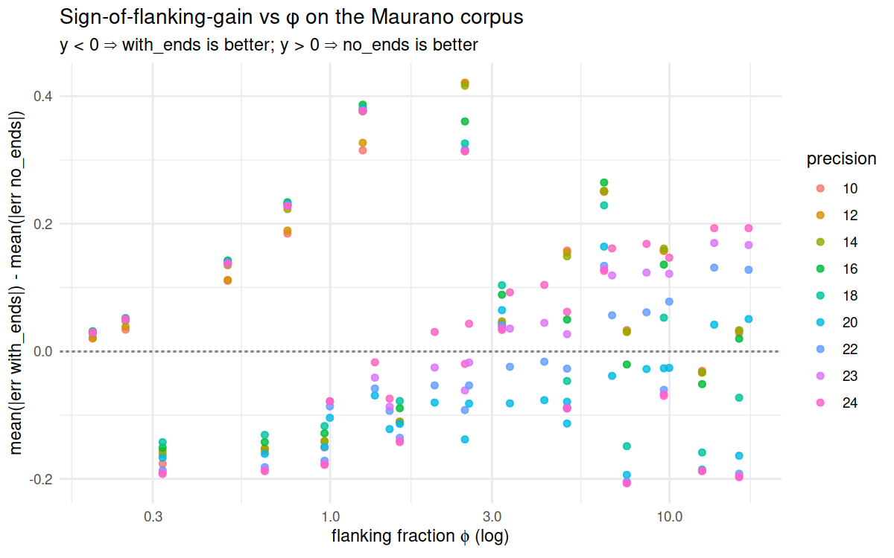

# modeD_flanking — When (if ever) do boundary k-mers help Mode D?

Mode D emits two Jaccard estimates per pair:

| column | what it counts |
|---|---|
| `jaccard_similarity`           | minimizers only |
| `jaccard_similarity_with_ends` | minimizers **plus** the first / last `(k-1)` k-mers of every sequence ("ends" / "flanking k-mers") |

The `_with_ends` form was originally introduced because short sequences may
contain *no* minimizer — every interior k-mer's minimizer happens to fall
outside the sequence — so the sketch is empty without boundary content. The
question this experiment asks is the natural follow-up:

**Under what conditions do the flanking k-mers actually improve the
estimate, and under what conditions do they corrupt it?**

The Maurano DHS sweep (`experiments/maurano_dhs_validation/`) gave the
first hint: at small `w`, `_with_ends` is wildly inflated (mean pred ~0.97
vs bedtools truth ~0.34); at modest `w` the no-ends column tracks bedtools
much more cleanly (k=10, w=20, p=24 → r=0.966 vs `_with_ends` r=0.93). But
that's one corpus, one ground-truth notion (bedtools interval Jaccard),
and one regime of sequence lengths. This experiment widens that picture.

---

## Hypothesis

Flanking k-mers help when interior minimizers are *sparse* relative to the
information they need to convey, and hurt when they are dense enough to
already characterise the sequence.

Concretely:

1. **Help regime:** short sequences (length ≲ `w`), few intervals, large
   `w`. Every sequence contributes only its flanks; without them, the
   sketch is empty or near-empty and the Jaccard is unstable.
2. **Hurt regime:** many short intervals concatenated into one FASTA
   (e.g. ChIP-seq / DHS peak FASTAs — thousands of ~150 bp regions).
   Boundary k-mers are over-represented relative to information content,
   and any two corpora with similar length distributions will share
   their flanking-k-mer fingerprints by coincidence — inflating Jaccard.
3. **Indifferent regime:** long, single-contig sequences (e.g. assembled
   mitochondrial genomes). Boundaries are 2(k-1) k-mers in a sequence of
   ~16 kb, so they're noise-level either way.

If these are right, the deciding parameter is the ratio of "boundary
k-mers per FASTA" to "minimizers per FASTA" — call this the **flanking
fraction** φ:

> φ ≈ ( 2 · (k−1) · n_intervals ) / ( total_length / w )

When φ is small, the two columns should agree. When φ is large,
`_with_ends` inflates and decouples from interior content.

---

## Design

Two parts, decoupled so part 1 needs no new compute:

### Part 1 — re-analyse `maurano_dhs_validation`

The Maurano sweep has already produced ≥ 200 Mode D CSVs, each with both
similarity columns. Read those, join against the bedtools reference, and:

- compute `Δr = r(no_ends) − r(with_ends)` and `Δmae = mae(no_ends) − mae(with_ends)`
  per `(k, w, p)`,
- compute φ from the input FASTAs (a single scalar per pair, since the
  Maurano corpus has a single (n_intervals, length distribution) per file
  — but φ does vary across pairs because both files contribute),
- plot `Δr` and `Δmae` against `w`, `k`, and φ; the prediction is a sign
  flip around some threshold of φ × w.

This is the "free" part: no hammock re-runs, just a new R/Python analysis
pass over existing CSVs.

### Part 2 — synthetic corpora with exact k-mer Jaccard ground truth

bedtools Jaccard is the wrong yardstick for the *flanking-k-mer* question:
boundary k-mers come from sequence content, not interval coordinates, so
the right ground truth is **exact k-mer set Jaccard** (the same notion
the `mode-d-optimality` experiment used in the original hammock repo).

Generate synthetic FASTA corpora that systematically vary:

| axis | values |
|---|---|
| `n_intervals` (per FASTA) | 10, 100, 1 000, 10 000 |
| mean interval length     | 50, 150, 500, 5 000 bp |
| length distribution      | constant, lognormal (σ=0.5), heavy-tailed (σ=1.5) |
| mutation rate between pair | 0.01, 0.05, 0.15, 0.30 |

For each (n_intervals, length, dist, mutation), produce a pair of FASTAs
with known divergence. Compute:

- **exact k-mer Jaccard** at the test k (ground truth);
- Mode D Jaccard, both columns, at the same (k, w, p);
- φ (flanking fraction) for the pair.

Then ask: at what φ does `(with_ends − no_ends)` flip sign, and how does
that boundary move with mutation rate?

### Optional Part 3 — real long-contig negative control

The old hammock `fish-mito` experiment has 25 mitochondrial FASTAs (~16 kb
single contigs, almost zero boundary k-mers relative to interior). It's
the cleanest "ends shouldn't matter" datapoint. Symlink those FASTAs in,
run a small (k, w, p) grid, and confirm the two columns agree on this
corpus.

---

## Reuse from `maurano_dhs_validation`

| asset | how used |
|---|---|
| `results/raw_d/*.csv`        | source for Part 1; both similarity columns already present |
| `data/maurano_bedtools_ref.tsv` | ground truth for Part 1 |
| `data/fastas/*.fa`           | inputs for measuring φ (length distribution) per file |
| `workflow/Snakefile` style   | template for this experiment's Snakefile |

Nothing in this experiment overwrites or modifies anything in
`maurano_dhs_validation/`; we only read from it.

---

## Outputs

- `results/part1_flanking_vs_bedtools.csv` — per-(k,w,p) Δr / Δmae and φ stats
- `results/part2_synthetic_truth.tsv`     — exact k-mer Jaccards for synthetic pairs
- `results/part2_sweep.csv`               — Mode D output on synthetic pairs
- `results/part2_summary.csv`             — Δr / Δmae binned by φ, mutation, length
- `figures/maurano_delta_r_vs_w.png`      — Part 1 headline
- `figures/synthetic_delta_vs_phi.png`    — Part 2 headline
- `figures/synthetic_phase_diagram.png`   — sign(Δerror) over (φ, mutation)

---

## Layout

```
experiments/modeD_flanking/
├── README.md                  (this file)
├── prepare_data.sh            symlink maurano_dhs_validation outputs into data/maurano_link/
├── generate_synthetic.py      [Part 2] seeded synthetic FASTA pair generator
├── exact_kmer_jaccard.py      [Part 2] exact k-mer set Jaccard reference
├── run_sweep_synthetic.py     [Part 2] Mode D sweep driver on synthetic corpora
├── analyze_part1_maurano.R    [Part 1] re-analyse existing Maurano CSVs
├── analyze_part2_synthetic.R  [Part 2] flanking gain/loss on synthetic
├── workflow/
│   ├── Snakefile              optional — wires Part 2 + analyses together
│   └── slurm_profile/
├── data/   → /vast/.../modeD_flanking/data
│   ├── maurano_link/          symlink back to maurano_dhs_validation results/data
│   └── synthetic/             [Part 2] generated FASTA pairs
├── results/ → /vast/.../modeD_flanking/results
├── figures/                   in-repo (small PNGs)
└── logs/   → /vast/.../modeD_flanking/logs
```

---

## Status

Both parts run. **Re-run 2026-05-14** after the Mode D `no_ends` bug fix
(see `CLAUDE.md` "Intentional divergences" §6 — pre-fix outputs are kept
at `results/buggy_pre_fix/`). All numbers below are post-fix.

---

## Results

### Part 1 — Maurano corpus (209 Mode D CSVs × 20 fetal-DHS samples vs bedtools)

The Maurano sweep shows **`no_ends` dominates `with_ends`** when the goal
is to recover bedtools-style interval Jaccard:

| metric | best (k, w, p) | `no_ends` value | `with_ends` value at same cell |
|---|---|---|---|
| Pearson r | k=20, w=100, p=24 | **0.9996** | 0.888 |
| MAE | k=25, w=100, p=24 | **0.0061** | (0.65 — much worse) |

47 of 209 configs exceed r > 0.99 in `no_ends`. The φ-based hypothesis
("flanking k-mers help capture more similarity") **does not survive
contact with Maurano**: at large k + large w + high precision the
minimizer-only sketch is nearly indistinguishable from bedtools, and
adding flank k-mers introduces a systematic bias (with_ends mean
prediction sits well above bedtools truth at small w, the classic
flanking-inflation signature). The single regime where `with_ends`
wins is small w (w ≈ 20) at large k, where the minimizer sample is
sparse — a minor edge case.



The sign-flip with φ is largely a precision artefact: cool colours
(p ≥ 18) cluster below zero, warm colours (p ≤ 16) cluster above. The
"high φ ⇒ with_ends inflates" prediction is at most weakly supported.

### Part 2 — synthetic random-ACGT corpus (192 pairs, 12 672 cells)

On synthetic pairs with substitution-only mutation, **`with_ends` wins
62.2% of cells on Mash residual against the true mutation rate**
(`no_ends` wins 21.3%, ties 16.5%). Stratified by k:

| k | with_ends wins | no_ends wins | tie |
|---|---:|---:|---:|
| 8  | 69.6 % | 16.6 % | 13.8 % |
| 10 | 70.0 % | 15.7 % | 14.3 % |
| 15 | 55.8 % | 26.0 % | 18.2 % |
| 20 | 50.2 % | 29.0 % | 20.7 % |


`with_ends` advantage shrinks at high k — exactly where the boundary
contribution (`2(k-1)·n_intervals` k-mers per record) becomes a smaller
fraction of the interior k-mer pool. The phase diagram remains uniformly
positive (with_ends wins everywhere), so the *direction* of the
advantage is robust on uniform-random synthetic — but the *magnitude*
matters, and at k ≥ 15 the two columns are roughly comparable.

### Headline interpretation

The two corpora give opposite verdicts:

- **Maurano (real DHS peaks, 20 samples, thousands of records each):**
  `no_ends` ≈ bedtools-perfect at the right config; `with_ends` adds
  systematic positive bias.
- **Synthetic (uniform iid ACGT, mutation-only divergence):** `with_ends`
  modestly improves the Mash-residual estimate, mostly at smaller k.

The most plausible reconciliation: on Maurano-like corpora, boundary
k-mers collide *by coincidence* across samples (thousands of short
peaks share boundary content despite biological divergence), which
inflates `with_ends` above truth. On uniform-random synthetic, no such
coincidental sharing happens, so the extra boundary content is pure
signal.

### Followup direction (not done yet)

The synthetic generator can't reproduce the Maurano failure mode of
`with_ends` because uniform-random sequences don't share boundary
content by coincidence. A "shared-vocabulary" generator — draw record
bodies from a fixed motif pool so that A and B share boundary k-mers
by construction, not by mutation — would let us probe the boundary
of where `with_ends` flips from helping to hurting. Scaffolded but not
implemented.
