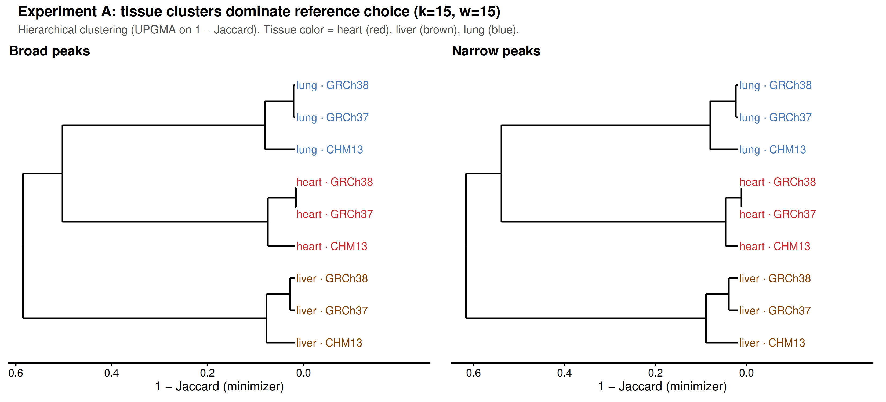
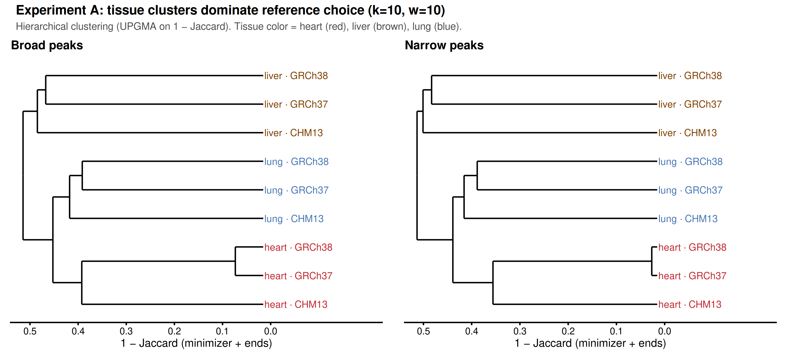
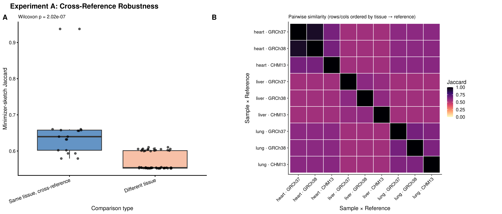
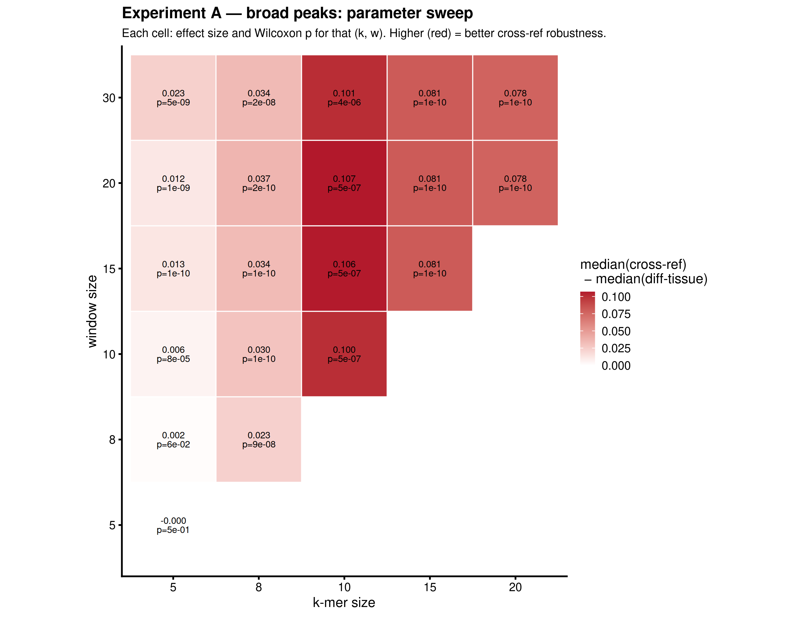
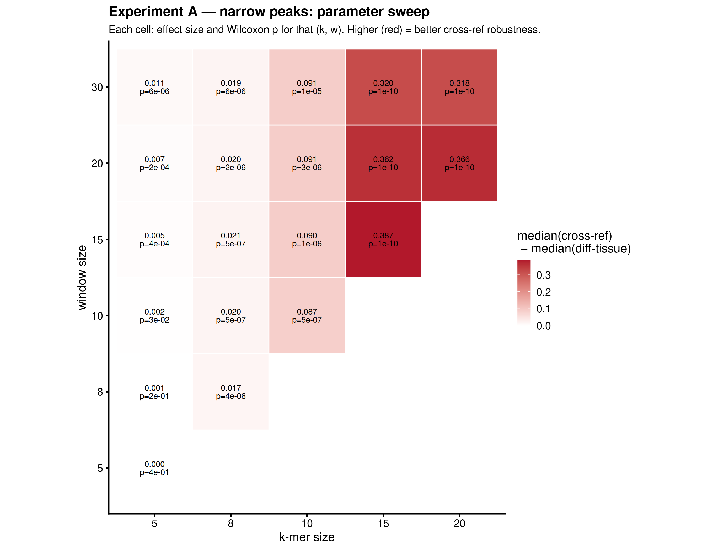
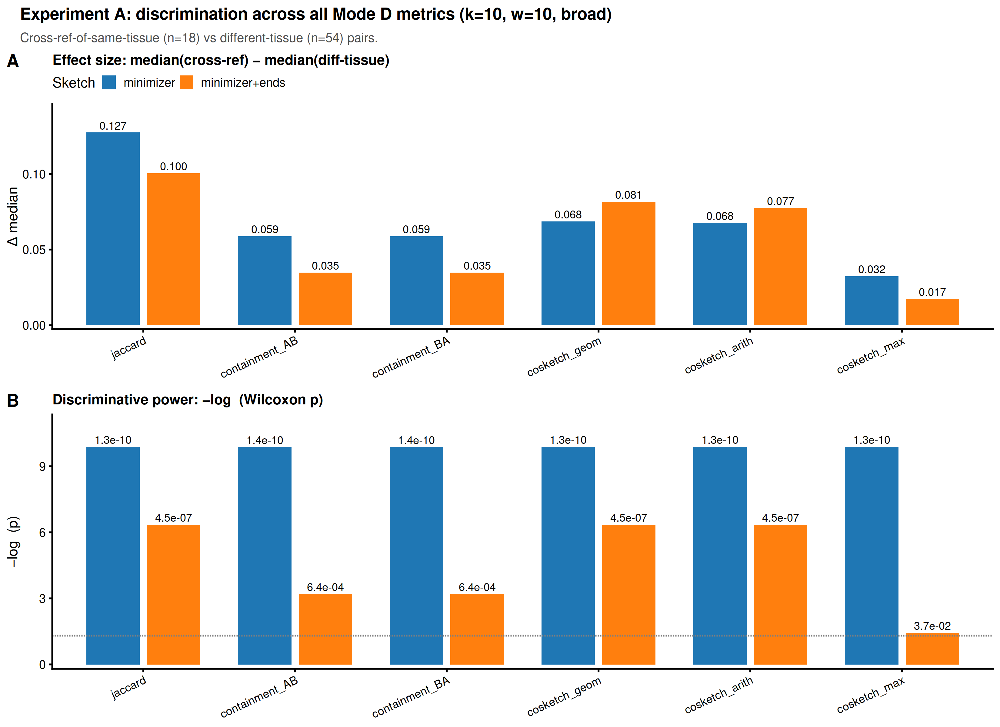
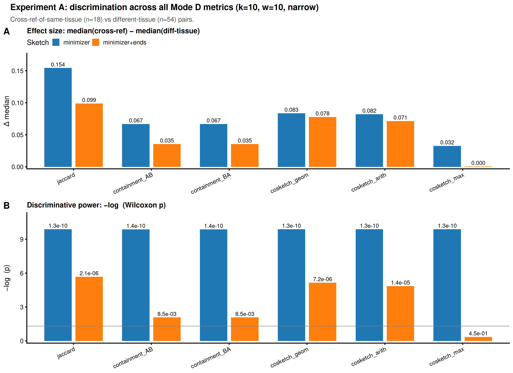

# Experiment A — Results

Cross-reference robustness validation: same-biological-sample H3K27ac
ChIP-seq peaks, aligned to GRCh37 / GRCh38 / CHM13, should sketch more
similarly *across references* than across tissues on any one reference.

3 tissues (heart, liver, lung) × 3 references = 9 sample × ref combinations.
2 peak callers (MACS3 broad + narrow). (k, w) sweep: 20 cells with w ≥ k.

Hammock Mode D with minimizer HLL, `--precision 24`. Similarity metric:
`jaccard_similarity_with_ends` (minimizer ∪ start-end HLL) for the stats
tables below; **the dendrogram was re-rendered on `jaccard_similarity` in
v0.6.0** (see that section). The `_with_ends` column no longer exists —
CLAUDE.md divergence #8, `docs/mode-d-ends-removal.md`.

> **Rerun 2026-05-14**: all hammock CSVs, stats, and figures below were
> regenerated after the Mode D minimizer-ingest bug fix (orig's slow-path
> `add_string(str(hash_val))` silently dropped most minimizers at k ≥ 12;
> `python/hammock/modes/sequence.py` now calls `add_hash64` directly —
> see CLAUDE.md "Intentional divergences" §6). Pre-fix the k=15 and k=20
> cells appeared to be a "saturated low" regime; post-fix they are the
> strongest discriminators in the sweep.

## Where to find the raw results

```
results/
├── exp_a/{broad,narrow}/k{k}_w{w}/
│   ├── exp_a_mnmzr_p24_jaccD_k{k}_w{w}.csv   ← all-vs-all hammock matrix
│   ├── cross_ref_validation.png              ← per-cell Wilcoxon + heatmap
│   └── cross_ref_stats.tsv                   ← per-cell summary stats
├── exp_a/{broad,narrow}/sweep_effect_size.png
├── fastas/{broad,narrow}/{GRCh37,GRCh38,CHM13}/{sample}.fa
└── logs/{exp_a,fastas}/
```

Underlying storage: `/vast/blangme2/jbonnie/hammock/claude-ref-comparison/results/`.

## Headline result

Same-tissue cross-reference Jaccard is significantly higher than
different-tissue Jaccard across every (k, w) cell with k ≥ 8 in both
peak types. The hypothesis ("reference choice contributes less than
tissue identity") holds across the entire usable parameter range, and
at k ∈ {15, 20} the two groups are **fully separated** — the minimum
same-tissue cross-ref similarity exceeds the maximum different-tissue
similarity.

### Dendrogram — direct visual proof

UPGMA clustering on `1 − jaccard_similarity`. Each tissue's
three references form a tight monophyletic clade in both peak types.
At k=15, w=15 the clades are deeply separated; at k=10, w=10 they
still partition cleanly but with smaller margin. Source:
`scripts/exp_a_dendrogram.R`.

> **Re-rendered 2026-08-03** on `jaccard_similarity`, after v0.6.0 removed
> `jaccard_similarity_with_ends` (CLAUDE.md divergence #8). The topology is
> **unchanged**: cutting either dendrogram at k=3 recovers the 3×3
> tissue partition exactly, under both columns and both peak types. Only the
> figure's provenance changed, not its claim. The stats tables further down
> this file were computed on the old column and have not been regenerated.





### Per-cell view at k=10, w=10

Boxplot of same-tissue cross-reference pairs (n=18) vs different-tissue
pairs (n=54), plus 9×9 sample × reference similarity heatmap. Visible
block structure: tissue diagonals are darker than off-diagonals
regardless of reference.



## Parameter sweep — three regimes

`figures/sweep_effect_size_{broad,narrow}.png`. Each cell shows the
effect size (median cross-ref − median diff-tissue) and the Wilcoxon p.

| Regime | Cells | Behavior |
|---|---|---|
| **Saturated high** | k=5 (any w); k=8 (any w) | Both groups ≈ 0.95–0.99. Δ ≤ 0.02; k=5 mostly non-significant. |
| **Interpretable mid** | k=10, w ≥ 10 | Medians ≈ 0.55–0.65; Δ ≈ 0.09; p ≈ 1e-7. Groups overlap. |
| **Interpretable + fully separated** | k=15, k=20 (any valid w) | Medians cross-ref ≈ 0.55–0.78 vs diff-tissue ≈ 0.24–0.39. Δ ≈ 0.32–0.45, p ≈ 1.35e-10 (Wilcoxon floor). **min(xref) > max(diff-tissue)**. |





Top-effect cells (broad / narrow consistent ordering):

| Cell | peak | Δmedian | Wilcoxon p | median(cross-ref) | median(diff-tissue) |
|---|---|---|---|---|---|
| k15_w15 | broad  | 0.398 | 1.35e-10 | 0.783 | 0.385 |
| k15_w15 | narrow | 0.387 | 1.35e-10 | 0.729 | 0.342 |
| k20_w20 | broad  | 0.413 | 1.35e-10 | 0.725 | 0.313 |
| k20_w20 | narrow | 0.366 | 1.35e-10 | 0.643 | 0.277 |
| k15_w20 | broad  | 0.383 | 1.35e-10 | 0.743 | 0.361 |
| k15_w30 | broad  | 0.353 | 1.35e-10 | 0.676 | 0.323 |
| k20_w30 | broad  | 0.379 | 1.35e-10 | 0.657 | 0.277 |
| k10_w10 | broad  | 0.086 | 2.02e-07 | 0.640 | 0.554 |
| k10_w10 | narrow | 0.087 | 4.54e-07 | 0.640 | 0.553 |

**k=15, w=15 is the best lead cell**: largest Δ, maximally significant,
medians sit in the interpretable mid-range, and the groups are *fully
separated* (broad: min cross-ref 0.753 > max diff-tissue 0.443). k=10
cells are still useful when overlap (rather than clean separation) is
the story being told.

## New Mode D columns — at k=10, w=10

`scripts/exp_a_metric_comparison.R` runs the same Wilcoxon test on each
of the 12 metric columns the new hammock emits (6 minimizer + 6
minimizer+ends). Outputs: `figures/metric_comparison_{broad,narrow}_k10_w10.{png,tsv}`.





### Findings (k=10, w=10)

| Metric (flavor)                | Δ broad | p broad | Δ narrow | p narrow |
|---|---|---|---|---|
| jaccard (minimizer)            | 0.071 | 1.35e-10 | 0.084 | 1.35e-10 |
| containment_AB/BA (minimizer)  | 0.032 | 1.36e-10 | 0.036 | 1.36e-10 |
| cosketch_geom (minimizer)      | 0.037 | 1.35e-10 | 0.044 | 1.35e-10 |
| cosketch_arith (minimizer)     | 0.036 | 1.35e-10 | 0.043 | 1.35e-10 |
| cosketch_max (minimizer)       | 0.017 | 1.35e-10 | 0.016 | 1.35e-10 |
| **jaccard (minimizer+ends)**   | **0.086** | **2.02e-07** | **0.087** | **4.54e-07** ← existing default |
| cosketch_geom (minimizer+ends) | 0.065 | 1.54e-07 | 0.064 | 9.94e-07 |
| cosketch_arith (minimizer+ends)| 0.062 | 2.02e-07 | 0.059 | 4.45e-06 |
| containment_AB/BA (with ends)  | 0.029 | 8.81e-04 | 0.028 | 6.62e-03 |
| cosketch_max (with ends)       | 0.013 | 5.13e-02 | 0.000 | 4.92e-01 |

Notes (both peak types):
1. **All minimizer-only metrics hit the Wilcoxon test floor** (p ≈ 1.4e-10 for n=18/54). Maximally significant but operating near saturation (medians ≈ 0.99 vs ≈ 0.92), so absolute Δ is small.
2. **Adding the start-end HLL lowers baselines into the interpretable mid-range** (~0.55–0.78) and reduces saturation. Cost: p drops by ~3–4 orders of magnitude for the surviving discriminators.
3. **Containment-with-ends is a markedly weaker discriminator** than jaccard-with-ends. `containment_AB` and `containment_BA` produce identical medians across the all-vs-all set because every unordered pair appears in both directions.
4. **cosketch_max collapses on with-ends** (broad Δ 0.013 p ≈ 0.05, narrow Δ ≈ 0 p ≈ 0.49). Worst metric in both flavors.
5. **`jaccard_similarity_with_ends` remains the right default** for headline analysis at k=10: best Δ/saturation trade-off and matches what the existing CSV sweep uses. `cosketch_geom_with_ends` is a near-tie if a redundancy-aware alternative is wanted.
6. **Broad vs narrow**: minimizer-only effects are slightly larger on narrow (likely tighter peak boundaries → more shared minimizers between same-sample-different-ref pairs). With-ends p-values are slightly weaker on narrow but the qualitative ordering of metrics is identical.

### To extend

- Replicate this 12-metric comparison at k=15, w=15 (the new headline cell) — `metric_comparison.R` is parameterised on the input CSV.
- The same minimizer / minimizer+ends pattern likely holds, but with-ends may matter less when the minimizer-only signal is already fully separated.

## Scripts that produced these outputs

- `scripts/exp_a_validate_plot.R` — per-cell Wilcoxon + 2-panel figure (boxplot + 9×9 heatmap)
- `scripts/exp_a_sweep_summary.R` — (k × w) effect-size heatmap
- `scripts/exp_a_dendrogram.R` — UPGMA dendrogram (broad + narrow)
- `scripts/exp_a_metric_comparison.R` — metric Wilcoxon comparison at one (k, w).
  The committed figure and TSV cover 12 metrics; hammock 0.5.0 emits 14 (adding
  `jaccard_similarity_ie` and its `_with_ends` twin), and the script picks those
  up automatically once the input CSVs are regenerated. Not yet re-run
- `workflow/Snakefile` — orchestrates peaks → FASTA (bedtools getfasta) → hammock Mode D → R plots

## Reproducing

```bash
conda activate claude-ref-comparison
ml r/4.3.0
snakemake --profile workflow/slurm_profile/
```

(Upstream nf-core/chipseq runs must have produced the broad/narrow peak
calls under `NFCORE_OUT/{ref}{,_narrow}/...` — see `scripts/run_nfcore.sh`.)
