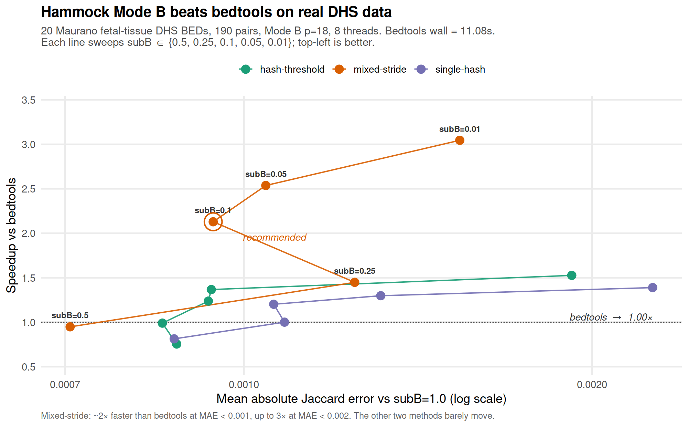
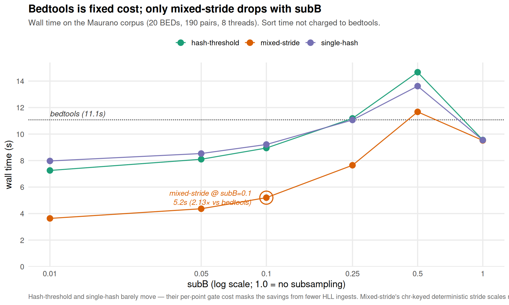
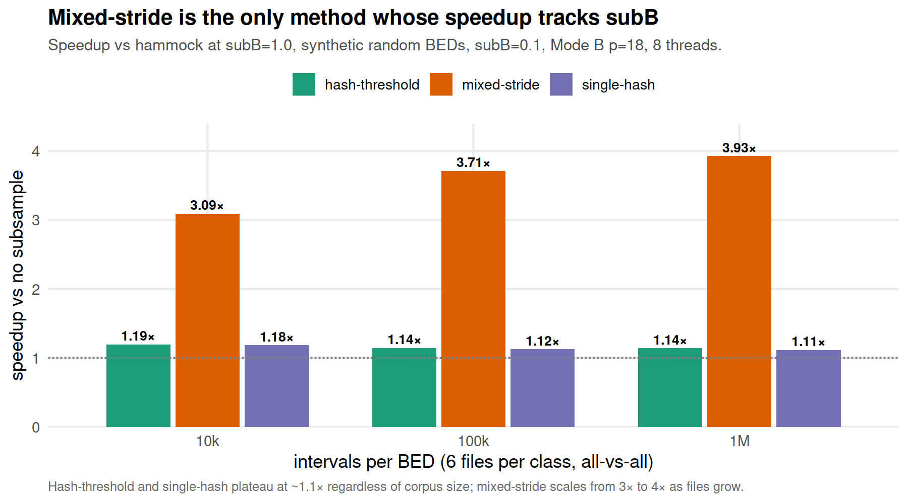
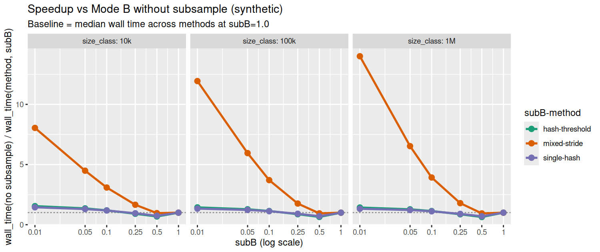
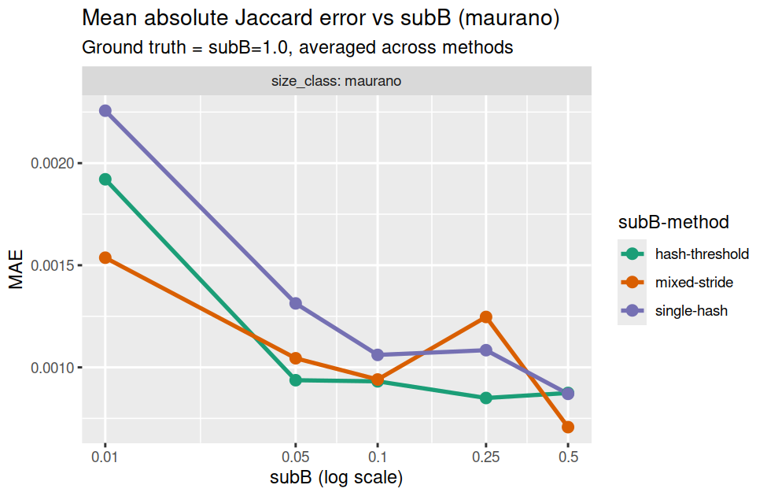
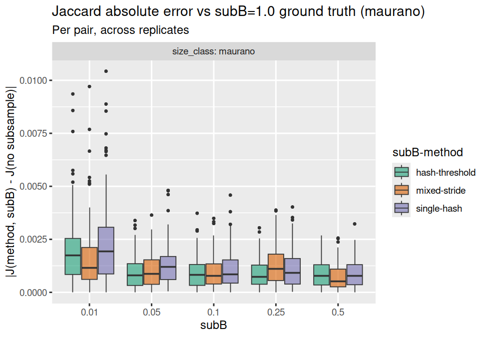

# subB / subB-method sweep — results notes

Findings from the 2026-05-12 (3-method × subB × size grid) and 2026-05-13
(bedtools reference) runs. Numbers below come from
`results/summary_synthetic_*.csv`, `results/summary_maurano_*.csv`, and
`results/sweep_maurano_bedtools_*.csv`. Figures live in `figures/`.

Design and how-to-rerun live in `README.md`.

---

## TL;DR

On real DHS data, `--subB-method mixed-stride --subB 0.1` is **2.13× faster
than `bedtools jaccard`** with mean absolute Jaccard error < 0.001 vs the
no-subsample reference. Even at `subB=1.0` (no subsampling) hammock-cpp is
**1.16× faster** than bedtools — the HLL sketch path is intrinsically
cheaper than bedtools's per-pair sorted-merge for many-pair comparison.

The three `--subB-method` modes give very similar accuracy, but only
**mixed-stride** actually trades subsampling for speed.

**Reading the zigzag.** The lines aren't sorted by error along the x-axis;
they connect points in subB sweep order (`0.5 → 0.25 → 0.1 → 0.05 → 0.01`,
i.e. each line moves *along the subB axis*, which is not a plot axis). So
whenever MAE isn't monotone in subB, the line doubles back. That's most
visible on mixed-stride: as subB goes from 0.5 → 0.25 the error jumps up,
then drops back at subB=0.1. The cause is that mixed-stride is a
*deterministic* chr-keyed sampler — at each subB it picks a specific stride
length, and the resulting sample sets are not nested across subB values.
Whether a given subB happens to align with the interval/chromosome
structure varies discretely. Per-replicate IQR across 5 replicates is
effectively zero in every cell (algorithm is deterministic given the
seed), so the zigzag is structural, not noise. See
`pareto_variants.pdf` for path-resorted and no-path versions if you'd
prefer to read the same data without the doubling-back.

---

## Speed: mixed-stride is the only method whose wall time tracks subB

At `subB=0.1` on synthetic data, mixed-stride gives a 3–4× speedup that
grows with corpus size:

| size | hash-threshold | mixed-stride | single-hash |
|------|----------------|--------------|-------------|
| 10k  | 1.19× | **3.09×** | 1.18× |
| 100k | 1.14× | **3.71×** | 1.12× |
| 1M   | 1.14× | **3.93×** | 1.11× |

The other two methods plateau around 1.1–1.2× regardless of corpus size or
how aggressive subB gets — their per-point gate-hash cost masks the savings
from fewer HLL ingests. Mixed-stride's chromosome-keyed deterministic
stride avoids that per-point hash, so its savings actually compound.

Pushing further down to `subB=0.01` on synthetic 1M, mixed-stride hits
**14×** (vs ~1.4× for the other two). The headline plot (Maurano) and the
diagnostic plots show the same pattern on real data, just at smaller
magnitudes (peak 2.62× vs no-subsample at subB=0.01; that same point is
3.05× vs bedtools — the baseline used for the §4.1 headline figure).

**The subB=0.5 hump:** every method on every corpus is *slower* than no
subsample at `subB=0.5` (0.65–0.86× speedup). The gate's per-point hash
cost beats the savings from a single decimation. Real wins only start at
`subB ≤ 0.25` and grow from there.

---

## Accuracy: methods are tied; real data is roughly 2× worse than synthetic

Per-pair MAE vs the subB=1.0 ground truth (averaged across methods):

| corpus    | size  | hash-threshold     | mixed-stride       | single-hash        |
|-----------|-------|--------------------|--------------------|--------------------|
| synthetic | 10k   | 1.1 × 10⁻³ / 2.1 × 10⁻² | 6.0 × 10⁻⁴ / 2.0 × 10⁻² | 9.7 × 10⁻⁴ / 2.0 × 10⁻² |
| synthetic | 100k  | 1.4 × 10⁻³ / 1.2 × 10⁻³ | 6.1 × 10⁻⁴ / 8.4 × 10⁻⁴ | 1.5 × 10⁻³ / 1.8 × 10⁻³ |
| synthetic | 1M    | ~2 × 10⁻⁵ / ~2 × 10⁻⁵ | ~2 × 10⁻⁵ / ~2 × 10⁻⁵ | ~2 × 10⁻⁵ / ~2 × 10⁻⁵ |
| maurano   | 20 DHS | 9.3 × 10⁻⁴ / 1.9 × 10⁻³ | 9.4 × 10⁻⁴ / 1.5 × 10⁻³ | 1.1 × 10⁻³ / 2.3 × 10⁻³ |

(each cell: MAE @ subB=0.1 / MAE @ subB=0.01)

Three observations:

1. **Method spread is small.** Within each (corpus, size) the three methods
   are within ~2× of each other on MAE. Mixed-stride is the recommended
   default for performance reasons, not accuracy.
2. **Real data has 2× worse accuracy** than synthetic at comparable file
   size. Max-error tails are also fatter: max |error| ≈ 10⁻² on Maurano at
   subB=0.01 vs ~3 × 10⁻³ on synthetic 100k. Clumpier spatial structure
   means subsampling has higher per-pair variance.
3. **The 10k cliff doesn't repeat on Maurano.** Synthetic 10k jumps to
   MAE ≈ 0.02 at subB=0.01; the Maurano corpus (per-file size somewhere
   between synthetic 100k and 1M) stays at MAE ≈ 0.002.

The per-pair error box gives the distribution view, including the heavier
real-data tails:

---

## Absolute comparison: hammock vs bedtools on Maurano

Bedtools wall (8-way GNU parallel, sort time not charged): **11.08 s
median**, very tight (10.99–11.10 s across 5 reps).

| method         | subB | hammock wall | bedtools / hammock |
|----------------|------|--------------|--------------------|
| (any)          | 1.00 | ~9.5 s       | **1.16×**          |
| hash-threshold | 0.10 |  8.95 s      | 1.24×              |
| **mixed-stride** | **0.10** | **5.20 s** | **2.13×**       |
| single-hash    | 0.10 |  9.21 s      | 1.20×              |
| mixed-stride   | 0.05 |  4.37 s      | 2.54×              |
| mixed-stride   | 0.01 |  3.64 s      | **3.04×**          |

The headline plot (top of this document) captures this in a single line
graph: bedtools is one fixed reference; only mixed-stride's wall time
drops meaningfully as subB shrinks.

The accuracy/speed tradeoff against bedtools is in the Pareto plot at the
top — at MAE < 10⁻³ mixed-stride sits at ~2× faster than bedtools; pushing
to MAE ≈ 2 × 10⁻³ buys 3×. Hash-threshold and single-hash never get more
than ~1.5× faster than bedtools even at the most aggressive subB tested.

---

## Recommendation

**`--subB-method mixed-stride --subB 0.1`** is the right default on this
evidence:

- Synthetic: 3–4× faster than no-subsample hammock, MAE ≤ 10⁻³ except the
  small-file (10k) cliff at very low subB.
- Maurano (real): 1.83× faster than no-subsample hammock and **2.13×
  faster than bedtools**, MAE ~10⁻³, max error ~3 × 10⁻³.

Aggressive `subB=0.01` is worth considering only on large
(≥1M-interval), high-Jaccard corpora where MAE stays at ~10⁻⁵. On real,
moderate-sized data expect roughly a doubling of max-error per decade of
subB drop below 0.1.

`hash-threshold` and `single-hash` are not competitive speed defaults on
either corpus — at best ~1.3× speedup even at `subB=0.01`. Keep them for
parity reasons (`hash-threshold` matches the original hammock gate) or for
codepath simplicity (`single-hash`), not performance.

---

## Diagnostic figures

The headline figures above were generated by `headline_figures.R`. The
diagnostic figures from `analyze.R` cover the same data with per-method
breakdowns:

- `figures/<corpus>_wall_time_vs_subB.png` — raw wall times per (method, size).
- `figures/<corpus>_speedup_vs_nosub.png` — speedup vs subB=1.0 cross-method
  baseline (bedtools overlaid as a dashed reference on the maurano panel).
- `figures/<corpus>_speedup_within_method.png` — each method against its
  own subB=1.0 (useful for spotting the subB=0.5 hump).
- `figures/<corpus>_mae_vs_subB.png` and `<corpus>_jaccard_error_vs_subB.png`
  — accuracy curves.

Full per-cell numbers: `results/summary_<corpus>_<stamp>.csv`.
