This document used for brainstorming and drafting. For current outline with all draft text see: https://www.overleaf.com/read/kggqsxtxrbdy#4685d0

> Every bedtools-relative number below is current as of 2026-08-10 and
> measured on the corrected benchmark harness. Full bug-hunt and
> re-measurement history: `docs/bedtools-baseline-retraction.md`. Where a
> stated number or claim was revised from something materially different,
> the reasoning is kept as a single *(Decision trail: ...)* note attached to
> the current fact — one compact sentence on what changed and why, not a
> chain of struck-through drafts. Grep `Decision trail` to find them all.

## Thesis

Modern interval collections are limited by two boundaries: the computational cost of comparing every dataset and the coordinate dependence that prevents comparison across references. Hammock creates reusable sketches of either interval coordinates or interval-derived sequences, expanding comparison within and across those boundaries while preserving useful biological structure.

## Abstract

## I. Introduction

Increased availability of high-throughput sequencing has facilitated a corresponding increase in large-scale modern sequencing projects which produce vast numbers of genomic annotation datasets which then, themselves, become part of the genomic data ecosystem. Large-scale initiatives such as the ENCODE Project\cite{encode_2012}, the Roadmap Epigenomics Project\cite{roadmap_2015}, GTex[REF], and the 1000 Genomes Project\cite{10002015global} make datasets publicly available, providing unprecedented opportunities for integrative analysis. Among the most common and biologically informative outputs of these projects are genomic intervals: contiguous stretches of the genome that define transcription factor binding sites, chromatin accessibility peaks, histone modifications, structural variants, and splicing junctions. Such interval datasets have become a cornerstone of downstream analyses that seek to characterize genome function and variation across populations, tissues, cell types, and experimental conditions. In particular, pairwise comparison of interval datasets presents a measurement of biological similarity, such as identifying conserved regulatory elements between tissues. Tools such as \program{BEDTools} provide exact calculations of these measures\cite{quinlan2010bedtools}, but the computational cost of pairwise overlap calculations grows rapidly with the size of modern repositories. In practice, this creates a scalability bottleneck that hampers systematic comparisons across the interval datasets now available\cite{li2020design}.

The numbers of files in these interval databases continue to grow every year. ChIP-Atlas, for example, expanded from 37,720 accumulated experiments in 2015 to 464,655 in 2025, while repositories such as ENCODE contain thousands of additional ChIP-seq and chromatin-accessibility experiments.

Scalability is not the only obstacle to systematic interval comparison. BED coordinates are meaningful only with respect to the reference genome on which they were defined, and large public collections remain distributed across multiple genome assemblies. Standard overlap measures therefore cannot directly compare two interval files when one is defined on hg19 and the other on hg38, even when the files describe the same assay or biological feature. Figure 1 illustrates this limitation for histone-mark ChIP-seq peak files from Roadmap Epigenomics and BLUEPRINT. For histone marks represented in both collections, within-Roadmap and within-BLUEPRINT comparisons can be performed in their respective coordinate systems, whereas every Roadmap–BLUEPRINT pairing is blocked by the hg19–hg38 mismatch. Coordinate conversion can sometimes recover such comparisons, but it introduces additional preprocessing, may not map all intervals unambiguously, and continues to define similarity in terms of a selected coordinate system. An alternative is to extract the reference sequence underlying each interval and compare the resulting sequence collections directly, allowing related genomic annotations to be evaluated across references without requiring their coordinates to coincide.

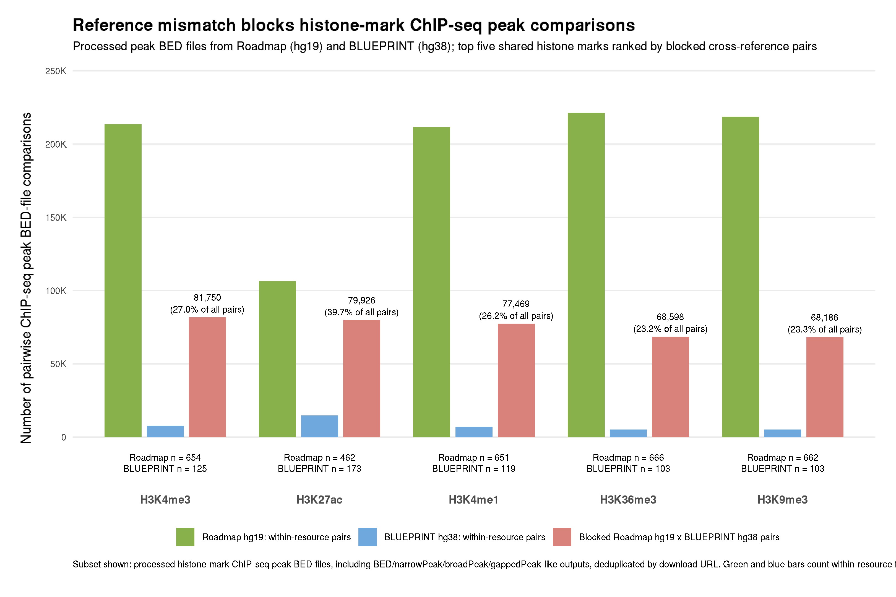

**Figure 1. Reference-genome fragmentation prevents direct comparison across public histone-mark collections.** Numbers of possible pairwise comparisons among processed histone-mark ChIP-seq peak BED files are shown for the five most represented marks shared by Roadmap Epigenomics and BLUEPRINT. Labels above the bars give pair counts; labels above the blocked cross-reference bars also give the percentage of all possible pairs for that mark. Within-resource comparisons can be performed directly because Roadmap files share hg19 coordinates and BLUEPRINT files share hg38 coordinates. In contrast, every Roadmap–BLUEPRINT pairing is blocked for direct coordinate-overlap analysis by the hg19–hg38 reference mismatch. File counts are deduplicated at the download-URL level; included outputs are BED-, narrowPeak-, broadPeak-, or gappedPeak-like peak files. Repository counting and inclusion criteria are described in Supplementary Methods S1.

Probabilistic data structures, or sketches, offer a powerful solution to these challenges. Sketching methods compress large datasets into compact representations that allow efficient estimation of set cardinality and similarity. Techniques such as MinHash\cite{minhash} and HyperLogLog\cite{hll} have seen wide application in computer science, and their introduction to genomics has already revolutionized k-mer–based comparisons of sequencing datasets. Tools like Dashing \cite{dashing} and Mash\cite{mash} have demonstrated the value of sketching for rapid, large-scale sequence and metagenome comparisons. Extending these methods to genomic interval data, however, remains relatively unexplored. Because intervals represent continuous spans rather than discrete tokens, adapting sketches for overlap estimation presents unique methodological challenges but also significant opportunities. Moreover, representing intervals through both their coordinates and their underlying reference sequences provides complementary notions of similarity: coordinate-based sketches support rapid comparison within a shared reference, whereas sequence-based sketches can support comparisons across references.

In this study, we present \program{hammock}, a command-line tool for scalable comparison of genomic interval datasets. Within a shared reference genome, \program{hammock} applies probabilistic sketches to BED intervals to approximate overlap and similarity across large collections of files, reducing the computational burden of systematic pairwise analysis. We benchmark these estimates against exact calculations from established interval-processing tools and evaluate the resulting trade-offs among speed, memory use, and accuracy. We additionally introduce a sequence-based representation in which the reference sequences underlying BED intervals are extracted and sketched, enabling similarity measurements between annotations defined on different genome assemblies. Together, these approaches address two complementary barriers to large-scale interval analysis: the computational cost of expanding pairwise comparisons within a reference and the coordinate incompatibility that prevents direct comparison across references.

## II. Results

### 2.1 Hammock represents interval sets in complementary coordinate and sequence spaces
\program{hammock} converts each input dataset once into a reusable file-level sketch. In interval mode the sketch represents genomic positions covered by the intervals, while in sequence mode, it represents minimizer-derived sequence features. As shown in Figure \ref{fig:hammock_workflow} both representations use compact HyperLogLog (HLL) sketches which are then available for pairwise comparisons in place of the original files. The subsequent analyses evaluate whether interval sketches preserve overlap similarity at scale and whether sequence sketches preserve biological relationships across reference genomes.

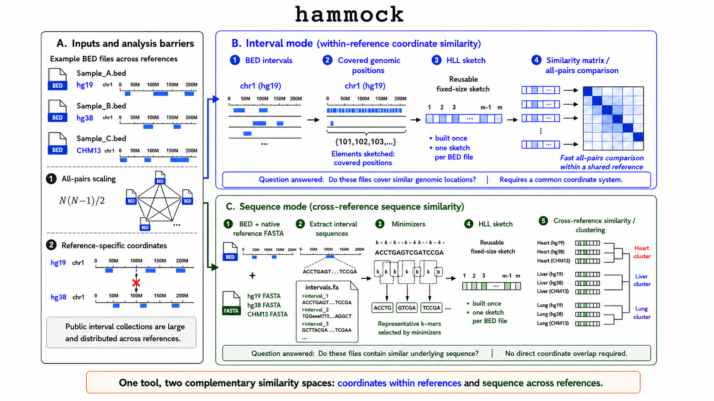

**Figure 2. Hammock provides complementary coordinate- and sequence-based representations of genomic interval sets.** (A) Public interval collections are large, comparisons scale quadratically with the number of files, and BED coordinates are tied to specific reference genomes. (B) In interval mode, each BED file is summarized as a reusable sketch of covered genomic positions, enabling fast all-pairs similarity comparisons within a shared reference. (C) In sequence mode, interval sequences are extracted from each file's native reference FASTA, representative k-mers are selected using minimizers, and the resulting sequence sketches are compared across references without requiring direct coordinate overlap. The two modes therefore answer complementary questions: whether interval sets occupy similar genomic locations and whether they contain similar underlying sequence.

### 2.2 Coordinate Space 
#### 2.2.1 Interval sketching expands feasible all-pairs BED comparison

[NOTE: find a place for this] Interval comparisons are typically conducted using files in the BED format, a simple tab-delimited representation of genomic intervals that has been in wide use since the early 2000s\cite{kent_hgbrowser}.

The Jaccard statistic, from set theory, [ETC] is one commonly used measure of similarity, offered by a number of tools. In particular, BEDtools [REF], a ubiquitous tool for genomic arithmetic, offers a `bedtools jaccard` command that calculates the exact value of intersection over union [this might now be the exact approach... subtraction is maybe used] for two BED files. \program{hammock}, which is built to compare *lists* of interval files, takes advantage of two aspects of a point-wise sketching representation approach: batch reusability of a sketch once built and point-based reproducibly random subsampling.
As can be seen in Figure 3, the majority of \program{hammock}'s time is spent summarizing each interval file into a sketch, but the pairwise calculations using and reusing the resulting bit-vectors are trivially fast. BEDtools, by contrast, must reprocess each interval file for each new comparison. As one would expect, this means the \program{hammock}'s performance advantage scales with the number of BED files included in the analysis.

\program{hammock}'s \texttt{interval} mode treats each point within an interval as an object to be hashed and added to a single sketch representation of the entire set of intervals in the file. Given the usual size of genomics intervals, this creates an opportunity for further subsampling prior to sketching.  \program{hammock}'s novel `subB` implementation uses mixed-stride methodology to sample genomic positions using deterministic chromosome-specific strides and offsets, avoiding the per-position hashing cost of other reproducibly random methods such as hash-threshold subsampling. As seen in Figure 3, this substantially reduces sketch-construction time while preserving reproducibility and producing little change relative to the unsubsampled hammock similarities in the evaluated datasets. The reduction is sublinear in the sampling fraction and corpus-dependent: a 10-fold subsample buys 2.12\times{} on a synthetic corpus at N=512 (p=18) but only 1.87\times{} on Maurano at p=18 — and the synthetic-corpus benefit itself shrinks with catalog scale, from a peak of 2.62\times{} at N=16 down to 1.57\times{} at N=2048, as the pairwise-comparison phase (which `subB` does not touch) comes to dominate wall time (Supplementary Figure S10).

Performance improvements are not uniform.

This section should distinguish three sources of the interval-mode speedup:

1. **Sketch reuse:** each BED file is read once and converted to a fixed-size summary that can be reused across all pairwise comparisons.
2. **Mixed-stride subsampling:** hammock's novel `subB` implementation samples genomic positions using deterministic chromosome-specific strides and offsets, avoiding the per-position hashing cost of hash-threshold subsampling. This substantially reduces sketch-construction time while preserving reproducibility and producing little change relative to the unsubsampled similarities. The reduction is sublinear in the sampling fraction and corpus-dependent — a 10-fold subsample buys only 1.87x on Maurano at p=18 but 2.12x on a synthetic corpus at N=512, and even the synthetic-corpus benefit shrinks with scale (2.62x at N=16 down to 1.57x at N=2048, Supplementary Figure S10) as the subB-invariant pairwise-comparison phase comes to dominate wall time — so it must not be described as proportional, or as a fixed multiplier independent of catalog size.
3. **Workflow parallelization:** The saturation is a result, not an obstacle. It's a genuine scalability argument for the evaluated workflows: the BEDTools process-per-pair workflow launches N² comparisons and re-reads each file N times, parallelizes poorly, and saturates early, whereas hammock launches one process and reads each file once. That's a real, defensible advantage. It just has to be attributed to batch-mode absence rather than to sketching, and reported as BEDTools' achieved efficiency rather than silently labeled "t=16."
- hammock's is intra-process: OpenMP threads in one address space, each file read once, sketches shared. This is completely unaffected by everything I found today. It scales, and we can show a real thread-scaling curve.
- bedtools' is workflow-level: N² independent process launches under a GNU parallel wrapper. On this cluster that saturates at ~1.2–2.9× no matter how many cores you supply, because process creation caps near 123 exec/s.
- Concretely, three ways to put parallelization in the figure, all supported by data we already have or can cheaply get:

1. A threads panel — wall or throughput vs thread count at fixed N, both tools, efficiency annotated. hammock rises; bedtools plateaus. This makes the point vividly and is self-documenting. "One thing worth flagging for when you write the caption: this figure makes the mechanism argument, not a "we're faster" argument. The honest reading is that hammock converts cores into throughput and the bedtools pairwise workflow stops doing so almost immediately — attributable to batch-mode absence, not to sketching."
2. CPU time beside wall — already recorded in every CSV. A reader can see cores actually used, which is precisely the subtraction a skeptical referee makes.
3. Anchor speedups on bedtools t=1 as well, so the headline doesn't depend on how well the wrapper happened to parallelize on a given node.

Mixed-stride should be presented as a methodological contribution within the interval-mode scaling result, not as an unrelated implementation optimization. The main text should briefly contrast it with hash-threshold subsampling; the full comparison among mixed-stride, hash-threshold, and single-hash strategies can remain supplementary.

- **Synthetic scaling result (Figure 3A):** each benchmark configuration comprises two disjoint collections of N files compared as a full cross product, so the number of comparisons grows as N^{2}, reaching 262,144 pairs at N=512. Because hammock constructs one reusable sketch per file while the BEDTools workflow repeatedly processes the underlying interval files, the performance advantage of sketch reuse increases with collection size.
- **Sketch-comparison output cost (Figure 3A):** Figure 3A plots `jaccard_similarity_ie` exclusively — one hammock curve ("hammock total") and one N=512 annotation (8.4×). The register-equality curve and its own N=512 number (9.2×) are in Supplementary Figure S9 instead. The inclusion–exclusion comparison phase costs 1.64–1.94× as much as the register-equality comparison phase for N≥64, growing total wall by +10.0% at N=512 against +0.7% at N=32. *(Decision trail: this overhead was first measured at p=14, where it read as a negligible 1.45% at N=512 and was left off the figure; re-measured at p=18 — the figure's actual precision — it's a real 10.0%, so it's now plotted. A design showing both `reg_eq_similarity` and `jaccard_similarity_ie` curves together was tried next and dropped the same day, since register-equality isn't calibrated to BEDTools' scale — that view moved to Supplementary Figure S9 rather than being discarded.)*
- **Real-data timing result (Figure 3B):** Panel B reads the `jaccard_similarity_ie` arm (costlier than register-equality, since it computes the full metrics block): unsubsampled hammock is **1.33× slower** than BEDTools, subB=0.1 is **1.41× faster**, subB=0.01 is **2.04× faster**. The register-equality equivalents (1.16× slower / 1.58× / 2.49×) are in Supplementary Figure S9. Still the expected shape — N=20 is far below the N≈64 crossover Panel A shows. *(Decision trail: an early draft of this bullet claimed hammock beats BEDTools even unsubsampled on this corpus. That was measured against an inflated bedtools baseline and is false; full bug history in `docs/bedtools-baseline-retraction.md`.)*
- **Mixed-stride result (Figure 3B):** `subB=0.1` and `subB=0.01` further reduce runtime while producing little change relative to exact BEDTools truth.
- **Definition of the plotted approximation change (Figure 3B):** Panel B's accuracy label is the MAE of `jaccard_similarity_ie` against **exact BEDTools** Jaccard, over 190 unique off-diagonal pairs (self-comparisons excluded; the five replicates are byte-identical, so the effective n is 190, not 950). The register-equality equivalent (MAE against exact BEDTools Jaccard) is in Supplementary Figure S9.

Both panels are measured on the corrected, rotated-arm benchmark harness (`docs/bedtools-baseline-retraction.md`); bedtools reliably wins below N≈64, with the crossover between N=32 and N=64.

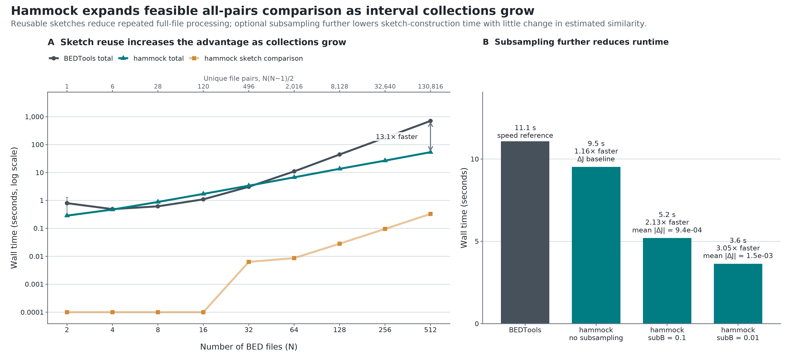

**Figure 3. Hammock expands feasible all-pairs comparison as interval collections grow.** (A) **Sketch reuse increases the advantage as collections grow.** Wall time for hammock and BEDTools across synthetic collections containing 10,000 intervals per BED file, using HyperLogLog precision p=18 (the hammock CLI default — corrected from p=14, used nowhere else in the paper), 16 threads, and three (twenty at N ≤ 32) runs per configuration; N files per side gives N^{2} ordered pairs, 262,144 at N=512. Curves show total hammock wall time on `jaccard_similarity_ie` — **the column we recommend reading for any comparison of magnitude, and the only one this figure reports** — plus its sketch-comparison-phase component in isolation ("hammock sketch comparison"). BEDTools is faster than hammock below N≈64; the two total-wall curves (BEDTools and hammock) cross between N=32 and N=64. At N=512, hammock is 8.4× faster than BEDTools. (The register-equality (`reg_eq_similarity`) variant of this panel, plotted alongside `jaccard_similarity_ie` rather than in its place, is Supplementary Figure S9; there the equivalent N=512 numbers are 9.2×/8.4×.) (B) **Subsampling further reduces runtime.** Wall time on 20 Maurano fetal-tissue DNase hypersensitivity BED files using interval mode with p=18 and eight threads, at the `jaccard_similarity_ie` arm (the full metrics block — costlier than a register-equality-only run, see Figure S9). Bars compare BEDTools with hammock at `subB=1.0`, `0.1`, and `0.01`; labels report wall time, speedup relative to BEDTools, and MAE of `jaccard_similarity_ie` relative to exact BEDTools Jaccard over the 190 unique off-diagonal pairs (self-comparisons excluded).

Together, the synthetic and real-data benchmarks show that hammock improves the feasibility of exhaustive pairwise analysis through both reusable sketches and efficient optional subsampling during sketch construction.

**Figure 3 generation.** The combined figure is generated by `paper/pairwise_scaling/plot_pairwise_scaling.R` and written to `paper/figures/pairwise_scaling.png`. Panel A uses `docs/data/cpp_vs_bedtools_t16_p18.csv`, job **29671317**, node **c529**, one exclusive allocation, two passes merged (N∈{2,4,8,16,32} at 20 replicates, N∈{64,128,256,512} at 3) — supersedes job 29656140 (node c531), whose N=2/N=4 cells were noise-corrupted at n=3, which itself replaced the p=14 `cpp_vs_bedtools_t16_20260804_172242.csv`/job 29552415 cited in an earlier draft of this note; Panel B uses `docs/data/maurano_subB_ie_summary.csv` (median wall time and MAE-vs-exact-BEDTools of the `+IE` arm at each subB level, 5 replicates, p=18, t=8) and `docs/data/maurano_bedtools.csv`. **Do not compare Panel A's absolute times to any earlier run.** The p=14 predecessor (job 29552415, node sr14) was itself a genuine allocated SLURM job; the "1.27–1.53× slower, no SLURM allocation" finding belongs to a *different*, unrelated 2026-08-04 file (`pairwise_cost_by_precision_20260804_164807.csv`, the metrics-block/fusion-cost experiment) compared against its 08-08 successor — not to job 29552415 (see `docs/seed-benchmark-methodology.md`, which distinguishes the two). The two share a date but are otherwise unconnected; conflating them was an error in an earlier draft of this note. Regardless of mechanism, do not compare absolutes across any of these runs — within-run ratios survive cross-run confounds; absolutes do not. The script rebuilds both panels with harmonized typography, panel labels, tool colors, wall-time units, and the pair count N^{2}.

#### 2.2.2 Interval sketches recover exact-overlap similarity structure and values

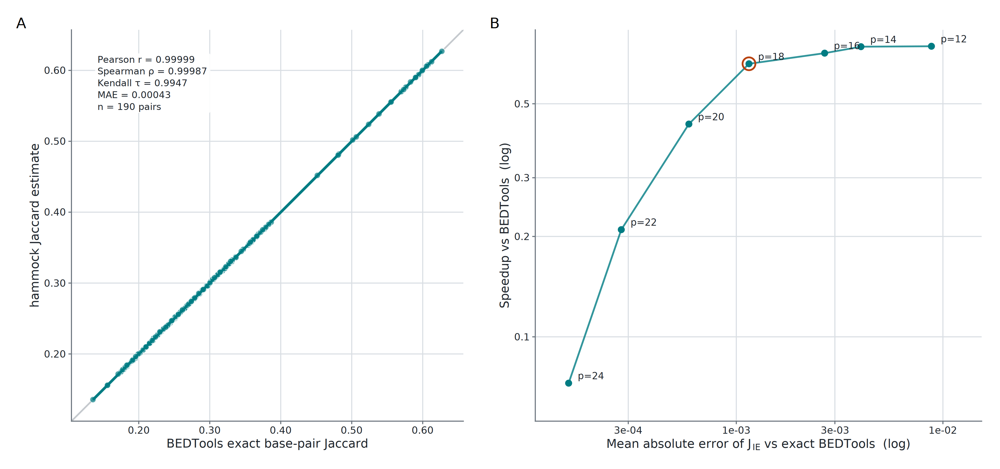

**Figure 4. Inclusion–exclusion estimates closely reproduce exact interval Jaccard, with a tunable precision–runtime tradeoff.** (A) Pairwise comparisons were performed on 20 Maurano fetal-tissue DNase hypersensitivity BED files, yielding 190 unique off-diagonal pairs; self-comparisons were excluded. At the hammock CLI default, HyperLogLog precision p=18, the inclusion–exclusion Jaccard estimate closely tracks exact BEDTools base-pair Jaccard over the observed off-diagonal range (MAE=1.15×10⁻³, Pearson r=0.99991, Spearman ρ=0.99966, Kendall τ=0.9883). (B) Accuracy and wall time were evaluated across p=12–24 on the same corpus using 16 threads and `subB=1.0`. The x-axis is MAE against exact BEDTools over the same 190 pairs on a base-10 logarithmic scale; lower values are more accurate and successive labeled ticks differ tenfold. The y-axis is median hammock wall time divided by median BEDTools wall time on a base-2 logarithmic scale; y=1 denotes equal runtime and each labeled tick doubles. Vertical ranges show the observed range among three hammock runs. Increasing precision reduced MAE from 8.80×10⁻³ at p=12 to 1.54×10⁻⁴ at p=24, while relative hammock wall time increased from 1.34× to 13.8×. Every point lies above y=1 because this 20-file corpus is below the approximately 64-file crossover at which reusable sketches amortize construction cost in the synthetic scaling benchmark. The magenta circle marks p=18, the CLI default.

**Figure 4 generation.** Both panels are generated by `paper/interval_accuracy/plot_interval_accuracy.R` with reference precision 18 and written to `paper/figures/interval_accuracy.png`. Panel A uses `docs/data/maurano_bedtools_ref.tsv` and `docs/data/hammock_hll_p18_jaccB_full.csv`. Panel B uses `docs/data/sweep_precision_maurano_p18_t16.csv`; accuracy is the MAE of `jaccard_similarity_ie`, and relative wall time is median hammock `wall_time` divided by median BEDTools wall time at each precision.

### 2.3 Sequence Space
#### 2.3.1 Biological identity is preserved across references in sequence space

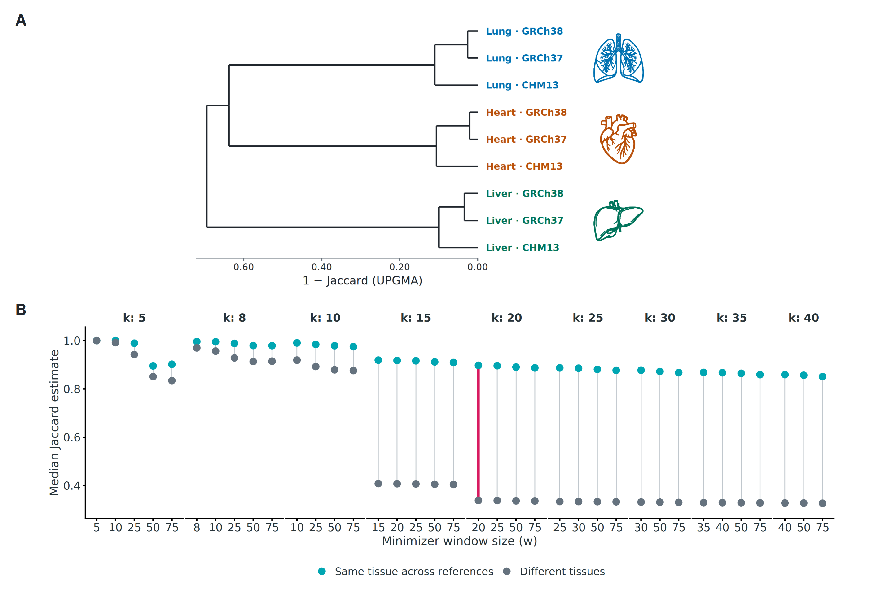

**Figure 5. Sequence sketches group samples by tissue across genome references.** Three ENCODE H3K27ac ChIP-seq samples—heart ENCSR175ABH, liver ENCSR864OOO, and lung ENCSR954JMZ—were independently aligned and peak-called against GRCh37, GRCh38, and CHM13, yielding nine peak sets. (A) Each broad-peak set was converted to sequence against its native reference and sketched in sequence mode at k=20, w=20, and HyperLogLog precision p=24. Average-linkage agglomerative hierarchical clustering on one minus the inclusion–exclusion Jaccard estimate groups the nine peak sets by tissue rather than by reference genome. (B) Median inclusion–exclusion Jaccard estimates for same-tissue comparisons across references and different-tissue comparisons are shown for selected cells from the expanded parameter sweep. Each vertical segment spans the two medians. The largest observed separation, Δ=0.563, occurred at k=20, w=20; its segment is highlighted in magenta.

**Figure 5 generation.** Panel A is generated by `paper/cross_reference_identity/plot_cross_reference_identity.R` from `docs/data/exp_a_broad_k20_w20_full.csv` and `docs/data/exp_a_metadata.tsv`. Panel B is generated by `paper/cross_reference_identity/plot_cross_reference_parameter_plateau.R` from the 63-cell-per-peak-type table `docs/data/exp_a_estimator_delta_expanded.csv`; the displayed broad-peak subset retains k=5–40 and selected tested window sizes. Both panels use `jaccard_similarity_ie`. `paper/cross_reference_identity/assemble_cross_reference_figure.R` stacks the title-free panels and writes `paper/figures/cross_reference_identity.png`.

### 2.3.2 Sequence sketches recover tissue organization

- **Quantitative clustering result for the Results prose:** cutting the average-linkage dendrogram into the ten annotated tissue classes gives adjusted Rand index (ARI) = 0.9102 and normalized mutual information (NMI) = 0.9610. These values quantify a separate 10-cluster evaluation and should not be presented as properties of the visual tissue annotations in Figure 6.
- **Figure interpretation:** Figure 6A does not display a discrete cluster cut; its labels are colored and boxed by the known tissue annotations. Figure 6B shows the separate ten-cluster evaluation as lime-green outlines on the corresponding distance matrix.

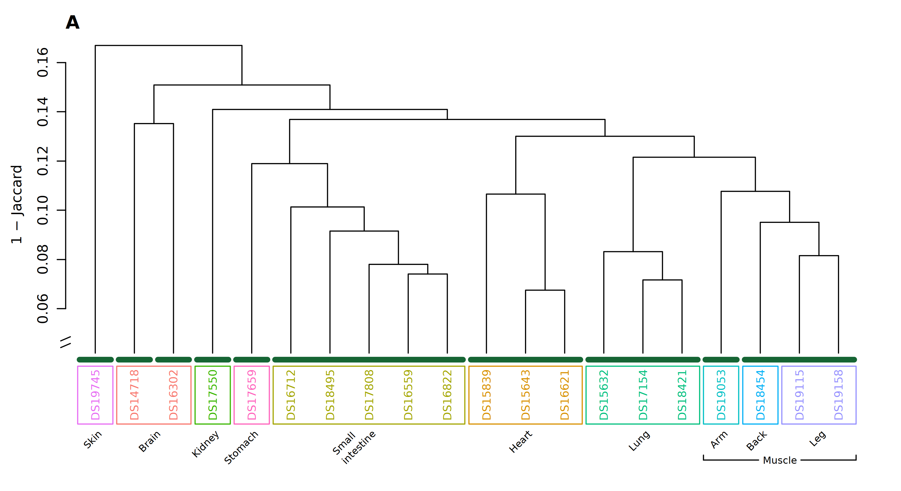

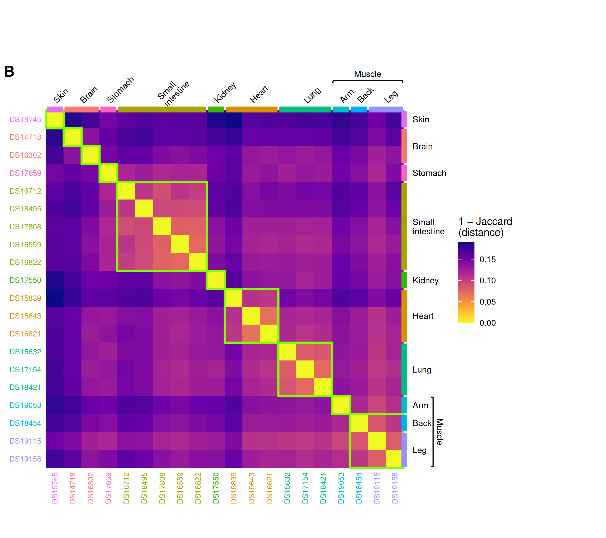

**Figure 6. Sequence sketches recover fetal-tissue organization in the Maurano DNase hypersensitivity subset.** Twenty fetal-tissue DNase-seq interval sets spanning ten annotated tissue labels were converted to interval-derived sequence and compared using the inclusion–exclusion Jaccard estimate at k=10, w=30, and HyperLogLog precision p=18, the hammock CLI default. **(A)** Average-linkage agglomerative hierarchical clustering was performed on 1−J. Leaf labels show dataset accessions and are colored and boxed by annotated tissue; these annotations do not represent a discrete cluster cut. **(B)** The complete pairwise 1−J distance matrix follows the leaf order of the average-linkage dendrogram in A for direct comparison; this display ordering does not affect distances or cluster assignments. Accession-label colors and marginal bars denote the annotated tissues. A bracket visually groups arm, back, and leg under muscle, but these three muscle subtypes remain separate labels in the ten-class evaluation. Lime-green diagonal outlines show the result of cutting the average-linkage agglomerative hierarchy into ten clusters. They expose the departures from the annotated tissue partition: the two brain samples occupy separate singleton clusters, whereas the back-muscle sample and two leg-muscle samples occupy one cluster without the arm-muscle sample. The brain samples remain adjacent in the dendrogram leaf order, but their pairwise distance (1−J=0.136) exceeds the tightest within-tissue distances for heart (~0.069) and lung (~0.073). The outlined ten-cluster cut separates the brain pair while retaining those tighter groups, yielding ARI=0.910 and NMI=0.961. The ten-cluster partition, ARI, and NMI are unchanged across the tested precisions p∈{12,14,16,18,20,22,23,24}.

**Figure 6 generation.** Panel A is generated by `paper/sequence_tissue_clustering/plot_sequence_tissue_clustering.R` and written to `paper/figures/sequence_tissue_clustering.png`; Panel B is generated by `paper/sequence_tissue_clustering/plot_distance_heatmap.R` and written to `paper/figures/sequence_tissue_distance_heatmap.png`. Both scripts read `experiments/maurano_dhs_validation/results/raw_d/hammock_mnmzr_p18_jaccD_k10_w30.csv`, use `jaccard_similarity_ie`, and obtain tissue annotations from `experiments/maurano_dhs_validation/data/maurano_filenames_key.tsv`. The archived sweep predates the native inclusion–exclusion output column, so the scripts derive it from `containment_AB` and `containment_BA`. Optional command-line arguments can substitute another similarity CSV, tissue key, output path, or similarity column.

### 2.3.3 Parameterization separates numerical agreement from biological resolution

- **Figure 6 parameter choice for the Results prose:** Under inclusion–exclusion, k=10, w=30 attains the maximum ARI at the displayed default precision p=18 and at every tested precision p=12–24; at p=12, k=10, w=20 ties that maximum. The k=10, w=30 ten-cluster partition persists across the tested precision range; the parameter sweep, rather than Figure 6 itself, is the evidence for that choice.

Sequence-mode parameterization separated numerical agreement with coordinate overlap from recovery of annotated tissue organization. At p=18, k=20, w=20 maximized Pearson correlation with exact BEDTools Jaccard (r=0.99997) but yielded ARI=0.693, whereas k=10, w=30 maximized tissue recovery (ARI=0.910) while retaining lower but substantial agreement with exact Jaccard (r=0.943; Figure 7). The supplementary hierarchy produced by the numerical optimum separated additional annotated tissue groups, demonstrating that maximizing agreement with coordinate-based overlap does not necessarily maximize biological resolution. Sequence mode can therefore preserve coordinate-overlap structure or emphasize tissue-associated sequence structure, depending on parameterization.

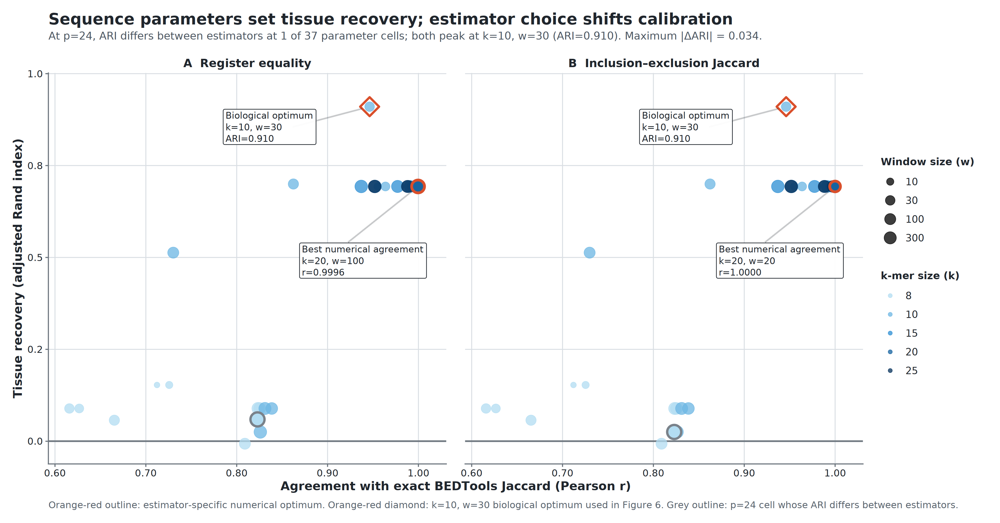

**Figure 7. Sequence parameters separate numerical agreement from biological recovery.** Sequence-mode parameter configurations were evaluated on 20 Maurano fetal-tissue DNase hypersensitivity interval sets at HyperLogLog precision p=18 using the inclusion–exclusion Jaccard estimate (`jaccard_similarity_ie`). Each point represents one combination of k-mer size (k) and minimizer-window size (w); the x-axis gives Pearson correlation with exact BEDTools Jaccard across pairwise comparisons, and the y-axis gives adjusted Rand index (ARI) for recovery of the ten annotated tissue classes after clustering. Point color encodes k and point size encodes w. The configuration with greatest numerical agreement, k=20 and w=20 (r=0.99997; ARI=0.693), has an orange outline. The k=10, w=30 biological optimum used in Figure 6 (ARI=0.910; r=0.943) has a magenta outline. Thus the parameters that best reproduce exact pairwise Jaccard values differ from those that best recover the annotated tissue organization.

**Figure 7 generation.** The figure is generated by `paper/parameter_objective_tradeoff/plot_parameter_objective_tradeoff_estimators.R` and written to `paper/figures/parameter_objective_tradeoff_estimators.png`. The script reads `docs/data/mode_d_summary.csv`, supplementing the inclusion–exclusion rows from `experiments/maurano_dhs_validation/results/mode_d_summary.csv` when they are absent from the staged paper copy, and filters to `jaccard_similarity_ie`, p=18, BEDTools reference, k≥8, and non-missing Pearson/ARI values. It identifies the greatest-Pearson configuration and verifies the k=10, w=30 ARI optimum.

At the maximum-ARI setting, the same ten-cluster partition was recovered at p=12, p=18, and p=24, producing identical ARI and NMI values (ARI=0.910; NMI=0.961). However, the complete dendrogram changed across precisions, including its leaf order, branch topology, and merge heights (Figure 8). Thus, partition-level recovery was robust to precision, but ARI and NMI masked variation in finer hierarchical relationships. Parameter selection should consequently follow the intended analytical objective, and hierarchical interpretations beyond the evaluated cluster cut should be made cautiously.

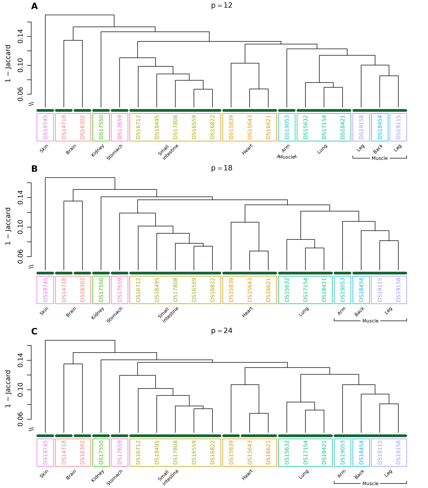

**Figure 8. Stable tissue partitions can mask precision-dependent hierarchical variation.** The same 20 fetal-tissue DNase-seq interval sets were compared at k=10 and w=30 using the inclusion–exclusion Jaccard estimate at **(A)** p=12, **(B)** p=18, and **(C)** p=24. Each panel shows average-linkage agglomerative hierarchical clustering on 1−J; leaf labels are colored and boxed by annotated tissue. Cutting each hierarchy into ten clusters gives the same partition at all three precisions (ARI=0.910 and NMI=0.961), although branch heights, topology, and leaf order differ. The y-axis is linear above 1−J=0.05; the interval from 0 to 0.05 is compressed at the marked axis break to shorten the terminal branches without changing the displayed merge order or the scale above the break.

**Figure 8 generation.** Panels A–C are generated with `paper/sequence_tissue_clustering/plot_sequence_tissue_clustering.R` from the p=12, p=18, and p=24 k=10, w=30 Mode D outputs using `jaccard_similarity_ie` and an axis break at 1−J=0.05. `paper/sequence_tissue_clustering/combine_precision_dendrograms.R` trims repeated outer margins and stacks the three panels as rows in `paper/figures/sequence_tissue_clustering_precision.png`.

## III. Discussion

### 3.1 Scaling comparison within references

Discuss both layers of the computational contribution: reusable sketches reduce the cost of repeated all-pairs comparisons, while mixed-stride makes optional base-pair subsampling computationally effective by avoiding a per-position hashing gate. Mixed-stride should be described as a novel deterministic subsampling strategy with chromosome-specific phase offsets, not merely as a command-line tuning option.

### 3.2 Comparing interval-derived sequence across references
SUNA: While coordinate-based methods require a shared reference/coordinate system public resources are partitioned across genome assemblies (e.g. hg19 and hg 38). This requires LiftOver-based approaches to align the datasets to the same coordinate system but brings its own problems (e.g. fragmentation, not possible to map all intervals, assembly specific artifacts etc).  Sequence sketches/Hammock can provide a practical assembly-independent framework for comparing interval datasets across reference genomes.  Instead of representing data by coordinates, hammock or similar sketching methods can represent intervals through genomic sequences allowing direct comparison without coordinate transformation. Emphasize the method evaluates similarity of sequence content represented by interval collections it does not attempt to reconstruct positional correspondence and therefore provides a practical framework for comparing interval datasets across reference genomes.   

### 3.3 Coordinate similarity and sequence similarity are complementary

### 3.4 Practical recommendations

### 3.5 Limitations and future work

The present analysis selected sequence-mode parameters retrospectively by either agreement with exact coordinate Jaccard or recovery of known tissue labels. A practical extension will be to develop automatic parameter-selection procedures that optimize a user-specified objective, quantify uncertainty, and avoid requiring labeled biological groups when such annotations are unavailable.

Every wall-time result reported here, including Figure 3 and its supplements, times the standalone \texttt{hammock-cpp} binary rather than the \program{hammock} Python command-line interface most users invoke directly (the installed wheel provides \texttt{hammock-cpp} but does not place it on \texttt{PATH}). We measured the gap between the two front-ends directly, at the same precision and thread count used throughout this study (p=18, 16 threads, synthetic catalogs of N=2 to N=2048 files per side, \texttt{--exclusive} SLURM allocation). The gap is not a fixed overhead: the two front-ends differ in how they dispatch per-file sketch construction — \texttt{hammock-cpp} sketches files serially, one dedicated thread team at a time, while the Python CLI dispatches multiple files concurrently through a thread pool. This makes the CLI faster than \texttt{hammock-cpp} across a middle range of catalog sizes (N≈8–1024 files per side, peaking near 28\% faster at N=32–128), converging back toward parity by N=1024 and reversing by N=2048, where \texttt{hammock-cpp} is roughly 13\% faster — the catalog size closest to the scaling regime Figure 3 addresses. Because \texttt{hammock-cpp} is the faster of the two tools specifically in the N≥1024 regime this study's scaling claims target, the wall times reported here are not shown to understate what the CLI most users run would achieve at that scale. At smaller-to-moderate catalog sizes, users invoking the CLI directly may see somewhat faster wall times than the \texttt{hammock-cpp} results presented here would suggest. A candidate explanation for the reversal — that the pairwise-comparison phase, identical compiled code in both front-ends and quadratic in N, comes to dominate wall time at large N and dilutes a dispatch advantage confined to the sketching phase — is consistent with the data but has not been confirmed by timing the two phases separately. Combining both front-ends' advantages, by parallelizing \texttt{hammock-cpp}'s per-file sketch dispatch to match the CLI's, is a natural direction for future work.

## IV. Methods

### 4.1 Software implementation

\program{hammock} is a command-line tool and importable Python package with a C++17 extension that uses OpenMP for parallel execution. It accepts two positional inputs, each a plain-text file containing paths to a collection of genomic datasets to be compared. Hammock selects interval or sequence mode based on the input dataset formats and supplied reference arguments unless a mode is explicitly requested. In all modes, one reusable sketch is constructed for each listed dataset, and pairwise comparisons between the two collections are written to a comma-separated table.

Hammock implements four representations that can be selected with `--mode`.

| CLI mode                       | Input                                | Representation                                       |
| ------------------------------ | ------------------------------------ | ---------------------------------------------------- |
| `interval-string`              | BED                                  | Exact chromosome–start–end interval strings          |
| `interval` / `interval-points` | BED                                  | Base-level genomic positions covered by intervals    |
| `interval-hybrid`              | BED                                  | Combined interval-string and position representation |
| `sequence`                     | FASTA or BED with a reference genome | Sliding-window minimizers derived from sequence      |

This study evaluates the base-level `interval` representation for within-reference comparisons and the `sequence` representation for comparisons of interval-derived sequence. The interval-string and interval-hybrid representations remain available in the software but are not evaluated as primary methods here.

For sequence comparisons beginning from BED files, hammock extracts the nucleotide sequence underlying each interval using the reference genome associated with that collection. `hammock fetch-ref` can be used to facilitate the download of references. Sequence extraction produces one FASTA file per BED file, which is then processed using the same sequence-mode workflow as directly supplied FASTA input.

For each pair of input datasets, hammock reports the following similarity summaries:

| Output field            | Interpretation                                                                 |
| ----------------------- | ------------------------------------------------------------------------------ |
| `jaccard_similarity_ie` | Set Jaccard estimated from HyperLogLog cardinalities using inclusion–exclusion |
| `reg_eq_similarity`    | Fraction of active HyperLogLog registers with equal values                     |
| `containment_AB`        | Estimated fraction of dataset A contained in dataset B                         |
| `containment_BA`        | Estimated fraction of dataset B contained in dataset A                         |
| `cosketch_geom`         | Geometric mean of the two directional containment estimates                    |
| `cosketch_arith`        | Arithmetic mean of the two directional containment estimates                   |
| `cosketch_max`          | Maximum of the two directional containment estimates                           |

The analyses in this study use the register-equality statistic, or the inclusion–exclusion Jaccard estimate when comparison with exact set Jaccard is required. Sketch construction and interval subsampling are reproducible for fixed parameter values and seeds.

### 4.2 Interval-mode sketch construction

#### 4.2.1 Hyperloglog Sketching

#### 4.2.2 Mixed-stride subsampling

Interval mode passes the points of a base-pair expansion of each interval to a HLL sketch. There is a certain computational excess involved in adding every point in an interval, so \program{hammock} includes a \texttt{--subB} command that allows for a subsampling of the points to be added to the sketch, where the value of \texttt{subB} is a proportion between $0$ and $1$. In order to maintain reproducible randomness of point selection, mixed-stride subsampling is used.

In mixed-stride subsampling, a deterministic chromosome-keyed offset is used to select the sampling phase, interpolating between two strides to exactly match a target probability $p$, with deterministic reproducibility.

ADD MATH HERE

Define `subB`, the sampled base-pair universe, and the mixed-stride algorithm. For sampling fraction `subB`, set the approximate stride to s=\mathrm{round}(1/\mathrm{subB}), use a deterministic chromosome-keyed offset to select the sampling phase, and advance directly between accepted positions rather than evaluating every covered position.

Explain determinism, seed handling, expected sampling density, computational cost, and the rationale for chromosome-specific offsets. Contrast the algorithm with hash-threshold subsampling, whose inclusion test requires a hash computation for every covered position regardless of the requested sampling fraction.

### 4.3 Sequence-mode sketch construction

#### 4.3.1 Minimizers

### 4.4 Similarity estimators and computational complexity

*Draft outline. Key sentences are given; connecting prose is not written.*

- **Framing.** Both estimators are computed from the same pair of sketches. *"Hammock's two similarity columns differ in what they estimate and in what they cost, not in the data they see."*
- **Register-equality (**`reg_eq_similarity`**).** Define as the fraction of active registers whose values agree.
  - *"This is not set Jaccard: two registers agree whenever the largest ρ observed in that bucket happens to coincide, which occurs at some rate even for disjoint inputs, so the statistic carries a chance-agreement floor c."*
  - c is set by the sketch load factor λ = n/m **and** by the cardinality ratio |A|/|B| — not by precision as such. Report 0.1699 at equal cardinality as λ→∞, 0.058 at ratio 10, and 0.045 in the ~5-Mbp synthetic benchmark at p=24, where m exceeded n.
  - *"Because c differs between pairs of differing size, register-equality is order-preserving within a cardinality ratio but not across ratios."* Ties to the 2.45% Maurano inversions in §2.3.
- **Inclusion–exclusion (**`jaccard_similarity_ie`**).** Define |A ∩ B| = |A| + |B| − |A ∪ B| with each term an Ertl (2017) estimate, union by register-wise maximum, intersection clamped to ≥ 0; J = |A∩B|/|A∪B|, equivalently 1/(1/C_AB + 1/C_BA − 1).
  - *"An exact 0.0 in this column means the intersection estimate hit the non-negativity clamp or the inputs are genuinely disjoint; it never means a measured zero."*
  - Relative error ≈ 0.6/(J√m), hence uninformative below J ≈ a few/√m — state as the column's domain of validity.
- **Cost.**
  - *"Register-equality is a ratio of two register counts and costs a single pass over the register arrays; inclusion–exclusion additionally requires a union sketch and cardinality estimates per pair, so its cost scales as O(N²·2^p) against O(N·M) for sketch construction."*
  - Measured overhead, 16 threads, p = 18 (`docs/data/cpp_vs_bedtools_t16_p18.csv`, job 29671317): the inclusion–exclusion comparison phase costs **1.64–1.94× as much as** the register-equality comparison phase for N ≥ 64. Its share of inclusion–exclusion total wall rises from **1.6% at N = 32 to 22.1% at N = 512**, while total inclusion–exclusion wall is 0.7%, 2.6%, 5.3%, and 10.0% higher at N = 32, 128, 256, and 512, respectively (78.08 s against 70.97 s at N = 512). Peak RSS is 278 MB against 266 MB. *(Decision trail: an earlier version of this bullet measured the same overhead at p=14 and reported it as a negligible 1.45% at N=512 — that doesn't hold at p=18, the figure's actual precision. Always match the overhead's precision to the figure it's describing.)*
  - *"The overhead is modest but no longer negligible at the default precision: the inclusion–exclusion comparison phase grows from 1.6% of wall at N = 32 to 22.1% at N = 512 because the phase is Θ(N²) against Θ(N) sketching."* Its growing share is visible in these data, but it does not yet dominate total wall at the largest measured N.
  - Figure 3 plots `jaccard_similarity_ie` only, so the speed claim and the reporting recommendation refer to literally the same run. The register-equality comparison is Supplementary Figure S9.
- **Why not the joint maximum-likelihood estimator.** *"Ertl's joint MLE is the lower-variance choice for HyperLogLog Jaccard, but it requires the joint register histogram of the pair, which hammock's sketch interface does not expose; the inclusion–exclusion form is recoverable from the containment estimates already computed and needs no additional interface."* Pre-empts the obvious reviewer question.
- **Which column to report.** *"We report* `jaccard_similarity_ie` *for any comparison of magnitude, and for any comparison spanning different set sizes;* `reg_eq_similarity` *is retained as the low-cost default."*
  - One clause on the exception (register-equality ranks better below J ≈ 0.05 at p ≤ 20 among comparably-sized pairs, and one step of precision removes the advantage), with the quantification deferred to a supplementary note rather than carried in Methods.
  - **Figure 6 estimator note:** Figure 6 uses `jaccard_similarity_ie`, derived from the archived sweep's containment columns. At Figure 6's configuration (k=10, w=30, p=18), inclusion–exclusion and the archived register-equality column induce the *identical* 10-cluster partition — not merely equal scores, the same member sets — with ARI and NMI agreeing to sixteen digits. The same partition and scores occur for inclusion–exclusion at every tested precision p=12–24, although the complete dendrogram topology is identical to p=24 only at p≥22. The estimator equivalence is **local, not global**: across the 235-cell sweep the two columns give different ARI at 48 cells (max |ΔARI| 0.301). Generated by `paper/sequence_tissue_clustering/estimator_agreement_stats.csv` and `experiments/maurano_dhs_validation/results/estimator_ari_by_config.csv`.
- **Complexity.** Retain the original stub: cost of mixed-stride sketch construction as a function of covered length and stride, alongside full interval ingestion and pairwise sketch comparison.

### 4.5 Datasets

### 4.6 Performance benchmarking

Include the direct comparison of no subsampling and mixed-stride `subB = 0.1` and `0.01` used in Figure 3B. The main benchmark establishes the practical speed–approximation trade-off; exhaustive comparison against hash-threshold and single-hash alternatives can be reported in Supplementary Results.

### 4.7 Interval-mode accuracy evaluation

### 4.8 Sequence-mode biological evaluation

## Data and code availability

## Author contributions

## Acknowledgments

## References

## Supplementary Methods

### S1. Quantification of public interval collections

### S2. Alternative `subB` sampling strategies and implementation details

Document hash-threshold and single-hash alternatives, the full mixed-stride derivation and reproducibility checks not needed in the main text, and any structured-sampling sensitivity analyses.

## Supplementary Results

### S3. Comparison of mixed-stride, hash-threshold, and single-hash subsampling

Report runtime, similarity deviation, and scaling across sampling fractions and file sizes. This supports the mixed-stride contribution without requiring an additional main-text figure unless its comparative advantage becomes a headline result.

### S4. Supplementary note for Section 2.3: register-equality and inclusion–exclusion estimate different quantities

Figure 4 evaluates only the numerical accuracy of `jaccard_similarity_ie` relative to exact BEDTools Jaccard. Hammock also emits `reg_eq_similarity`, a register-equality statistic defined as the fraction of active HyperLogLog registers whose values agree. This statistic is not set Jaccard: registers can tie by chance, producing a positive chance-agreement floor whose magnitude depends on sketch load and on the cardinality ratio |A|/|B|.

In separate analyses on the same 20-file Maurano corpus, register-equality preserved the broad ordering of pairwise similarities but did not reproduce exact Jaccard magnitudes. At p=21, register-equality had MAE =0.1378, Pearson r=0.99720, and Kendall \tau=0.9511 relative to BEDTools Jaccard, whereas inclusion–exclusion had MAE =4.3\times10^{-4}, Pearson r=0.99999, and Kendall \tau=0.9947. The register-equality offset was approximately 0.14 and remained largely unchanged across p=18, p=21, and p=23, consistent with an estimator-specific chance-agreement floor rather than ordinary sketch sampling error. By contrast, inclusion–exclusion error decreased with precision.

The ordering differences under register-equality were small but systematic. Kendall \tau=0.951 corresponds to 439 of 17,955 pair-of-pair comparisons (2.45%) in which register-equality and BEDTools disagreed on ordering; all involved BEDTools Jaccard differences were approximately 0.025 or smaller (maximum 0.025033). The same residual pattern recurred across independently generated sketch sets at p=18 and p=21 (r=0.994), consistent with the chance floor changing with the relative cardinalities of the compared interval sets. Under inclusion–exclusion at p=21, the same corpus produced 48 ordering inversions (0.27%). These analyses explain why the main-text Figure 4 focuses on inclusion–exclusion when the goal is to recapitulate exact Jaccard values.

### S5. Sequence-mode results are unchanged when read on `jaccard_similarity_ie`

Figures 5, 6 (with its companion distance heatmap), and 7 all use `jaccard_similarity_ie`. Because the archived Figure 5 and Figure 6 sweeps both carry `containment_AB` and `containment_BA`, their inclusion–exclusion columns are exactly recoverable (`J = 1/(1/C_AB + 1/C_BA − 1)`), so switching either figure's primary column requires no re-sketching.

**Tissue clustering (Figure 6).** At k=10, w=30, p=18 the inclusion–exclusion and register-equality columns induce the identical ten-cluster partition (ARI = 0.9102, NMI = 0.9610 under both, agreeing to sixteen digits). Under inclusion–exclusion, that partition and those scores are unchanged across every tested precision p=12–24, although lower precisions can rearrange branches within the hierarchy. Across the full 235-cell (k, w, p) sweep the estimators are *not* interchangeable — ARI differs at 48 cells, maximum |ΔARI| = 0.301.

The ten-cluster partition itself is not perfect (ARI 0.9102, not 1.0), and Figure 6A's tissue-colored boxes can make the shortfall harder to see than it is, because those boxes are drawn from the true tissue labels' contiguity in the leaf order, not from the `cutree(k=10)` assignment the ARI is computed from. Concretely, at this configuration `cutree` splits the two fBrain samples into two singleton clusters and groups the back sample with the two leg samples. Figure 6B plots the full pairwise 1−J distance matrix in the same leaf order: the fBrain samples remain adjacent, but their pairwise distance (0.136) is larger than the tightest within-tissue distances for Heart (~0.069) or Lung (~0.073). The lime-green outlines show the resulting ten-cluster cut directly rather than asking the pairwise distances alone to imply it.

**Parameter selection (Figure 7).** Under `jaccard_similarity_ie`, k=10, w=30 attains the maximum ARI (0.9102) at every tested precision p=12–24; at p=12, k=10, w=20 ties that maximum. At p=24, the Pearson-optimal configuration is k=20, w=20 (r = 0.99997; ARI = 0.693). Figure 7 therefore shows that numerical agreement and biological resolution select different settings without introducing an estimator comparison into the main Results. The exact BEDTools reference used here was independently regenerated with BEDTools 2.30.0 over all 400 ordered pairs and matched the checked-in reference byte-for-byte, with 0 of 190 unique pairs asymmetric.

**Cross-reference identity (Figure 5).** Figure 5 is now drawn on `jaccard_similarity_ie`; the original register-equality version is retained as Supplementary Figure S5b (`paper/figures/cross_reference_identity_regeq.png`). Under both columns the nine peak sets form the same three monophyletic tissue clades, each containing all three reference-genome representations. Ranking the twenty (k, w) cells by the separation statistic Δ = median(same-tissue cross-reference) − median(different-tissue) gives Spearman ρ = 0.9925 between the two columns on both broad and narrow peaks, with rank changes confined to the top five cells, which lie within 0.06 of one another. The k ≥ 15 and k ≤ 10 groups remain disjoint under both columns, with a slightly wider gap on `jaccard_similarity_ie` (broad +0.415 against +0.389) — the column Figure 5 now displays.

Caveat worth carrying: `jaccard_similarity_ie` is censored at zero by the non-negativity clamp on the inclusion–exclusion intersection, so an exact 0.0 means "clamped or empty", never "measured zero". This does not arise at the configurations above but would in a low-similarity corpus.

## Supplementary Figures and Tables

### Figure S1 — interval accuracy at higher precision

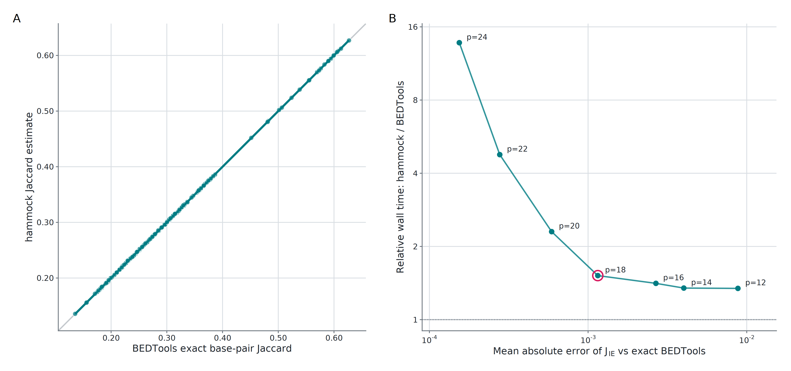

**Figure S1. Inclusion–exclusion estimates closely reproduce exact interval Jaccard at higher HyperLogLog precision.** (A) Pairwise comparisons on 20 Maurano et al. fetal-tissue DNase hypersensitivity BED files yielded 190 unique off-diagonal pairs after self-comparisons and reciprocal duplicates were excluded. At p=21, `jaccard_similarity_ie` closely tracked exact BEDTools base-pair Jaccard (MAE=4.30×10⁻⁴, Pearson r=0.99999, Spearman ρ=0.99987, and Kendall τ=0.9947). (B) The precision–runtime analysis from Figure 4 is repeated for context. The x-axis is MAE on a base-10 logarithmic scale, where lower is more accurate and successive labeled ticks differ tenfold. The y-axis is hammock/BEDTools relative wall time on a base-2 logarithmic scale, where y=1 denotes equal runtime and each labeled tick doubles; vertical ranges show the three-run hammock range. The magenta circle marks p=18, the CLI default.

**Figure S1 generation.** `paper/interval_accuracy/plot_interval_accuracy.R` with its optional reference-precision argument set to 21, using `docs/data/maurano_bedtools_ref.tsv`, `docs/data/hammock_hll_p21_jaccB_full.csv`, and `docs/data/sweep_precision_maurano_p18_t16.csv`; output is `paper/figures/interval_accuracy_p21.png`.

### Figure S5a — tissue organization at the numerical optimum

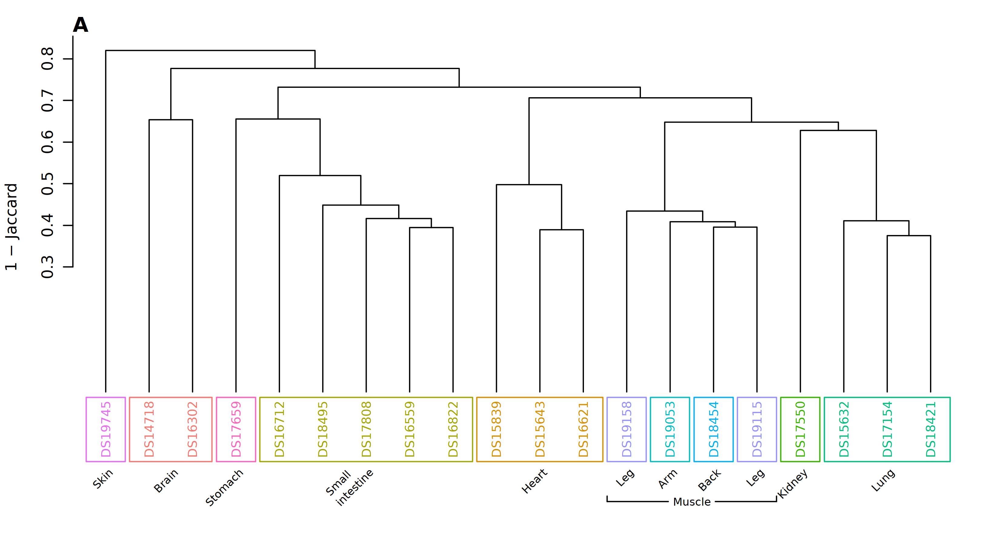

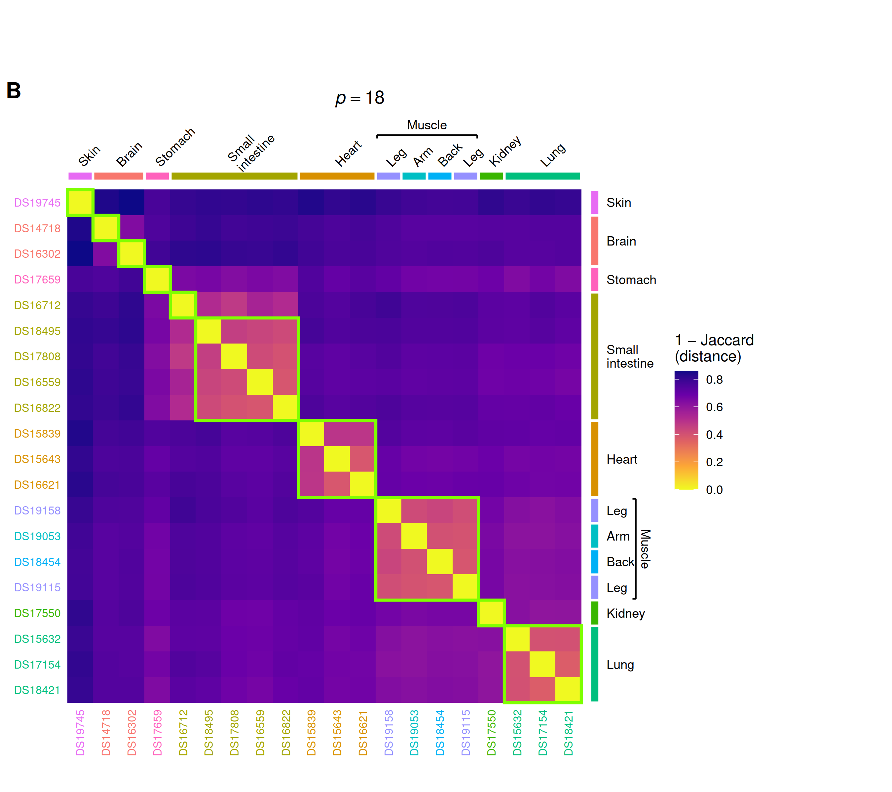

**Figure S5a. Numerical agreement with exact interval Jaccard does not maximize recovery of fetal-tissue organization.** The same 20 fetal-tissue DNase-seq interval sets shown in Figure 6 were compared using the inclusion–exclusion Jaccard estimate, `jaccard_similarity_ie`, at k=20, w=20, and HyperLogLog precision p=18—the parameter combination with the greatest Pearson correlation with exact BEDTools Jaccard within the p=18 comparison shown in Figure 7 (r=0.99997). **(A)** Average-linkage agglomerative hierarchical clustering was performed on 1−J. Leaf labels show dataset accessions and are colored and boxed by annotated tissue; these annotations do not represent a discrete cluster cut. **(B)** The complete pairwise 1−J distance matrix follows the dendrogram leaf order in A. Accession-label colors and marginal bars denote annotated tissues, with arm, back, and leg grouped under muscle. Lime-green diagonal outlines show the result of cutting the average-linkage agglomerative hierarchy into ten clusters. Relative to the annotated tissue partition, the cut separates the two brain samples, separates one of the five small-intestine samples, and combines the arm, back, and two leg samples into one cluster, yielding ARI=0.693 and NMI=0.905. In contrast, the biologically selected k=10, w=30 setting in Figure 6 at the same precision yields ARI=0.910 and NMI=0.961, demonstrating that numerical agreement with exact pairwise Jaccard and recovery of tissue organization select different sequence-sketch parameters.

**Figure S5a generation.** Panel A is generated by `paper/sequence_tissue_clustering/plot_sequence_tissue_clustering.R` using `experiments/maurano_dhs_validation/results/raw_d/hammock_mnmzr_p18_jaccD_k20_w20_full.csv`, the Maurano tissue key, `paper/figures/sequence_tissue_clustering_k20_w20.png`, and `jaccard_similarity_ie` as its four positional arguments. Panel B is generated by `paper/sequence_tissue_clustering/plot_distance_heatmap.R` with the same input CSV, tissue key, `paper/figures/sequence_tissue_distance_heatmap_k20_w20.png`, and similarity-column argument.

- **Figure S5b — cross-reference dendrogram on `reg_eq_similarity`:** `paper/figures/cross_reference_identity_regeq.png`, generated by `paper/cross_reference_identity/plot_cross_reference_identity.R` with the output path and `reg_eq_similarity` as its two positional arguments. Register-equality companion to the now-`jaccard_similarity_ie`-based Figure 5; see S5.
- **Table S5 — estimator agreement:** `paper/sequence_tissue_clustering/estimator_agreement_stats.csv` (per-column ARI/NMI and partition identity at Figure 6's cell), `experiments/maurano_dhs_validation/results/estimator_ari_by_config.csv` (all 235 cells), `experiments/maurano_dhs_validation/results/best_config_by_column.csv` (per-column optimum with tie sets), and `experiments/ref-comparison/results/exp_a_estimator_delta.csv` (cross-reference Δ per cell).
- **TODO — sequence-mode parameter heatmaps:** include the full k × w parameter-response heatmaps for numerical agreement with BEDTools and biological clustering performance (ARI/NMI), potentially stratified by HyperLogLog precision and/or estimator. These heatmaps should provide the complete response surface underlying the compact objective-space summary in Figure 7 without burdening the main-text figure.

### Figure S9 — Figure 3 companion: register-equality vs +IE, both scored against exact BEDTools

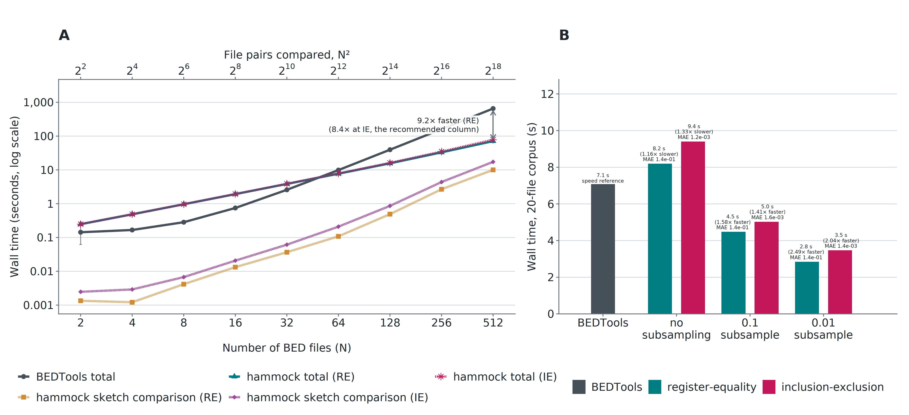

**Figure S9.** Companion to Figure 3, using the same underlying runs. (A) **Sketch reuse increases the advantage as collections grow.** Panel A retains both hammock variants (`reg_eq_similarity` and `jaccard_similarity_ie`, labeled "hammock total (RE)" and "hammock total (IE)", plus their sketch-comparison-phase components). (B) **Subsampling further reduces runtime.** Panel B scores the register-equality bars on the same basis as the IE bars: mean absolute error against exact BEDTools Jaccard, rather than drift from hammock's own unsubsampled run. On that shared footing, register-equality's MAE is ~0.137–0.138 across all three subsampling levels—roughly 100× the IE MAE (0.0012–0.0016)—and remains essentially flat because it is dominated by the register-equality chance-agreement floor, not by subsampling. This is why Figure 3 itself reports IE only: placing a BEDTools-uncalibrated statistic beside a calibrated Jaccard estimate without this framing would invite a direct comparison of unlike quantities.

**Figure S9 generation.** `paper/pairwise_scaling/plot_pairwise_scaling_supplement.R`, forked 2026-08-10 from the script that produces Figure 3 at the commit where it still plotted both hammock variants. Panel A shares Figure 3's `docs/data/cpp_vs_bedtools_t16_p18.csv` (job 29671317). Panel B shares Figure 3's `docs/data/maurano_bedtools.csv` and `docs/data/maurano_subB_ie_summary.csv`, plus a new `docs/data/maurano_subB_re_vs_bedtools.csv` (register-equality MAE vs exact BEDTools, computed from `experiments/subB_mixed_stride/results/sweep_maurano_ie_20260809_200658.csv` — mixed-stride, p=18, t=8, `rep=0`, against `docs/data/maurano_bedtools_ref.tsv`; reps are byte-identical, see `experiments/subB_mixed_stride/RESULTS.md` "Harness validation") and the existing register-equality wall times in `docs/data/maurano_subB_summary.csv`.

### Figure S6 — Thread scaling

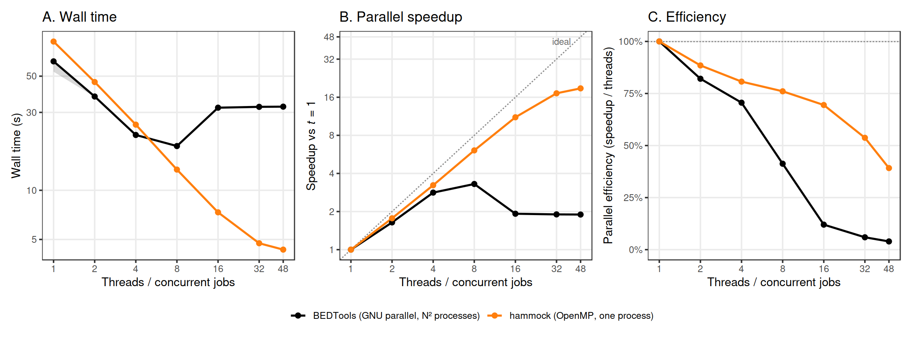

**Figure S6.** Wall time, speedup vs each tool's own *t*=1, and parallel efficiency across thread counts 1–48, on a synthetic 64-files-per-side corpus (10k intervals/file, p=18, subB=1.0, 3 replicates, medians). The hammock curve uses the historical register-equality-only output mode; this run did not measure inclusion–exclusion output. Deliberately separate from Figure 3, which is about cost vs. collection size; this is about what each tool does with the cores it is given, and shares no axis with Figure 3. BEDTools plateaus by t=8 (4.22× over its own t=1) and stays flat through t=48 (4.20×), converting at most 6.5 of its available cores into throughput because `bedtools jaccard` has no batch mode — a pairwise workflow is N² separate process launches, each re-reading its input files, wrapped in GNU `parallel`. hammock keeps improving to t=32 (12.11×, 24.0 of 32 cores busy) before easing back slightly at t=48 (11.59×, 28.1 of 48 — an oversubscription effect, not a new mechanism; see `docs/seed-mode-d-threading.md` for the analogous Mode D finding). Every BEDTools row in the benchmark CSVs carries `mean_bedtools_parallel_eff`, so this achieved-parallelism gap is checkable rather than assumed on any figure that quotes a BEDTools speedup at a fixed thread count. Caveat: one node, one corpus size, one precision — the *level* of BEDTools' achieved parallelism is node-dependent (measured 1.17–2.86× across three otherwise-identical runs), but the *shape* (early saturation, then a plateau rather than a steep regression) is the part to trust as general.

**Figure S6 generation.** `paper/pairwise_scaling/plot_threading_supplement.R` from `docs/data/sweep_threads_p18.csv` (job 29670792, node c531, one exclusive allocation).

### Figure S7 — Catalog scale

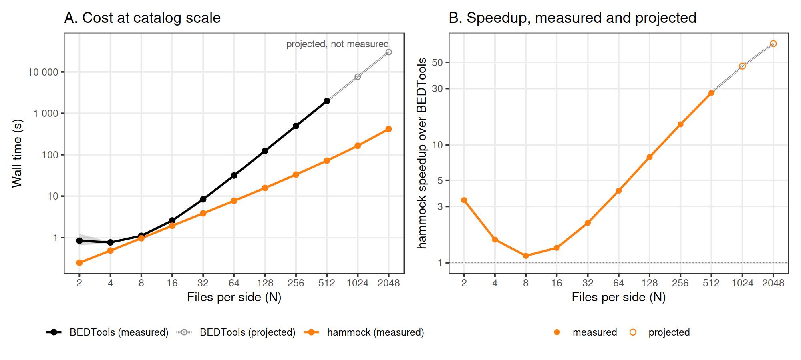

**Figure S7.** hammock measured to N=2048 (the ChIP-Atlas hg38 CTCF manifest holds 2,206 verified files, so this is a real corpus size) against a **projected**, not measured, BEDTools curve — drawn dashed, grey, and with open points to keep a projection from being mistaken for a third measurement. Projecting was the only practical option: BEDTools measures 653.4 s at N=512 (the same corrected, job-29671317 measurement Figure 3A plots — do not substitute the retracted pre-LD_LIBRARY_PATH-fix figure of 1978 s from the top-of-document notice), growing ~3.97× per doubling, so one replicate is ~0.7 h at N=1024 and ~2.9 h at N=2048 — roughly 11 h of node time for three replicates at each of N=1024 and N=2048, to extend a comparison Figure 3 already settles by N=256. The fitted exponent is 2.000 (theory 2.0, R²=0.9999, fit on N≥32 only, since smaller N is startup-dominated). At N=512, 1024, and 2048 hammock measures 71.35 s, 164.68 s, and 417.27 s against BEDTools' 653.4 s (measured) and 2574 s / 10294 s (projected), for speedups of 9.2×, 15.6× (projected), and 24.7× (projected). hammock's own curve is not extrapolated — every hammock point shown is measured — and its cost per doubling is itself rising (2.30× then 2.53×) as the Θ(N²) pairwise phase begins to overtake linear sketching, which is why only the BEDTools segment is dashed. The 9-column metrics block costs 1.27× at N=2048 (529.6 s vs 417.3 s) against **~1.15×** at N=20 on Maurano (`maurano_subB_ie_summary.csv` wall 9.404 s vs `maurano_subB_summary.csv` wall 8.188 s at subB=1.0 — not directly readable off Figure 3B, which as of the 2026-08-10 simplification plots only the +IE arm; see Figure S9 for the register-equality comparison point) — the block is a per-*pair* cost, so its share still grows markedly with N, and "the metrics are nearly free" from the small-N comparison does not generalize.

**Figure S7 generation.** `paper/pairwise_scaling/plot_largeN_supplement.R` from `docs/data/cpp_vs_bedtools_t16_p18.csv` (job 29671317, node c529 — same run as Figure 3A) joined to `docs/data/cpp_vs_bedtools_t16_p18_largeN.csv` (job 29652432, node c594, hammock-only, N ∈ {512, 1024, 2048}, same corpus generator and seed schedule as Figure 3A). The script checks and prints two internal consistency gates rather than assuming them: the N=512 cell measured by both jobs on different nodes agrees to 1.1% (70.97 s vs 71.73 s), and the fitted BEDTools exponent (2.000) is reported alongside its R².

### Figure S8 — Precision frontier

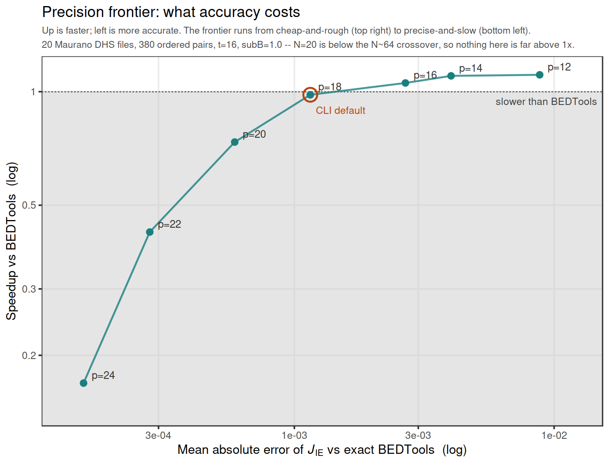

**Figure S8.** x = MAE of `jaccard_similarity_ie` vs exact BEDTools (log), y = speedup vs BEDTools based on the paired reduced/base-arm wall time (log), one point per HyperLogLog precision p ∈ {12,14,16,18,20,22,24}, on the 20-file Maurano corpus (190 unique off-diagonal pairs, subB=1.0, 3 replicates, medians). Deliberately not twin y-axes against p: twin log axes have no canonical registration, so an apparent crossing would be an artifact of axis placement rather than a property of the data. Plotted this way, iso-accuracy is a vertical line and "slower than BEDTools" is the region below y=1 — which is every precision tested on this corpus (0.744× at p=12 down to 0.0726× at p=24). Accuracy improves 57× from p=12 to p=24 (MAE 8.8e-3 → 1.5e-4) while speed falls ~10×, so there is no accuracy/speed knee to trade toward on this corpus — the choice of p here is purely an accuracy decision. This panel must be read together with Figure 3A, not against it: at N=20 (this corpus) hammock is slower than BEDTools at every precision, while Figure 3A reports 8.4× at N=512 — both are true, because Maurano sits well below the N≈64 crossover, so sketching cost has not yet been amortized over enough pairs. `reg_eq_similarity` (register-equality) cannot usefully appear on the accuracy axis: its MAE is 0.1374–0.1383 across the whole precision sweep (varying 1.01× while `_ie`'s MAE moves 57×), because it is dominated by the register-equality chance-agreement floor rather than by sampling noise — the same floor Figure S9 makes visible directly.

**Figure S8 generation.** `paper/pairwise_scaling/plot_precision_frontier.R` from `docs/data/sweep_precision_maurano_p18_t16.csv` (job 29670793, node c432; the t=8 companion `sweep_precision_maurano_p18_t8.csv` from the same job is a cross-check, not a second plotted series — accuracy at t=8 is bit-identical to t=16, since thread count changes only how fast a deterministic sketch is built, not its content, and this was verified exactly: max |ΔMAE| = 0 at every precision). The script pairs `jaccard_ie_mae_vs_bt` from the metrics arm with `wall_time` from the reduced/base arm; it does not use the metrics arm's `metrics_wall_time`. The p=18 base-arm speedup is 0.66× here, whereas Figure 3B's full-metrics IE speedup at eight threads is 0.75×. That difference reflects both thread count and output workload, so the two y-values are not a direct cross-check.

### Figure S10 — subB speedup vs catalog scale

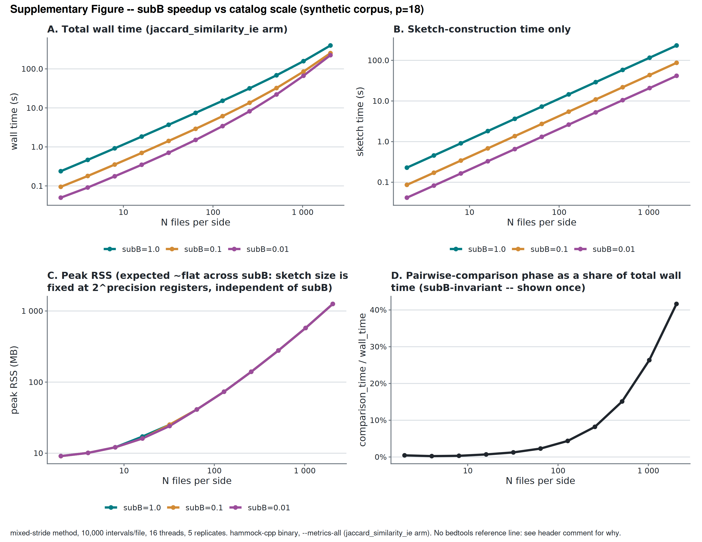

**Figure S10.** Answers the synthetic-corpus TODO left by the main-text subB paragraph (`docs/seed-subsampling-synthetic-supplement.md`): a synthetic corpus (10,000 intervals/file, p=18, 16 threads, 5 replicates), three `subB` lines (1.0, 0.1, 0.01), N ∈ {2,4,...,2048} files per side, `jaccard_similarity_ie` throughout. Panel A (total wall time) shows the three lines converging, not staying parallel, as N grows — the 10-fold (1.0→0.1) speedup falls from 2.62× at its N=16 peak to 1.57× at N=2048, and the 100-fold (1.0→0.01) speedup falls from 5.28× at N=16 to 1.77× at N=2048. Panels B and D isolate why: subB only discounts sketch-construction time (Panel B, where the three lines stay proportionally separated on the log-log scale for the full N range), while the Θ(N²) pairwise-comparison phase is subB-invariant and grows from <1% of wall time at N≤32 to 43.4% at N=2048 (Panel D) — so as N grows, an increasing share of total wall time is work subB cannot touch. Panel C confirms peak RSS is ~flat across subB at fixed N, as expected: subB changes how many points are inserted into a sketch, not the sketch's size (fixed at 2^precision registers).

At N=512 — matching Figure 3A's headline point — the synthetic-corpus 10-fold speedup is 2.12×, against 1.87× on the 20-file Maurano corpus (`maurano_subB_ie_summary.csv`): real, but modest corpus-dependence, not the 4.21× a since-corrected outline draft once (incorrectly) claimed. The two corpora are not at comparable N (Maurano has 20 files; this panel's N=512 point uses 512 synthetic files per side), so this is a same-precision, not same-N, comparison — read as "both real, both modest, in the same direction," not as a precise ratio-of-ratios.

**Figure S10 generation.** `paper/pairwise_scaling/plot_subB_nscaling_supplement.R` from `experiments/bedtools_benchmark/results/cpp_vs_bedtools_t16_20260811_154922.csv` (job 29761450, `experiments/bedtools_benchmark/sbatch_subB_nsweep.sh`, `--metrics-all --subB-list 1.0,0.1,0.01`). Hammock-only — no projected BEDTools reference line; see the script's header comment for why one projected curve under three hammock lines would multiply the mis-citation surface for no new BEDTools information. The script's own overlap check confirms this job's N=512, subB=1.0 point (68.5 s) is within 14.0% of the separately-allocated Figure 3A point at the same N (78.1 s, `docs/data/cpp_vs_bedtools_t16_p18.csv`) — consistent enough to treat the two as comparable despite being different SLURM allocations.
