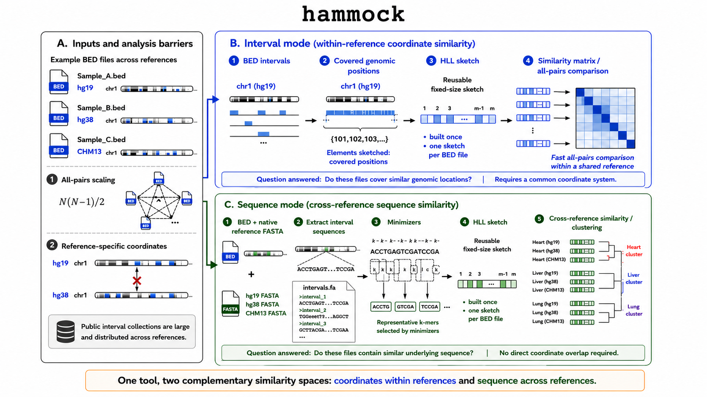

## Thesis

Modern interval collections are limited by two boundaries: the computational cost of comparing every dataset and the coordinate dependence that prevents comparison across references. Hammock creates reusable sketches of either interval coordinates or interval-derived sequences, expanding comparison within and across those boundaries while preserving useful biological structure.

## Abstract

## I. Introduction

The introduction establishes two barriers to systematic comparison of genomic interval collections:

1. the computational cost of expanding all-pairs comparisons as repositories grow; and
2. the dependence of coordinate-overlap methods on a shared reference genome.

**Figure 1. Reference-genome fragmentation prevents direct comparison across public histone-mark collections.** Numbers of possible pairwise comparisons among processed histone-mark ChIP-seq peak BED files are shown for the five most represented marks shared by Roadmap Epigenomics and BLUEPRINT. Within-resource comparisons can be performed directly because Roadmap files share hg19 coordinates and BLUEPRINT files share hg38 coordinates. In contrast, every Roadmap–BLUEPRINT pairing is blocked for direct coordinate-overlap analysis by the hg19–hg38 reference mismatch. File counts are deduplicated at the download-URL level; included outputs are BED-, narrowPeak-, broadPeak-, or gappedPeak-like peak files. Repository counting and inclusion criteria are described in Supplementary Methods S1.

## II. Results

### 2.1 Hammock represents interval sets in complementary coordinate and sequence spaces

**Figure 2. Hammock provides complementary coordinate- and sequence-based representations of genomic interval sets.** (A) Public interval collections are large, comparisons scale quadratically with the number of files, and BED coordinates are tied to specific reference genomes. (B) In interval mode, each BED file is summarized as a reusable sketch of covered genomic positions, enabling fast all-pairs similarity comparisons within a shared reference. (C) In sequence mode, interval sequences are extracted from each file's native reference FASTA, representative k-mers are selected using minimizers, and the resulting sequence sketches are compared across references without requiring direct coordinate overlap. The two modes therefore answer complementary questions: whether interval sets occupy similar genomic locations and whether they contain similar underlying sequence.

### 2.2 Interval sketching expands feasible all-pairs BED comparison

**Figure 3. Hammock expands feasible all-pairs comparison as interval collections grow.** (A) Wall time for hammock and BEDTools across synthetic collections containing 10,000 intervals per BED file, using HyperLogLog precision \(p=14\), 16 threads, and three runs per configuration. Hammock constructs one reusable sketch per file and separates sketch-construction time from fixed-size sketch comparison, whereas the BEDTools workflow repeatedly performs exact comparisons over the underlying interval files. The number of unique file pairs grows as \(N(N-1)/2\), causing the performance advantage of sketch reuse to increase with collection size. (B) Wall time on 20 Maurano fetal-tissue DNase hypersensitivity BED files, corresponding to 190 unique pairs, using interval mode with \(p=18\) and eight threads. Hammock is faster than the parallelized BEDTools workflow without subsampling, while mixed-stride subsampling at `subB = 0.1` and `subB = 0.01` further reduces runtime with little change relative to hammock's own unsubsampled similarity estimates. Bar labels report wall time, speedup relative to BEDTools, and the mean change in estimated Jaccard similarity relative to unsubsampled hammock. Together, the synthetic and real-data benchmarks show that hammock improves the feasibility of exhaustive pairwise analysis through both reusable sketches and optional approximation within sketch construction.

**Figure 3 generation.** The combined figure is generated by `paper/pairwise_scaling/plot_pairwise_scaling.R` and written to `paper/figures/pairwise_scaling.png`. Panel A uses `docs/data/cpp_vs_bedtools_t16_20260512_160412.csv`. Panel B uses `docs/data/maurano_subB_summary.csv` and `docs/data/maurano_bedtools.csv`. The script rebuilds both panels with harmonized typography, panel labels, tool colors, wall-time units, and the correct unique-pair count, \(N(N-1)/2\).

### 2.3 Interval sketches preserve exact-overlap similarity structure

### 2.4 Sequence sketches enable comparison across genome references

### 2.5 Biological identity is preserved across references

### 2.6 Sequence sketches recover tissue organization

### 2.7 Parameterization separates numerical agreement from biological resolution

## III. Discussion

### 3.1 Scaling comparison within references

### 3.2 Comparing interval-derived sequence across references

### 3.3 Coordinate similarity and sequence similarity are complementary

### 3.4 Practical recommendations

### 3.5 Limitations and future work

## IV. Methods

### 4.1 Software implementation

### 4.2 Interval-mode sketch construction

### 4.3 Sequence-mode sketch construction

### 4.4 Similarity estimators and computational complexity

### 4.5 Datasets

### 4.6 Performance benchmarking

### 4.7 Interval-mode accuracy evaluation

### 4.8 Sequence-mode biological evaluation

## Data and code availability

## Author contributions

## Acknowledgments

## References

## Supplementary Methods

### S1. Quantification of public interval collections

#### S1.1 ChIP-Atlas experiment counts

#### S1.2 ENCODE assay counts

#### S1.3 Roadmap and BLUEPRINT file selection

#### S1.4 Reference-assembly classification

#### S1.5 Pairwise-comparison calculations

## Supplementary Results

## Supplementary Figures and Tables
