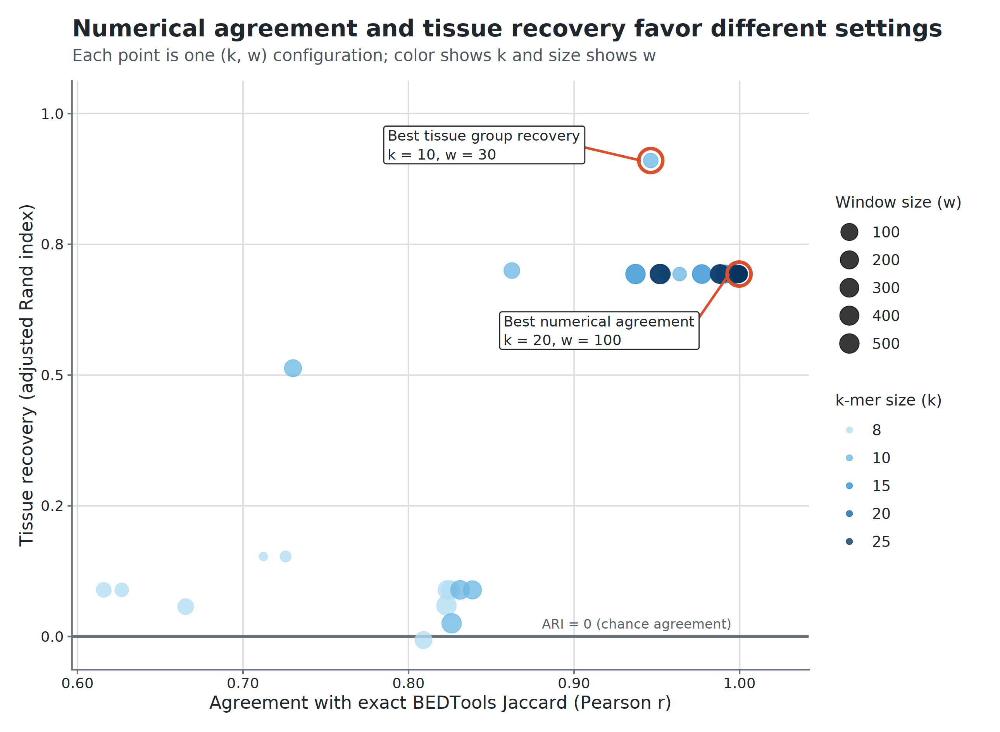

## Thesis

Modern interval collections are limited by two boundaries: the computational cost of comparing every dataset and the coordinate dependence that prevents comparison across references. Hammock creates reusable sketches of either interval coordinates or interval-derived sequences, expanding comparison within and across those boundaries while preserving useful biological structure.

## Abstract

## I. Introduction

Increased availability of high-throughput sequencing has facilitated a corresponding increase in large-scale modern sequencing projects which produce vast numbers of genomic annotation datasets which then, themselves, become part of the genomic data ecosystem. Large-scale initiatives such as the ENCODE Project\cite{encode_2012}, the Roadmap Epigenomics Project\cite{roadmap_2015}, GTex[REF], and the 1000 Genomes Project\cite{10002015global} make datasets publicly available, providing unprecedented opportunities for integrative analysis. Among the most common and biologically informative outputs of these projects are genomic intervals: contiguous stretches of the genome that define transcription factor binding sites, chromatin accessibility peaks, histone modifications, structural variants, and splicing junctions. Such interval datasets have become a cornerstone of downstream analyses that seek to characterize genome function and variation across populations, tissues, cell types, and experimental conditions. In particular, pairwise comparison of interval datasets presents a measurement of biological similarity, such as identifying conserved regulatory elements between tissues. Tools such as \program{BEDTools} provide exact calculations of these measures\cite{quinlan2010bedtools}, but the computational cost of pairwise overlap calculations grows rapidly with the size of modern repositories. In practice, this creates a scalability bottleneck that hampers systematic comparisons across the interval datasets now available\cite{li2020design}.

The numbers of files in these interval databases continue to grow every year. ChIP-Atlas, for example, expanded from 37,720 accumulated experiments in 2015 to 464,655 in 2025, while repositories such as ENCODE contain thousands of additional ChIP-seq and chromatin-accessibility experiments.

Scalability is not the only obstacle to systematic interval comparison. BED coordinates are meaningful only with respect to the reference genome on which they were defined, and large public collections remain distributed across multiple genome assemblies. Standard overlap measures therefore cannot directly compare two interval files when one is defined on hg19 and the other on hg38, even when the files describe the same assay or biological feature. Figure 1 illustrates this limitation for histone-mark ChIP-seq peak files from Roadmap Epigenomics and BLUEPRINT. For histone marks represented in both collections, within-Roadmap and within-BLUEPRINT comparisons can be performed in their respective coordinate systems, whereas every Roadmap–BLUEPRINT pairing is blocked by the hg19–hg38 mismatch. Coordinate conversion can sometimes recover such comparisons, but it introduces additional preprocessing, may not map all intervals unambiguously, and continues to define similarity in terms of a selected coordinate system. An alternative is to extract the reference sequence underlying each interval and compare the resulting sequence collections directly, allowing related genomic annotations to be evaluated across references without requiring their coordinates to coincide.

**Figure 1. Reference-genome fragmentation prevents direct comparison across public histone-mark collections.** Numbers of possible pairwise comparisons among processed histone-mark ChIP-seq peak BED files are shown for the five most represented marks shared by Roadmap Epigenomics and BLUEPRINT. Within-resource comparisons can be performed directly because Roadmap files share hg19 coordinates and BLUEPRINT files share hg38 coordinates. In contrast, every Roadmap–BLUEPRINT pairing is blocked for direct coordinate-overlap analysis by the hg19–hg38 reference mismatch. File counts are deduplicated at the download-URL level; included outputs are BED-, narrowPeak-, broadPeak-, or gappedPeak-like peak files. Repository counting and inclusion criteria are described in Supplementary Methods S1.

Probabilistic data structures, or sketches, offer a powerful solution to these challenges. Sketching methods compress large datasets into compact representations that allow efficient estimation of set cardinality and similarity. Techniques such as MinHash\cite{minhash} and HyperLogLog\cite{hll} have seen wide application in computer science, and their introduction to genomics has already revolutionized k-mer–based comparisons of sequencing datasets. Tools like Dashing \cite{dashing} and Mash\cite{mash} have demonstrated the value of sketching for rapid, large-scale sequence and metagenome comparisons. Extending these methods to genomic interval data, however, remains relatively unexplored. Because intervals represent continuous spans rather than discrete tokens, adapting sketches for overlap estimation presents unique methodological challenges but also significant opportunities. Moreover, representing intervals through both their coordinates and their underlying reference sequences provides complementary notions of similarity: coordinate-based sketches support rapid comparison within a shared reference, whereas sequence-based sketches can support comparisons across references.

In this study, we present \program{hammock}, a command-line tool for scalable comparison of genomic interval datasets. Within a shared reference genome, \program{hammock} applies probabilistic sketches to BED intervals to approximate overlap and similarity across large collections of files, reducing the computational burden of systematic pairwise analysis. We benchmark these estimates against exact calculations from established interval-processing tools and evaluate the resulting trade-offs among speed, memory use, and accuracy. We additionally introduce a sequence-based representation in which the reference sequences underlying BED intervals are extracted and sketched, enabling similarity measurements between annotations defined on different genome assemblies. Together, these approaches address two complementary barriers to large-scale interval analysis: the computational cost of expanding pairwise comparisons within a reference and the coordinate incompatibility that prevents direct comparison across references.

## II. Results

### 2.1 Hammock represents interval sets in complementary coordinate and sequence spaces

**Figure 2. Hammock provides complementary coordinate- and sequence-based representations of genomic interval sets.** (A) Public interval collections are large, comparisons scale quadratically with the number of files, and BED coordinates are tied to specific reference genomes. (B) In interval mode, each BED file is summarized as a reusable sketch of covered genomic positions, enabling fast all-pairs similarity comparisons within a shared reference. (C) In sequence mode, interval sequences are extracted from each file's native reference FASTA, representative k-mers are selected using minimizers, and the resulting sequence sketches are compared across references without requiring direct coordinate overlap. The two modes therefore answer complementary questions: whether interval sets occupy similar genomic locations and whether they contain similar underlying sequence.

### 2.2 Interval sketching expands feasible all-pairs BED comparison

This section should distinguish two sources of the interval-mode speedup:

1. **Sketch reuse:** each BED file is read once and converted to a fixed-size summary that can be reused across all pairwise comparisons.
2. **Mixed-stride subsampling:** hammock's novel `subB` implementation samples genomic positions using deterministic chromosome-specific strides and offsets, avoiding the per-position hashing cost of hash-threshold subsampling. This reduces sketch-construction time in proportion to the requested sampling fraction while preserving reproducibility and producing little change relative to the unsubsampled hammock similarities in the evaluated datasets.

Mixed-stride should be presented as a methodological contribution within the interval-mode scaling result, not as an unrelated implementation optimization. The main text should briefly contrast it with hash-threshold subsampling; the full comparison among mixed-stride, hash-threshold, and single-hash strategies can remain supplementary.

**Figure 3. Hammock expands feasible all-pairs comparison as interval collections grow.** (A) Wall time for hammock and BEDTools across synthetic collections containing 10,000 intervals per BED file, using HyperLogLog precision p=14, 16 threads, and three runs per configuration. Hammock constructs one reusable sketch per file and separates sketch-construction time from fixed-size sketch comparison, whereas the BEDTools workflow repeatedly performs exact comparisons over the underlying interval files. Each configuration comprises two disjoint collections of N files compared as a full cross product, so the number of compared pairs grows as N^{2} — reaching 262,144 at N=512 — causing the performance advantage of sketch reuse to increase with collection size. The lower pair of curves separates the two output shapes hammock can emit: the sketch-comparison phase with the three-column output used for timing, and the same phase emitting `jaccard_similarity_ie` together with the containment and co-sketch columns (`+IE`), which is the configuration recommended for analysis. The additional columns cost a factor of 3.4–3.8 in that phase at N\ge64 (less at smaller N, where fixed per-run overhead dominates a sub-millisecond phase) but only 1.45% of total wall time at N=512 (54.15 s against 53.38 s), because sketch construction dominates throughout; the two total-time curves are consequently indistinguishable and only the three-column one is drawn. (B) Wall time on 20 Maurano fetal-tissue DNase hypersensitivity BED files, corresponding to 190 unique pairs, using interval mode with p=18 and eight threads. Hammock is faster than the parallelized BEDTools workflow without subsampling, while the novel mixed-stride implementation of `subB` at `0.1` and `0.01` further reduces runtime with little change relative to hammock's own unsubsampled similarity estimates. Mixed-stride deterministically advances through genomic positions at chromosome-specific strides and offsets, avoiding a hash-based inclusion test at every covered position. Bar labels report wall time, speedup relative to BEDTools, and mean |\Delta J|. \Delta J is defined per pair as the difference between a subsampled run's `jaccard_similarity` and the mean `jaccard_similarity` of hammock's own unsubsampled (\mathrm{subB}=1.0) runs on that same pair; mean |\Delta J| is the mean of its absolute value over all 950 pair-by-replicate comparisons (190 pairs \times 5 replicates). Two consequences are worth stating explicitly. 

Together, the synthetic and real-data benchmarks show that hammock improves the feasibility of exhaustive pairwise analysis through both reusable sketches and efficient optional subsampling during sketch construction.

**Figure 3 generation.** The combined figure is generated by `paper/pairwise_scaling/plot_pairwise_scaling.R` and written to `paper/figures/pairwise_scaling.png`. Panel A uses `docs/data/cpp_vs_bedtools_t16_20260804_172242.csv` (job 29552415); Panel B uses `docs/data/maurano_subB_summary.csv` and `docs/data/maurano_bedtools.csv`. The script rebuilds both panels with harmonized typography, panel labels, tool colors, wall-time units, and the pair count N^{2}.

### 2.3 Interval sketches recover exact-overlap similarity structure and values

**Figure 4. Inclusion–exclusion estimates closely reproduce exact BEDTools Jaccard.** Pairwise comparisons were performed on 20 Maurano fetal-tissue DNase hypersensitivity BED files, yielding 190 unique off-diagonal pairs; self-comparisons were excluded. Hammock's `jaccard_similarity_ie` uses HyperLogLog cardinality estimates with inclusion–exclusion to approximate the same base-pair Jaccard statistic computed exactly by BEDTools. At HyperLogLog precision p=21, the estimated values closely track exact BEDTools Jaccard over the observed off-diagonal range (MAE =4.3\times10^{-4}, Pearson r=0.99999, Kendall \tau=0.9947). Across precisions p=18, p=21, and p=23, absolute deviation from BEDTools decreases as precision increases, from approximately 1\times10^{-3} to approximately 2\times10^{-4}. The figure therefore evaluates the numerical accuracy of the inclusion–exclusion estimate relative to exact interval Jaccard; it does not compare inclusion–exclusion with hammock's register-equality statistic.

**Figure 4 generation.** The figure is generated by `paper/interval_accuracy/plot_interval_accuracy.R` and written to `paper/figures/interval_accuracy.png`. Inputs are `docs/data/maurano_bedtools_ref.tsv` and `docs/data/hammock_hll_p{18,21,23}_jaccB.csv`. Those three CSVs were regenerated with hammock 0.5.0 on 2026-07-31 to obtain the `jaccard_similarity_ie` column; earlier copies carried the placeholder `containment` column and could not supply it. The regeneration reproduces the archived `jaccard_similarity` values **exactly** (0 of 400 pairs differ at any precision), so panel A's register-equality series is unchanged from the previously published figure.

### 2.4 Biological identity is preserved across references

**Figure 5. Sequence sketches group samples by tissue across genome references.** Three ENCODE H3K27ac ChIP-seq samples—heart ENCSR175ABH, liver ENCSR864OOO, and lung ENCSR954JMZ—were independently aligned and peak-called against GRCh37, GRCh38, and CHM13, yielding nine peak sets. Each peak set was converted to sequence against its native reference and sketched in sequence mode using broad peaks, k=10, w=10, HyperLogLog precision p=24, and the minimizer-only Jaccard metric. UPGMA clustering on 1-J groups the nine peak sets by tissue rather than by reference genome: heart, liver, and lung each form a distinct clade containing the GRCh37-, GRCh38-, and CHM13-derived representation of that tissue. In this proof-of-concept panel, reference choice therefore behaves as a within-tissue perturbation rather than as the dominant axis of separation, showing that sequence sketches can retain biological identity across genome references without requiring direct coordinate overlap.

**Figure 5 generation.** The figure is generated by `paper/cross_reference_identity/plot_cross_reference_identity.R` and written to `paper/figures/cross_reference_identity.png`. Inputs are `docs/data/exp_a_broad_k10_w10.csv` (staged from `experiments/ref-comparison/results/exp_a/broad/k10_w10/exp_a_mnmzr_p24_jaccD_k10_w10.csv`) and `docs/data/exp_a_metadata.tsv` (staged from the experiment configuration). The script constructs the nine-sample similarity matrix, converts similarity to 1-J, performs average-linkage hierarchical clustering, and renders the tissue-colored dendrogram.

### 2.5 Sequence sketches recover tissue organization

- **Quantitative clustering result for the Results prose:** cutting the average-linkage dendrogram into the ten annotated tissue classes gives adjusted Rand index (ARI) = 0.9102 and normalized mutual information (NMI) = 0.9610. These values quantify a separate 10-cluster evaluation and should not be presented as properties of the visual tissue annotations in Figure 6.
- **Figure interpretation:** Figure 6 itself does not display a discrete cluster cut. Its labels are colored by the known tissue annotations to show how biological identity is organized along the dendrogram.

**Figure 6. Sequence sketches recover fetal-tissue organization in the Maurano DNase hypersensitivity collection.** Twenty fetal-tissue DNase-seq interval sets spanning ten annotated tissue labels were converted to interval-derived sequence and compared using the minimizer-only `jaccard_similarity` score at k=10, w=30, and HyperLogLog precision p=24. Average-linkage hierarchical clustering was performed on 1-J. Leaf labels show dataset accessions and are colored by annotated tissue. The tissue coloring is an annotation of the dendrogram and does not represent a discrete cluster cut.

**Figure 6 generation.** The figure is generated by `paper/sequence_tissue_clustering/plot_sequence_tissue_clustering.R` and written to `paper/figures/sequence_tissue_clustering.png`. By default, the script reads `experiments/maurano_dhs_validation/results/raw_d/hammock_mnmzr_p24_jaccD_k10_w30.csv`, uses the `jaccard_similarity` column, and obtains tissue annotations from `experiments/maurano_dhs_validation/data/maurano_filenames_key.tsv`. Optional command-line arguments can substitute another similarity CSV, tissue key, output path, or similarity column.

### 2.6 Parameterization separates numerical agreement from biological resolution

- **Figure 6 parameter choice for the Results prose:** k=10, w=30 lies on the ARI-optimal sequence-mode plateau; p=24 is the precision used for the manuscript dendrogram. The parameter sweep, rather than Figure 6 itself, is the evidence that this setting is ARI-optimal.

**Figure 7. Numerical agreement and tissue recovery favor different sequence-mode settings.** Sequence-mode parameter configurations were evaluated on 20 Maurano fetal-tissue DNase hypersensitivity interval sets at HyperLogLog precision p=24 using HLL sketches constructed from minimizers and compared with Hammock's register-equality statistic (`jaccard_similarity`). Each point represents one combination of k-mer size (k) and minimizer-window size (w). The x-axis reports agreement with exact BEDTools Jaccard across pairwise comparisons as Pearson correlation, while the y-axis reports recovery of the annotated tissue classes as adjusted Rand index (ARI) after clustering. Point color denotes k and point size denotes w on a logarithmic scale. The horizontal line at ARI=0 marks chance-level cluster agreement. Red outlines and callouts identify the configuration with the greatest numerical agreement and the configuration with the greatest tissue recovery; when distinct, the setting used for the Figure 6 dendrogram is also highlighted. The separation of these optima shows that parameters chosen to most closely reproduce coordinate-based Jaccard need not be those that best preserve tissue-level biological organization.

**Figure 7 generation.** The figure is generated by `paper/parameter_objective_tradeoff/plot_parameter_objective_tradeoff.R` and written to `paper/figures/parameter_objective_tradeoff.png`. The input is `docs/data/mode_d_summary.csv` (staged from `experiments/maurano_dhs_validation/results/mode_d_summary.csv`), filtered to `precision == 24`, `column == "jaccard_similarity"`, and `reference == "bedtools"`; configurations with k<8 and rows lacking Pearson correlation or ARI are excluded. The script identifies the maximum-Pearson and maximum-ARI configurations directly from the filtered sweep and marks the k=10, w=30 setting used in Figure 6 when it is not itself the ARI optimum.

## III. Discussion

### 3.1 Scaling comparison within references

Discuss both layers of the computational contribution: reusable sketches reduce the cost of repeated all-pairs comparisons, while mixed-stride makes optional base-pair subsampling computationally effective by avoiding a per-position hashing gate. Mixed-stride should be described as a novel deterministic subsampling strategy with chromosome-specific phase offsets, not merely as a command-line tuning option.

### 3.2 Comparing interval-derived sequence across references

### 3.3 Coordinate similarity and sequence similarity are complementary

### 3.4 Practical recommendations

### 3.5 Limitations and future work

## IV. Methods

### 4.1 Software implementation

### 4.1 Software implementation

\program{hammock} is a command-line tool and importable Python package with a C++17 extension that uses OpenMP for parallel execution. It accepts two positional inputs, each a plain-text file containing paths to a collection of genomic datasets to be compared. Hammock selects interval or sequence mode based on the input dataset formats and supplied reference arguments unless a mode is explicitly requested. In all modes, one reusable sketch is constructed for each listed dataset, and pairwise comparisons between the two collections are written to a comma-separated table.

Hammock implements four representations that can be selected with `--mode`.

| CLI mode                       | Input                                | Representation                                       |
| ------------------------------ | ------------------------------------ | ---------------------------------------------------- |
| `interval-string`              | BED                                  | Exact chromosome–start–end interval strings          |
| `interval` / `interval-points` | BED                                  | Base-level genomic positions covered by intervals    |
| `interval-hybrid`              | BED                                  | Combined interval-string and position representation |
| `sequence`                     | FASTA or BED with a reference genome | Sliding-window minimizers derived from sequence      |

This study evaluates the base-level `interval` representation for within-reference comparisons and the `sequence` representation for comparisons of interval-derived sequence. The interval-string and interval-hybrid representations remain available in the software but are not evaluated as primary methods here.

For sequence comparisons beginning from BED files, hammock extracts the nucleotide sequence underlying each interval using the reference genome associated with that collection. `hammock fetch-ref` can be used to facilitate the download of references. Sequence extraction produces one FASTA file per BED file, which is then processed using the same sequence-mode workflow as directly supplied FASTA input.

For each pair of input datasets, hammock reports the following similarity summaries:

| Output field            | Interpretation                                                                 |
| ----------------------- | ------------------------------------------------------------------------------ |
| `jaccard_similarity_ie` | Set Jaccard estimated from HyperLogLog cardinalities using inclusion–exclusion |
| `jaccard_similarity`    | Fraction of active HyperLogLog registers with equal values                     |
| `containment_AB`        | Estimated fraction of dataset A contained in dataset B                         |
| `containment_BA`        | Estimated fraction of dataset B contained in dataset A                         |
| `cosketch_geom`         | Geometric mean of the two directional containment estimates                    |
| `cosketch_arith`        | Arithmetic mean of the two directional containment estimates                   |
| `cosketch_max`          | Maximum of the two directional containment estimates                           |

The analyses in this study use the register-equality Jaccard estimate or the inclusion–exclusion Jaccard estimate when comparison with exact set Jaccard is required. Sketch construction and interval subsampling are reproducible for fixed parameter values and seeds.

### 4.2 Interval-mode sketch construction

#### 4.2.1 Hyperloglog Sketching

#### 4.2.2 Mixed-stride subsampling

Interval mode passes the points of a base-pair expansion of each interval to a HLL sketch. There is a certain computational excess involved in adding every point in an interval, so \program{hammock} includes a \texttt{--subB} command that allows for a subsampling of the points to be added to the sketch, where the value of \texttt{subB} is a proportion between $0$ and $1$. In order to maintain reproducible randomness of point selection, mixed-stride subsampling is used.

In mixed-stride subsampling, a deterministic chromosome-keyed offset is used to select the sampling phase, interpolating between two strides to exactly match a target probability $p$, with deterministic reproducibility.

ADD MATH HERE

Define `subB`, the sampled base-pair universe, and the mixed-stride algorithm. For sampling fraction `subB`, set the approximate stride to s=\mathrm{round}(1/\mathrm{subB}), use a deterministic chromosome-keyed offset to select the sampling phase, and advance directly between accepted positions rather than evaluating every covered position.

Explain determinism, seed handling, expected sampling density, computational cost, and the rationale for chromosome-specific offsets. Contrast the algorithm with hash-threshold subsampling, whose inclusion test requires a hash computation for every covered position regardless of the requested sampling fraction.

### 4.3 Sequence-mode sketch construction

#### 4.3.1 Minimizers

### 4.4 Similarity estimators and computational complexity

*Draft outline. Key sentences are given; connecting prose is not written.*

- **Framing.** Both estimators are computed from the same pair of sketches. *"Hammock's two similarity columns differ in what they estimate and in what they cost, not in the data they see."*
- **Register-equality (**`jaccard_similarity`**).** Define as the fraction of active registers whose values agree.
  - *"This is not set Jaccard: two registers agree whenever the largest ρ observed in that bucket happens to coincide, which occurs at some rate even for disjoint inputs, so the statistic carries a chance-agreement floor c."*
  - c is set by the sketch load factor λ = n/m **and** by the cardinality ratio |A|/|B| — not by precision as such. Report 0.1699 at equal cardinality as λ→∞, 0.058 at ratio 10, 0.045 at p = 24 once m > n.
  - *"Because c differs between pairs of differing size, register-equality is order-preserving within a cardinality ratio but not across ratios."* Ties to the 2.45% Maurano inversions in §2.3.
- **Inclusion–exclusion (**`jaccard_similarity_ie`**).** Define |A ∩ B| = |A| + |B| − |A ∪ B| with each term an Ertl (2017) estimate, union by register-wise maximum, intersection clamped to ≥ 0; J = |A∩B|/|A∪B|, equivalently 1/(1/C_AB + 1/C_BA − 1).
  - *"An exact 0.0 in this column means the intersection estimate hit the non-negativity clamp or the inputs are genuinely disjoint; it never means a measured zero."*
  - Relative error ≈ 0.6/(J√m), hence uninformative below J ≈ a few/√m — state as the column's domain of validity.
- **Cost, and why the two columns are not interchangeable operationally.**
  - *"Register-equality is a ratio of two register counts and costs a single pass over the register arrays; inclusion–exclusion additionally requires a union sketch and cardinality estimates per pair, so its cost scales as O(N²·2^p) against O(N·M) for sketch construction."*
  - Measured overhead, same binary, 16 threads, p = 14: not measurable at N = 20 (p = 18), +2.4% at N = 100, **+10.4% at N = 512** — the largest collection in Figure 3A.
  - *"The overhead is therefore negligible for small collections and material at the catalog scale the method targets."*
  - State explicitly which configuration Figure 3 benchmarks, so the speed claim and the reporting recommendation refer to the same thing.
- **Why not the joint maximum-likelihood estimator.** *"Ertl's joint MLE is the lower-variance choice for HyperLogLog Jaccard, but it requires the joint register histogram of the pair, which hammock's sketch interface does not expose; the inclusion–exclusion form is recoverable from the containment estimates already computed and needs no additional interface."* Pre-empts the obvious reviewer question.
- **Which column to report.** *"We report* `jaccard_similarity_ie` *for any comparison of magnitude, and for any comparison spanning different set sizes;* `jaccard_similarity` *is retained as the low-cost default."*
  - One clause on the exception (register-equality ranks better below J ≈ 0.05 at p ≤ 20 among comparably-sized pairs, and one step of precision removes the advantage), with the quantification deferred to a supplementary note rather than carried in Methods.
  - **Figure 6 estimator note:** the current Figure 6 is generated from `jaccard_similarity` because that is the column emitted by the original sequence-mode sweep. On this Maurano configuration, `jaccard_similarity` and `jaccard_similarity_ie` induce the same 10-cluster partition, with ARI and NMI agreeing to sixteen digits. This is methodological context and should not be carried in the Figure 6 caption.
- **Complexity.** Retain the original stub: cost of mixed-stride sketch construction as a function of covered length and stride, alongside full interval ingestion and pairwise sketch comparison.

### 4.5 Datasets

### 4.6 Performance benchmarking

Include the direct comparison of no subsampling and mixed-stride `subB = 0.1` and `0.01` used in Figure 3B. The main benchmark establishes the practical speed–approximation trade-off; exhaustive comparison against hash-threshold and single-hash alternatives can be reported in Supplementary Results.

### 4.7 Interval-mode accuracy evaluation

### 4.8 Sequence-mode biological evaluation

## Data and code availability

## Author contributions

## Acknowledgments

## References

## Supplementary Methods

### S1. Quantification of public interval collections

### S2. Alternative `subB` sampling strategies and implementation details

Document hash-threshold and single-hash alternatives, the full mixed-stride derivation and reproducibility checks not needed in the main text, and any structured-sampling sensitivity analyses.

## Supplementary Results

### S3. Comparison of mixed-stride, hash-threshold, and single-hash subsampling

Report runtime, similarity deviation, and scaling across sampling fractions and file sizes. This supports the mixed-stride contribution without requiring an additional main-text figure unless its comparative advantage becomes a headline result.

### S4. Supplementary note for Section 2.3: register-equality and inclusion–exclusion estimate different quantities

Figure 4 evaluates only the numerical accuracy of `jaccard_similarity_ie` relative to exact BEDTools Jaccard. Hammock also emits `jaccard_similarity`, a register-equality statistic defined as the fraction of active HyperLogLog registers whose values agree. This statistic is not set Jaccard: registers can tie by chance, producing a positive chance-agreement floor whose magnitude depends on sketch load and on the cardinality ratio |A|/|B|.

In separate analyses on the same 20-file Maurano corpus, register-equality preserved the broad ordering of pairwise similarities but did not reproduce exact Jaccard magnitudes. At p=21, register-equality had MAE =0.1378, Pearson r=0.99720, and Kendall \tau=0.9511 relative to BEDTools Jaccard, whereas inclusion–exclusion had MAE =4.3\times10^{-4}, Pearson r=0.99999, and Kendall \tau=0.9947. The register-equality offset was approximately 0.14 and remained largely unchanged across p=18, p=21, and p=23, consistent with an estimator-specific chance-agreement floor rather than ordinary sketch sampling error. By contrast, inclusion–exclusion error decreased with precision.

The ordering differences under register-equality were small but systematic. Kendall \tau=0.951 corresponds to 439 of 17,955 pair-of-pair comparisons (2.45%) in which register-equality and BEDTools disagreed on ordering; all involved BEDTools Jaccard differences below 0.025. The same residual pattern recurred across independently generated sketch sets at p=18 and p=21 (r=0.994), consistent with the chance floor changing with the relative cardinalities of the compared interval sets. Under inclusion–exclusion at p=21, the same corpus produced 48 ordering inversions (0.27%). These analyses explain why the main-text Figure 4 focuses on inclusion–exclusion when the goal is to recapitulate exact Jaccard values.

## Supplementary Figures and Tables

- **TODO — sequence-mode parameter heatmaps:** include the full k × w parameter-response heatmaps for numerical agreement with BEDTools and biological clustering performance (ARI/NMI), potentially stratified by HyperLogLog precision and/or estimator. These heatmaps should provide the complete response surface underlying the compact objective-space summary in Figure 7 without burdening the main-text figure.
