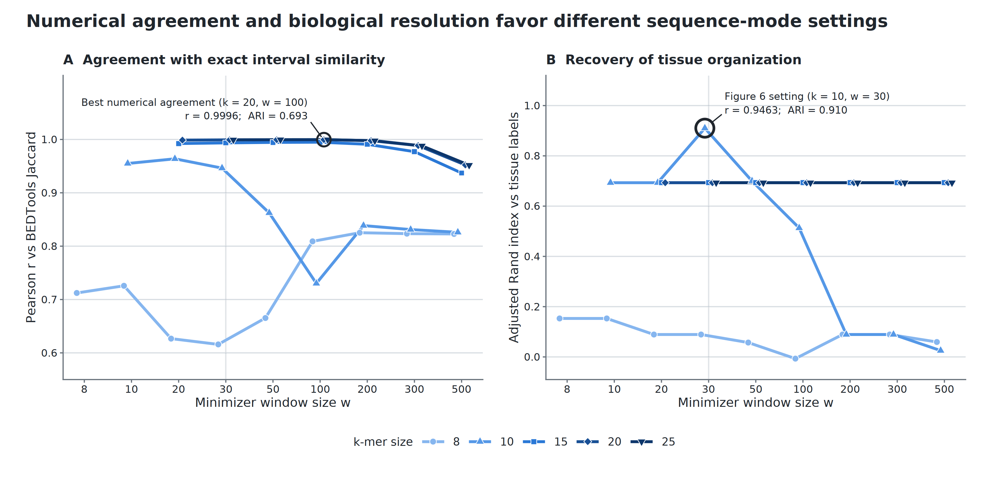

## Thesis

Modern interval collections are limited by two boundaries: the computational cost of comparing every dataset and the coordinate dependence that prevents comparison across references. Hammock creates reusable sketches of either interval coordinates or interval-derived sequences, expanding comparison within and across those boundaries while preserving useful biological structure.

## Abstract

## I. Introduction

Increased availability of high-throughput sequencing has facilitated a corresponding increase in large-scale modern sequencing projects which produce vast numbers of genomic annotation datasets which then, themselves, become part of the genomic data ecosystem. Large-scale initiatives such as the ENCODE Project\cite{encode_2012}, the Roadmap Epigenomics Project\cite{roadmap_2015}, GTex[REF], and the 1000 Genomes Project\cite{10002015global} make datasets publicly available, providing unprecedented opportunities for integrative analysis. Among the most common and biologically informative outputs of these projects are genomic intervals: contiguous stretches of the genome that define transcription factor binding sites, chromatin accessibility peaks, histone modifications, structural variants, and splicing junctions. Such interval datasets have become a cornerstone of downstream analyses that seek to characterize genome function and variation across populations, tissues, cell types, and experimental conditions. In particular, pairwise comparison of interval datasets presents a measurement of biological similarity, such as identifying conserved regulatory elements between tissues. Tools such as \program{BEDTools} provide exact calculations of these measures\cite{quinlan2010bedtools}, but the computational cost of pairwise overlap calculations grows rapidly with the size of modern repositories. In practice, this creates a scalability bottleneck that hampers systematic comparisons across the interval datasets now available\cite{li2020design}.

The numbers of files in these interval databases continue to grow every year. ChIP-Atlas, for example, expanded from 37,720 accumulated experiments in 2015 to 464,655 in 2025, while repositories such as ENCODE contain thousands of additional ChIP-seq and chromatin-accessibility experiments.

Scalability is not the only obstacle to systematic interval comparison. BED coordinates are meaningful only with respect to the reference genome on which they were defined, and large public collections remain distributed across multiple genome assemblies. Standard overlap measures therefore cannot directly compare two interval files when one is defined on hg19 and the other on hg38, even when the files describe the same assay or biological feature. Figure 1 illustrates this limitation for histone-mark ChIP-seq peak files from Roadmap Epigenomics and BLUEPRINT. For histone marks represented in both collections, within-Roadmap and within-BLUEPRINT comparisons can be performed in their respective coordinate systems, whereas every Roadmap–BLUEPRINT pairing is blocked by the hg19–hg38 mismatch. Coordinate conversion can sometimes recover such comparisons, but it introduces additional preprocessing, may not map all intervals unambiguously, and continues to define similarity in terms of a selected coordinate system. An alternative is to extract the reference sequence underlying each interval and compare the resulting sequence collections directly, allowing related genomic annotations to be evaluated across references without requiring their coordinates to coincide.

**Figure 1. Reference-genome fragmentation prevents direct comparison across public histone-mark collections.** Numbers of possible pairwise comparisons among processed histone-mark ChIP-seq peak BED files are shown for the five most represented marks shared by Roadmap Epigenomics and BLUEPRINT. Within-resource comparisons can be performed directly because Roadmap files share hg19 coordinates and BLUEPRINT files share hg38 coordinates. In contrast, every Roadmap–BLUEPRINT pairing is blocked for direct coordinate-overlap analysis by the hg19–hg38 reference mismatch. File counts are deduplicated at the download-URL level; included outputs are BED-, narrowPeak-, broadPeak-, or gappedPeak-like peak files. Repository counting and inclusion criteria are described in Supplementary Methods S1.

Probabilistic data structures, or sketches, offer a powerful solution to these challenges. Sketching methods compress large datasets into compact representations that allow efficient estimation of set cardinality and similarity. Techniques such as MinHash\cite{minhash} and HyperLogLog\cite{hll} have seen wide application in computer science, and their introduction to genomics has already revolutionized k-mer–based comparisons of sequencing datasets. Tools like Dashing \cite{dashing} and Mash\cite{mash} have demonstrated the value of sketching for rapid, large-scale sequence and metagenome comparisons. Extending these methods to genomic interval data, however, remains relatively unexplored. Because intervals represent continuous spans rather than discrete tokens, adapting sketches for overlap estimation presents unique methodological challenges but also significant opportunities. Moreover, representing intervals through both their coordinates and their underlying reference sequences provides complementary notions of similarity: coordinate-based sketches support rapid comparison within a shared reference, whereas sequence-based sketches can support comparisons across references.

In this study, we present \program{hammock}, a command-line tool for scalable comparison of genomic interval datasets. Within a shared reference genome, \program{hammock} applies probabilistic sketches to BED intervals to approximate overlap and similarity across large collections of files, reducing the computational burden of systematic pairwise analysis. We benchmark these estimates against exact calculations from established interval-processing tools and evaluate the resulting trade-offs among speed, memory use, and accuracy. We additionally introduce a sequence-based representation in which the reference sequences underlying BED intervals are extracted and sketched, enabling similarity measurements between annotations defined on different genome assemblies. Together, these approaches address two complementary barriers to large-scale interval analysis: the computational cost of expanding pairwise comparisons within a reference and the coordinate incompatibility that prevents direct comparison across references.

## II. Results

### 2.1 Hammock represents interval sets in complementary coordinate and sequence spaces

**Figure 2. Hammock provides complementary coordinate- and sequence-based representations of genomic interval sets.** (A) Public interval collections are large, comparisons scale quadratically with the number of files, and BED coordinates are tied to specific reference genomes. (B) In interval mode, each BED file is summarized as a reusable sketch of covered genomic positions, enabling fast all-pairs similarity comparisons within a shared reference. (C) In sequence mode, interval sequences are extracted from each file's native reference FASTA, representative k-mers are selected using minimizers, and the resulting sequence sketches are compared across references without requiring direct coordinate overlap. The two modes therefore answer complementary questions: whether interval sets occupy similar genomic locations and whether they contain similar underlying sequence.

### 2.2 Interval sketching expands feasible all-pairs BED comparison

This section should distinguish two sources of the interval-mode speedup:

1. **Sketch reuse:** each BED file is read once and converted to a fixed-size summary that can be reused across all pairwise comparisons.
2. **Mixed-stride subsampling:** hammock's novel `subB` implementation samples genomic positions using deterministic chromosome-specific strides and offsets, avoiding the per-position hashing cost of hash-threshold subsampling. This reduces sketch-construction time in proportion to the requested sampling fraction while preserving reproducibility and producing little change relative to the unsubsampled hammock similarities in the evaluated datasets.

Mixed-stride should be presented as a methodological contribution within the interval-mode scaling result, not as an unrelated implementation optimization. The main text should briefly contrast it with hash-threshold subsampling; the full comparison among mixed-stride, hash-threshold, and single-hash strategies can remain supplementary.

**Figure 3. Hammock expands feasible all-pairs comparison as interval collections grow.** (A) Wall time for hammock and BEDTools across synthetic collections containing 10,000 intervals per BED file, using HyperLogLog precision \(p=14\), 16 threads, and three runs per configuration. Hammock constructs one reusable sketch per file and separates sketch-construction time from fixed-size sketch comparison, whereas the BEDTools workflow repeatedly performs exact comparisons over the underlying interval files. The number of unique file pairs grows as \(N(N-1)/2\), causing the performance advantage of sketch reuse to increase with collection size. (B) Wall time on 20 Maurano fetal-tissue DNase hypersensitivity BED files, corresponding to 190 unique pairs, using interval mode with \(p=18\) and eight threads. Hammock is faster than the parallelized BEDTools workflow without subsampling, while the novel mixed-stride implementation of `subB` at `0.1` and `0.01` further reduces runtime with little change relative to hammock's own unsubsampled similarity estimates. Mixed-stride deterministically advances through genomic positions at chromosome-specific strides and offsets, avoiding a hash-based inclusion test at every covered position. Bar labels report wall time, speedup relative to BEDTools, and the mean change in estimated Jaccard similarity relative to unsubsampled hammock. Together, the synthetic and real-data benchmarks show that hammock improves the feasibility of exhaustive pairwise analysis through both reusable sketches and efficient optional subsampling during sketch construction.

**Figure 3 generation.** The combined figure is generated by `paper/pairwise_scaling/plot_pairwise_scaling.R` and written to `paper/figures/pairwise_scaling.png`. Panel A uses `docs/data/cpp_vs_bedtools_t16_20260512_160412.csv`. Panel B uses `docs/data/maurano_subB_summary.csv` and `docs/data/maurano_bedtools.csv`. The script rebuilds both panels with harmonized typography, panel labels, tool colors, wall-time units, and the correct unique-pair count, \(N(N-1)/2\).

### 2.3 Interval sketches recover exact-overlap similarity structure and values

**Figure 4. Inclusion–exclusion reproduces BEDTools Jaccard; register-equality reproduces only its ordering.** Pairwise comparisons were performed on 20 Maurano fetal-tissue DNase hypersensitivity BED files, yielding 190 unique off-diagonal pairs; self-comparisons were excluded from all statistics and plots. Hammock interval mode emits two similarity columns, and the distinction is the subject of this figure. `jaccard_similarity` is a *register-equality* statistic — the fraction of active HyperLogLog registers whose values agree — which is not set Jaccard: registers tie by chance, placing a floor under the statistic. `jaccard_similarity_ie` is the inclusion–exclusion estimate \(\left(|A|+|B|-|A\cup B|\right)/|A\cup B|\), which estimates the same quantity BEDTools computes exactly. (A) Both estimates at HyperLogLog precision \(p=21\) are plotted against BEDTools Jaccard over the observed off-diagonal range, with LOESS fits; the dashed line marks numerical identity. The inclusion–exclusion cloud lies on that line (MAE \(=4.3\times10^{-4}\), Pearson \(r=0.99999\), Kendall \(\tau=0.9947\)), whereas register-equality lies in a band roughly \(0.14\) above it (MAE \(=0.1378\), \(r=0.99720\), \(\tau=0.9511\)). (B) Absolute deviation from BEDTools, on a logarithmic axis, for precisions \(p=18\), \(p=21\) and \(p=23\), distinguished by line type. The logarithmic axis is necessary rather than cosmetic: the two estimators differ by nearly three orders of magnitude, so on a linear axis all three inclusion–exclusion curves collapse onto zero. The register-equality deviation is \(\approx0.14\) and does not move with precision — the three curves superimpose — because it is a property of the estimator, not sampling error; it is a chance-agreement floor whose size is set by the sketch load factor and by the cardinality ratio \(|A|/|B|\). The inclusion–exclusion deviation falls from \(\approx1\times10^{-3}\) to \(\approx2\times10^{-4}\) across the same precisions, scaling as \(1/\sqrt{m}\) as HyperLogLog error should. Together the panels separate two claims that a single-column figure conflates. Interval sketching preserves similarity *structure* under either column, but only inclusion–exclusion reproduces BEDTools *values*. Ordering under register-equality is high but not exact: \(\tau=0.951\) corresponds to 439 of 17,955 comparisons (2.45%) in which the two tools disagree on ordering, all involving BEDTools Jaccard differences below 0.025 (the largest inverting gap is precision-dependent: 0.0303, 0.0250 and 0.0267 at \(p=18\), \(21\) and \(23\)). Those inversions are systematic rather than stochastic — the chance floor decreases with \(|A|/|B|\), so pairs of unequal size are transformed differently — and the same residual pattern recurs across independent sketch sets at \(p=18\) and \(p=21\) (\(r=0.994\)). Under inclusion–exclusion at \(p=21\) the same corpus inverts 48 comparisons (0.27%).

**Figure 4 generation.** The figure is generated by `paper/interval_accuracy/plot_interval_accuracy.R` and written to `paper/figures/interval_accuracy.png`. Inputs are `docs/data/maurano_bedtools_ref.tsv` and `docs/data/hammock_hll_p{18,21,23}_jaccB.csv`. Those three CSVs were regenerated with hammock 0.5.0 on 2026-07-31 to obtain the `jaccard_similarity_ie` column; earlier copies carried the placeholder `containment` column and could not supply it. The regeneration reproduces the archived `jaccard_similarity` values **exactly** (0 of 400 pairs differ at any precision), so panel A's register-equality series is unchanged from the previously published figure.

### 2.4 Sequence sketches enable comparison across genome references

### 2.5 Biological identity is preserved across references

**Figure 5. Sequence sketches group samples by tissue across genome references.** Three ENCODE H3K27ac ChIP-seq samples—heart ENCSR175ABH, liver ENCSR864OOO, and lung ENCSR954JMZ—were independently aligned and peak-called against GRCh37, GRCh38, and CHM13, yielding nine peak sets. Each peak set was converted to sequence against its native reference and sketched in sequence mode using broad peaks, \(k=10\), \(w=10\), HyperLogLog precision \(p=24\), and the minimizer-only Jaccard metric. UPGMA clustering on \(1-J\) groups the nine peak sets by tissue rather than by reference genome: heart, liver, and lung each form a distinct clade containing the GRCh37-, GRCh38-, and CHM13-derived representation of that tissue. In this proof-of-concept panel, reference choice therefore behaves as a within-tissue perturbation rather than as the dominant axis of separation, showing that sequence sketches can retain biological identity across genome references without requiring direct coordinate overlap.

**Figure 5 generation.** The figure is generated by `paper/cross_reference_identity/plot_cross_reference_identity.R` and written to `paper/figures/cross_reference_identity.png`. Inputs are `docs/data/exp_a_broad_k10_w10.csv` (staged from `experiments/ref-comparison/results/exp_a/broad/k10_w10/exp_a_mnmzr_p24_jaccD_k10_w10.csv`) and `docs/data/exp_a_metadata.tsv` (staged from the experiment configuration). The script constructs the nine-sample similarity matrix, converts similarity to \(1-J\), performs average-linkage hierarchical clustering, and renders the tissue-colored dendrogram.

### 2.6 Sequence sketches recover tissue organization

**Figure 6. Sequence sketches recover fetal-tissue organization in the Maurano DNase hypersensitivity collection.** Twenty fetal-tissue DNase-seq interval sets spanning ten annotated tissue labels were converted to interval-derived sequence and compared using the minimizer-only `jaccard_similarity` score at \(k=10\), \(w=30\), and HyperLogLog precision \(p=24\). Section 6.1 recommends `jaccard_similarity_ie` for magnitude; the choice is immaterial here, because the two columns induce the same partition on this corpus and yield adjusted Rand and normalized mutual information values that agree to sixteen digits. We report the register-equality column because it is the one the sequence-mode sweep emitted. This parameter combination lies on the ARI-optimal \(k,w\) plateau identified in the sequence-mode sweep; \(p=24\) is used for the manuscript dendrogram. Average-linkage hierarchical clustering was performed on \(1-J\). Leaf labels show dataset accessions and are colored by annotated tissue; the legend maps colors to tissue labels. Blue rectangles outline contiguous organ-level groups up to their most recent common-ancestor height, with the three muscle subtypes treated as one organ group for the boxes. Cutting the dendrogram into the ten annotated tissue classes yielded an adjusted Rand index of \(0.910\) and normalized mutual information of \(0.961\). The figure therefore shows that sequence-derived similarity recovers the known tissue organization while retaining finer distinctions among closely related muscle samples.

**Figure 6 generation.** The figure is generated by `paper/sequence_tissue_clustering/plot_sequence_tissue_clustering.R` and written to `paper/figures/sequence_tissue_clustering.png`. By default, the script reads `experiments/maurano_dhs_validation/results/raw_d/hammock_mnmzr_p24_jaccD_k10_w30.csv`, uses the `jaccard_similarity` column, and obtains tissue annotations from `experiments/maurano_dhs_validation/data/maurano_filenames_key.tsv`. Optional command-line arguments can substitute another similarity CSV, tissue key, output path, or similarity column.

### 2.7 Parameterization separates numerical agreement from biological resolution

**Figure 7. Numerical agreement and biological resolution favor different sequence-mode parameter settings.** Sequence-mode configurations were evaluated on the 20 Maurano fetal-tissue DNase hypersensitivity interval sets at HyperLogLog precision \(p=24\) using the minimizer-only `jaccard_similarity` estimator; the panels are qualitatively unchanged under `jaccard_similarity_ie`, which relocates the Pearson optimum to \(k=20\), \(w=20\), \(p=20\) while leaving its tissue-clustering performance at the same adjusted Rand index of \(0.693\), against \(0.910\) at the ARI optimum. Both panels use the same ordered minimizer-window axis and the same color, line type, and point shape for each \(k\); a light dashed guide marks \(w=30\). (A) Pearson correlation with exact BEDTools Jaccard approaches a broad optimum across larger \(k\)-mer and minimizer-window settings. The configuration with the highest Pearson correlation is marked with an open symbol and annotated with both its numerical agreement and tissue-clustering performance. (B) Agreement between average-linkage clusters and the annotated tissue labels, measured by adjusted Rand index, instead reaches its maximum at \(k=10\) and \(w=30\), the setting used for Figure 6. The \(k=15\), \(k=20\), and \(k=25\) ARI curves overlap across the sweep and remain below the Figure 6 setting. Together, the panels show that parameter settings that most closely reproduce exact interval-similarity values are not the same settings that best preserve tissue organization.

**Figure 7 generation.** The figure is generated by `paper/parameter_response/plot_parameter_response.R` and written to `paper/figures/parameter_response.png`. The input is `docs/data/mode_d_summary.csv` (staged from `experiments/maurano_dhs_validation/results/mode_d_summary.csv`), filtered to `precision == 24`, `column == "jaccard_similarity"`, and `reference == "bedtools"`; configurations with \(k<8\) are excluded because too few usable window settings were available to form a response curve. The script computes the best-Pearson and Figure 6 annotations directly from the input and reports the lowest-MAE setting to stderr. The earlier Pearson-versus-ARI scatter (`docs/scripts/mode_d_metric_tradeoff.R`) is retained as a compact supplementary summary of the same sweep.

## III. Discussion

### 3.1 Scaling comparison within references

Discuss both layers of the computational contribution: reusable sketches reduce the cost of repeated all-pairs comparisons, while mixed-stride makes optional base-pair subsampling computationally effective by avoiding a per-position hashing gate. Mixed-stride should be described as a novel deterministic subsampling strategy with chromosome-specific phase offsets, not merely as a command-line tuning option.

### 3.2 Comparing interval-derived sequence across references

### 3.3 Coordinate similarity and sequence similarity are complementary

### 3.4 Practical recommendations

### 3.5 Limitations and future work

## IV. Methods

### 4.1 Software implementation

### 4.2 Interval-mode sketch construction

#### 4.2.1 Mixed-stride subsampling

Define `subB`, the sampled base-pair universe, and the mixed-stride algorithm. For sampling fraction `subB`, set the approximate stride to \(s=\mathrm{round}(1/\mathrm{subB})\), use a deterministic chromosome-keyed offset to select the sampling phase, and advance directly between accepted positions rather than evaluating every covered position. Explain determinism, seed handling, expected sampling density, computational cost, and the rationale for chromosome-specific offsets. Contrast the algorithm with hash-threshold subsampling, whose inclusion test requires a hash computation for every covered position regardless of the requested sampling fraction.

### 4.3 Sequence-mode sketch construction

### 4.4 Similarity estimators and computational complexity

Include the cost of mixed-stride sketch construction as a function of covered length and stride, alongside full interval ingestion and pairwise sketch comparison.

### 4.5 Datasets

### 4.6 Performance benchmarking

Include the direct comparison of no subsampling and mixed-stride `subB = 0.1` and `0.01` used in Figure 3B. The main benchmark establishes the practical speed–approximation trade-off; exhaustive comparison against hash-threshold and single-hash alternatives can be reported in Supplementary Results.

### 4.7 Interval-mode accuracy evaluation

### 4.8 Sequence-mode biological evaluation

## Data and code availability

## Author contributions

## Acknowledgments

## References

## Supplementary Methods

### S1. Quantification of public interval collections

### S2. Alternative `subB` sampling strategies and implementation details

Document hash-threshold and single-hash alternatives, the full mixed-stride derivation and reproducibility checks not needed in the main text, and any structured-sampling sensitivity analyses.

## Supplementary Results

### S3. Comparison of mixed-stride, hash-threshold, and single-hash subsampling

Report runtime, similarity deviation, and scaling across sampling fractions and file sizes. This supports the mixed-stride contribution without requiring an additional main-text figure unless its comparative advantage becomes a headline result.

## Supplementary Figures and Tables
