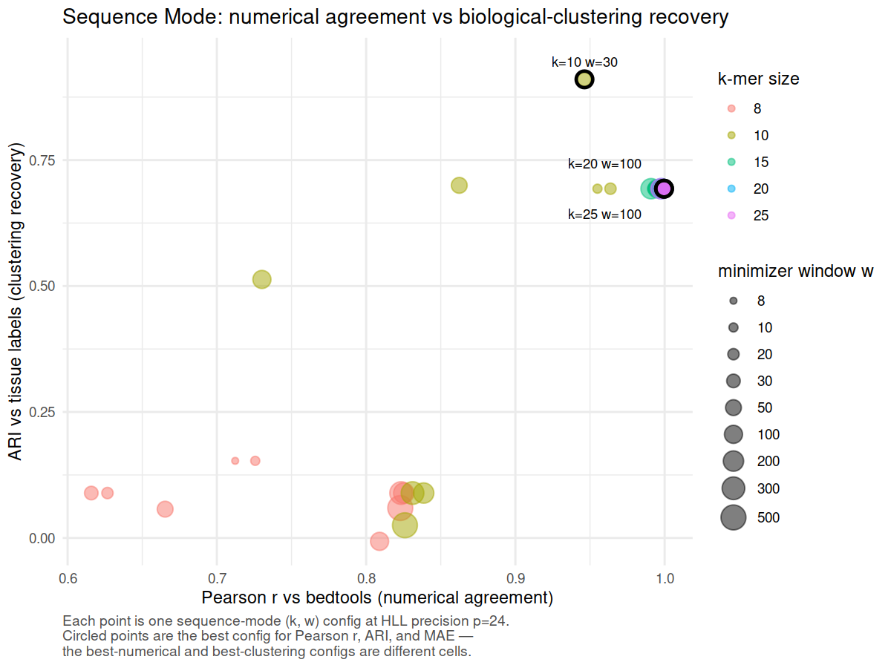

## Thesis

Modern interval collections are limited by two boundaries: the computational cost of comparing every dataset and the coordinate dependence that prevents comparison across references. Hammock creates reusable sketches of either interval coordinates or interval-derived sequences, expanding comparison within and across those boundaries while preserving useful biological structure.

## Abstract

## I. Introduction

The introduction establishes two barriers to systematic comparison of genomic interval collections:

1. the computational cost of expanding all-pairs comparisons as repositories grow; and
2. the dependence of coordinate-overlap methods on a shared reference genome.

Increased availability of high-throughput sequencing has facilitated a corresponding increase in large-scale modern sequencing projects which produce vast numbers of genomic annotation datasets which then, themselves, become part of the genomic data ecosystem. Large-scale initiatives such as the ENCODE Project\cite{encode_2012}, the Roadmap Epigenomics Project\cite{roadmap_2015}, GTex[REF], and the 1000 Genomes Project\cite{10002015global} make datasets publicly available, providing unprecedented opportunities for integrative analysis. Among the most common and biologically informative outputs of these projects are genomic intervals: contiguous stretches of the genome that define transcription factor binding sites, chromatin accessibility peaks, histone modifications, structural variants, and splicing junctions. Such interval datasets have become a cornerstone of downstream analyses that seek to characterize genome function and variation across populations, tissues, cell types, and experimental conditions. In particular, pairwise comparison of interval datasets presents a measurement of biological similarity, such as identifying conserved regulatory elements between tissues. Tools such as \program{BEDTools} provide exact calculations of these measures\cite{quinlan2010bedtools}, but the computational cost of pairwise overlap calculations grows rapidly with the size of modern repositories. In practice, this creates a scalability bottleneck that hampers systematic comparisons across the interval datasets now available\cite{li2020design}.

The numbers of files in these interval databases continue to grow every year. ChIP-Atlas, for example, expanded from 37,720 accumulated experiments in 2015 to 464,655 in 2025, while repositories such as ENCODE contain thousands of additional ChIP-seq and chromatin-accessibility experiments.

Scalability is not the only obstacle to systematic interval comparison. BED coordinates are meaningful only with respect to the reference genome on which they were defined, and large public collections remain distributed across multiple genome assemblies. Standard overlap measures therefore cannot directly compare two interval files when one is defined on hg19 and the other on hg38, even when the files describe the same assay or biological feature. Figure~\ref{fig} illustrates this limitation for histone-mark ChIP-seq peak files from Roadmap Epigenomics and BLUEPRINT. For histone marks represented in both collections, within-Roadmap and within-BLUEPRINT comparisons can be performed in their respective coordinate systems, whereas every Roadmap–BLUEPRINT pairing is blocked by the hg19–hg38 mismatch. Coordinate conversion can sometimes recover such comparisons, but it introduces additional preprocessing, may not map all intervals unambiguously, and continues to define similarity in terms of a selected coordinate system. An alternative is to extract the reference sequence underlying each interval and compare the resulting sequence collections directly, allowing related genomic annotations to be evaluated across references without requiring their coordinates to coincide.

**Figure 1. Reference-genome fragmentation prevents direct comparison across public histone-mark collections.** Numbers of possible pairwise comparisons among processed histone-mark ChIP-seq peak BED files are shown for the five most represented marks shared by Roadmap Epigenomics and BLUEPRINT. Within-resource comparisons can be performed directly because Roadmap files share hg19 coordinates and BLUEPRINT files share hg38 coordinates. In contrast, every Roadmap–BLUEPRINT pairing is blocked for direct coordinate-overlap analysis by the hg19–hg38 reference mismatch. File counts are deduplicated at the download-URL level; included outputs are BED-, narrowPeak-, broadPeak-, or gappedPeak-like peak files. Repository counting and inclusion criteria are described in Supplementary Methods S1.

Probabilistic data structures, or sketches, offer a powerful solution to this challenge. Sketching methods compress large datasets into compact representations that allow efficient estimation of set cardinality and similarity. Techniques such as MinHash\cite{minhash} and HyperLogLog\cite{hll} have seen wide application in computer science, and their introduction to genomics has already revolutionized k-mer–based comparisons of sequencing datasets. Tools like Mash\cite{mash} and Dashing \cite{dashing} have demonstrated the value of sketching for rapid, large-scale sequence and metagenome comparisons. Extending these methods to genomic interval data, however, remains relatively unexplored. Because intervals represent continuous spans rather than discrete tokens, adapting sketches for overlap estimation presents unique methodological challenges but also significant opportunities. Moreover, representing intervals through both their coordinates and their underlying reference sequences provides complementary notions of similarity: coordinate-based sketches support rapid comparison within a shared reference, whereas sequence-based sketches can support comparisons across references.

In this study, we present \program{hammock}, a command-line tool for scalable comparison of genomic interval datasets. Within a shared reference genome, \program{hammock} applies probabilistic sketches to BED intervals to approximate overlap and similarity across large collections of files, reducing the computational burden of systematic pairwise analysis. We benchmark these estimates against exact calculations from established interval-processing tools and evaluate the resulting trade-offs among speed, memory use, and accuracy. We additionally introduce a sequence-based representation in which the reference sequences underlying BED intervals are extracted and sketched, enabling similarity measurements between annotations defined on different genome assemblies. Together, these approaches address two complementary barriers to large-scale interval analysis: the computational cost of expanding pairwise comparisons within a reference and the coordinate incompatibility that prevents direct comparison across references.

## II. Results

### 2.1 Hammock represents interval sets in complementary coordinate and sequence spaces

**Figure 2. Hammock provides complementary coordinate- and sequence-based representations of genomic interval sets.** (A) Public interval collections are large, comparisons scale quadratically with the number of files, and BED coordinates are tied to specific reference genomes. (B) In interval mode, each BED file is summarized as a reusable sketch of covered genomic positions, enabling fast all-pairs similarity comparisons within a shared reference. (C) In sequence mode, interval sequences are extracted from each file's native reference FASTA, representative k-mers are selected using minimizers, and the resulting sequence sketches are compared across references without requiring direct coordinate overlap. The two modes therefore answer complementary questions: whether interval sets occupy similar genomic locations and whether they contain similar underlying sequence.

### 2.2 Interval sketching expands feasible all-pairs BED comparison

**Figure 3. Hammock expands feasible all-pairs comparison as interval collections grow.** (A) Wall time for hammock and BEDTools across synthetic collections containing 10,000 intervals per BED file, using HyperLogLog precision \(p=14\), 16 threads, and three runs per configuration. Hammock constructs one reusable sketch per file and separates sketch-construction time from fixed-size sketch comparison, whereas the BEDTools workflow repeatedly performs exact comparisons over the underlying interval files. The number of unique file pairs grows as \(N(N-1)/2\), causing the performance advantage of sketch reuse to increase with collection size. (B) Wall time on 20 Maurano fetal-tissue DNase hypersensitivity BED files, corresponding to 190 unique pairs, using interval mode with \(p=18\) and eight threads. Hammock is faster than the parallelized BEDTools workflow without subsampling, while mixed-stride subsampling at `subB = 0.1` and `subB = 0.01` further reduces runtime with little change relative to hammock's own unsubsampled similarity estimates. Bar labels report wall time, speedup relative to BEDTools, and the mean change in estimated Jaccard similarity relative to unsubsampled hammock. Together, the synthetic and real-data benchmarks show that hammock improves the feasibility of exhaustive pairwise analysis through both reusable sketches and optional approximation within sketch construction.

**Figure 3 generation.** The combined figure is generated by `paper/pairwise_scaling/plot_pairwise_scaling.R` and written to `paper/figures/pairwise_scaling.png`. Panel A uses `docs/data/cpp_vs_bedtools_t16_20260512_160412.csv`. Panel B uses `docs/data/maurano_subB_summary.csv` and `docs/data/maurano_bedtools.csv`. The script rebuilds both panels with harmonized typography, panel labels, tool colors, wall-time units, and the correct unique-pair count, \(N(N-1)/2\).

### 2.3 Interval sketches preserve exact-overlap similarity structure

**Figure 4. Interval sketches preserve pairwise similarity structure relative to exact base-pair overlap.** Pairwise comparisons were performed on 20 Maurano fetal-tissue DNase hypersensitivity BED files, yielding 190 unique off-diagonal pairs; self-comparisons were excluded from all statistics and plots. BEDTools reports exact set Jaccard over covered base pairs, whereas hammock interval mode reports register-equality Jaccard over sketched genomic positions, so the two values are not expected to be numerically identical. (A) Hammock estimates at HyperLogLog precision \(p=21\) are plotted against BEDTools Jaccard within the observed off-diagonal range. The dashed line marks numerical identity, the orange curve is a LOESS fit with a 95% confidence interval, and the inset reports Pearson's \(r\), Spearman's \(\rho\), and Kendall's \(\tau\). Pearson's \(r\) summarizes linear agreement, whereas Spearman's \(\rho\) and Kendall's \(\tau\) quantify rank concordance. (B) The difference between hammock and BEDTools estimates is plotted against BEDTools Jaccard for precisions \(p=18\), \(p=21\), and \(p=23\). Points are shown in a common neutral color, while precision-specific LOESS trends are distinguished only by line type. The gap is largest for low-overlap pairs, decreases as overlap increases, and is similar across precision settings. Together, the panels show that interval sketches preserve both the ordering and broad linear structure of pairwise similarities even though the sketch-based and exact-overlap estimators operate over different representations.

**Figure 4 generation.** The figure is generated by `paper/interval_accuracy/plot_interval_accuracy.R` and written to `paper/figures/interval_accuracy.png`. Inputs are `docs/data/maurano_bedtools_ref.tsv` and `docs/data/hammock_hll_p{18,21,23}_jaccB.csv`.

### 2.4 Sequence sketches enable comparison across genome references

### 2.5 Biological identity is preserved across references

**Figure 5. Sequence sketches group samples by tissue across genome references.** Three ENCODE H3K27ac ChIP-seq samples—heart ENCSR175ABH, liver ENCSR864OOO, and lung ENCSR954JMZ—were independently aligned and peak-called against GRCh37, GRCh38, and CHM13, yielding nine peak sets. Each peak set was converted to sequence against its native reference and sketched in sequence mode using broad peaks, \(k=10\), \(w=10\), HyperLogLog precision \(p=24\), and the minimizer-only Jaccard metric. UPGMA clustering on \(1-J\) groups the nine peak sets by tissue rather than by reference genome: heart, liver, and lung each form a distinct clade containing the GRCh37-, GRCh38-, and CHM13-derived representation of that tissue. In this proof-of-concept panel, reference choice therefore behaves as a within-tissue perturbation rather than as the dominant axis of separation, showing that sequence sketches can retain biological identity across genome references without requiring direct coordinate overlap.

**Figure 5 generation.** The figure is generated by `paper/cross_reference_identity/plot_cross_reference_identity.R` and written to `paper/figures/cross_reference_identity.png`. Inputs are `docs/data/exp_a_broad_k10_w10.csv` (staged from `experiments/ref-comparison/results/exp_a/broad/k10_w10/exp_a_mnmzr_p24_jaccD_k10_w10.csv`) and `docs/data/exp_a_metadata.tsv` (staged from the experiment configuration). The script constructs the nine-sample similarity matrix, converts similarity to \(1-J\), performs average-linkage hierarchical clustering, and renders the tissue-colored dendrogram.

### 2.6 Sequence-mode parameterization separates numerical agreement from biological resolution

**Figure 6. Sequence-mode parameter settings that maximize numerical agreement do not maximize recovery of tissue organization.** Each point represents one sequence-mode configuration from the Maurano fetal-tissue DNase hypersensitivity sweep at HyperLogLog precision \(p=24\), using the minimizer-only `jaccard_similarity` score. The x-axis reports Pearson correlation with exact BEDTools Jaccard, whereas the y-axis reports adjusted Rand index relative to the annotated tissue labels after average-linkage clustering. Point color encodes k-mer size and point size encodes minimizer window size. Circled configurations identify the best Pearson correlation, best adjusted Rand index, and lowest mean absolute error. The highest numerical-agreement settings occur at large \(k\) and large \(w\), but yield lower agreement with the tissue partition than the ARI-optimal setting near \(k=10\), \(w=30\). Thus, parameter choices that most closely reproduce exact similarity values are not identical to those that best preserve biological organization.

**Figure 6 generation.** The figure is generated by `docs/scripts/mode_d_metric_tradeoff.R` from `docs/data/mode_d_summary.csv` and written to `docs/figures/mode_d_metric_tradeoff.png`. The script filters to the minimizer-only `jaccard_similarity` score, BEDTools as the numerical reference, and HyperLogLog precision \(p=24\).

### 2.7 Parameterization separates numerical agreement from biological resolution

## III. Discussion

### 3.1 Scaling comparison within references

### 3.2 Comparing interval-derived sequence across references

### 3.3 Coordinate similarity and sequence similarity are complementary

### 3.4 Practical recommendations

### 3.5 Limitations and future work

## IV. Methods

### 4.1 Software implementation

### 4.2 Interval-mode sketch construction

### 4.3 Sequence-mode sketch construction

### 4.4 Similarity estimators and computational complexity

### 4.5 Datasets

### 4.6 Performance benchmarking

### 4.7 Interval-mode accuracy evaluation

### 4.8 Sequence-mode biological evaluation

## Data and code availability

## Author contributions

## Acknowledgments

## References

## Supplementary Methods

### S1. Quantification of public interval collections

#### S1.1 ChIP-Atlas experiment counts

#### S1.2 ENCODE assay counts

#### S1.3 Roadmap and BLUEPRINT file selection

#### S1.4 Reference-assembly classification

#### S1.5 Pairwise-comparison calculations

## Supplementary Results

## Supplementary Figures and Tables